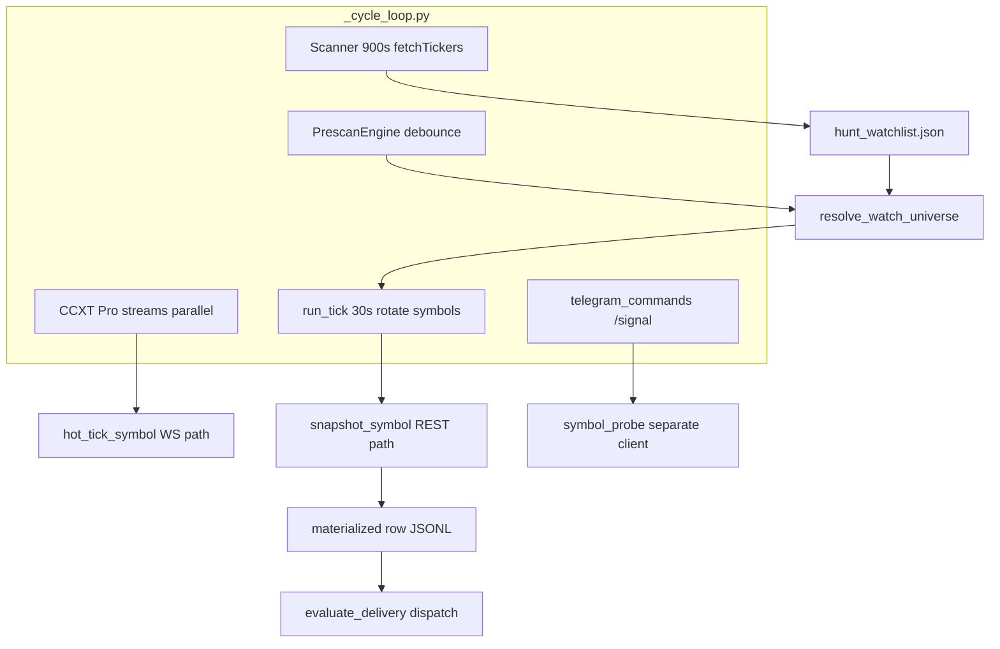
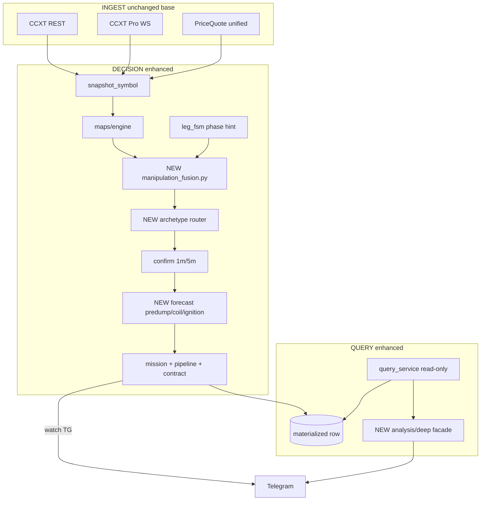

# Hunt — полная спецификация (AS-IS → TO-BE)

> **Это не план «50 проблем».** Старый remediation-черновик (10 опор × 50 audit items) **заменён** этим документом.  
> Здесь — продуктовая спецификация охотника: как работает, как должен работать, стратегии, данные, TF, gates, deep analysis, OSS/research, миграция кода.

Документ описывает **как устроено сейчас**, **как будет**, **зачем**, **какие данные**, **откуда идеи** (research + GitHub), и **что менять в коде**.  
Hunt — **signal-analytics only**: Telegram + manual entry оператора. **Autotrade запрещён** (grep по `hunt_core` — нет `place_order` / `create_order`).

---

## О документе — линия эволюции

| Этап чата | Что зафиксировано | Где в этом файле |
|-----------|-------------------|------------------|
| Принцип работы охотника (pre-move, манипуляции) | Миссия, 3 archetype, no mid-leg | **Часть 0**, **2.1** |
| Критика / уточнение TF и данных | MTF top-down, data plane | **2.5**, **Часть 3** |
| 50 audit items (исторический) | **Снято с повестки** — заменено gap matrix §1.8 | §1.8 только конкретные code gaps |
| Web research (36 URL, 12 доменов) | Обоснование fusion domains | **2.3**, **Часть 7** |
| GitHub 30+ OSS | Паттерны alert-only, anti-autotrade | **Часть 4** |
| Wave A–D (уже в коде) | Mission lock, oracle TTL, check_logic — **частично merged** | §1.8 «post-audit» |
| Полный дизайн TO-BE | Fusion, forecasts, deep module | **Часть 2** |
| Архитектура runtime | 3 planes, loops, delivery chain | **Часть 1–2** |
| Стратегии / условия входа | Archetype playbooks + gates | **0.3**, **2.7** |
| Реализация в коде | File map, Pass A/B, acceptance | **Части 5–6** |

**Канон после merge:** этот файл + [`hunt/docs/ENGINE_DESIGN.md`](hunt/docs/ENGINE_DESIGN.md) (product) + [`hunt/ARCHITECTURE.md`](hunt/ARCHITECTURE.md) (operational, sync in Pass A).

---

## Карта покрытия — отражает ли план всё обсуждённое?

| Тема | В плане? | Раздел |
|------|----------|--------|
| Охота на манипуляции (не generic bot) | Да | 0.1, 2.1 |
| Pre-dump / coil / ignition | Да | 0.1, 0.3, 2.3–2.5 |
| Прогноз **куда** пойдёт цена | Да | 2.4 (3 forecast kinds) |
| Deep analysis pinned + user symbol | Да | 2.6 |
| Без autotrade | Да | 0.2, 8, acceptance grep |
| AS-IS по реальному коду | Да | Часть 1 |
| TO-BE архитектура | Да | 2.2 diagram |
| Data: REST/WS/fapiData/maps | Да | 1.6, Часть 3 |
| Таймфреймы per archetype | Да | 2.5 |
| Условия delivery / gates | Да | 1.4, 2.7 |
| OSS projects (signal-only) | Да | Часть 4 |
| Academic sources | Да | Часть 7 |
| Что уже сделано vs что строим | Частично | 1.8 gaps; см. 0.3 «already in code» |
| Примеры TG-сообщений | **Нет** | Out of scope spec; templates in Pass A |
| Пороги config.toml построчно | **Нет** | Defaults in 1.6; tune via ledger post-live |

**Вывод:** план отражает обсуждение **принципов, архитектуры, стратегий, данных, TF, OSS и research**. Не отражает (намеренно): построчный config tuning и mockups TG — это артефакты Pass A при реализации.

---

## Часть 0. Продуктовая цель

### 0.1 Что должен делать Hunt (TO-BE)

Охотник ищет **формations манипуляций** на Binance USDⓈ-M perps (meme + anchors) и строит **прогнозы по данным**:

| Archetype | Рынок | Прогноз для оператора | Watch TG |
|-----------|-------|----------------------|----------|
| **predump_short** | Монета запамплена → distribution/UTAD | Зона markdown: long-liq clusters ниже, VAL, opposite range | Только pre-dump phases |
| **coil_long** | Накопление (часы–недели) | Target band вверх через LVN (HVN, short-liq magnet) | accumulation / breakout_arming |
| **ignition_long** | Crowded shorts + book imbalance | Short-liq magnet, окно 2–15m | Только при squeeze setup, не mid-pump |

**Deep Analysis** — отдельный продукт: pinned (BTC/ETH/XAU/XAG) + любой символ из канала/`/signal`. Полный разбор **без** ограничения pre-* в тексте; поле `would_deliver` = честный ответ watch gates.

### 0.2 Чего Hunt не делает (навсегда)

- Ордера, кошельки, private API, Jupiter/exec webhook (паттерны IPA, futurabot, ChartNagari exec — **не портируем**)
- LLM на hot path (optional только в deep briefing, off by default)
- «Сигнал ради сигнала» после движения (mid-leg `dump_active` / `impulse_initiating`)

### 0.3 Три стратегии — условия (playbook оператора)

Watch TG шлёт сигнал только когда выполнены **все** слои: fusion score ≥ порог → mission phase OK → closed-bar confirm → gates → contract.

#### predump_short (fade после пампа)

| Элемент | Условие | Зачем |
|---------|---------|-------|
| Context | leg_gain высокий, pos_near_high ≥0.85, phase ∈ exhaustion/distribution | Pump уже был ([D3 BitMEX](https://www.bitmex.com/blog/wyckoff-distribution)) |
| Structure | OI regime → new_money_short или stall at top; bear CVD div | Distribution, не squeeze ([D7](https://axeladlerjr.com/bitcoin-open-interest-price-divergence-patterns/)) |
| Trigger | **1m** closed bar: reclaim после BSL sweep / support break | Не вход на wick ([D10 BingX](https://bingx.com/en/learn/article/what-is-a-liquidity-sweep-in-crypto-trading-how-to-spot-and-trade)) |
| Forecast | `build_dump_forecast` → zone ниже (long liq, VAL) | Оператор видит magnet markdown |
| Block | funding deeply negative + OI crowding short → **no predump** | Squeeze risk ([D8 Buildix](https://www.buildix.trade/blog/spot-bitcoin-short-squeeze-funding-cvd-liquidations)) |

#### coil_long (накопление → breakout)

| Элемент | Условие | Зачем |
|---------|---------|-------|
| Context | VP 1d/1w: VA expansion, POC shift up, range age days–weeks | Coil ([D4 TraderAbyss](https://traderabyss.com/artigos/crypto-wyckoff-accumulation-guide-2026)) |
| Structure | map_vp_accumulation ≥0.55, bid absorption, spring + bull CVD | Confirm accumulation ([ChartWhisperer](https://chartwhisperer.ca/wyckoff-method)) |
| Trigger | **5m** closed: VAH break, vol ≥1.5× avg | Valid breakout ([D5 CoinXSight](https://coinxsight.com/blog/indicators/volume-profile-guide)) |
| Forecast | `build_maps_forecast` → LVN path up | Target band |
| Env | `HUNT_LONG_TG=0` default until ledger proves edge | Policy ([ENGINE_DESIGN](hunt/docs/ENGINE_DESIGN.md)) |

#### ignition_long (squeeze / manipulation pump)

| Элемент | Условие | Зачем |
|---------|---------|-------|
| Context | Extended decline, funding negative, OI elevated | Crowded shorts ([D8](https://tradfidefi.tech/tactics-oi-funding/)) |
| Setup | CVD absorption (price LL, CVD HL) | Hidden bid ([MarketTrace](https://markettrace.ai/blog/cumulative-volume-delta)) |
| Trigger | Liq cluster above + OBI; fusion ignition score lead | [A7 leionion scraper](https://github.com/leionion/liquidation-cluster-signal-scraper) pattern |
| Forecast | `build_ignition_forecast`, window 2–15m | Time box |
| Block | phase = impulse_initiating / mega_leg | Mission — уже в движении |

### 0.4 Уже в коде (Wave A–D audit) vs строим по этой spec

| Capability | In code now | Spec TO-BE delta |
|------------|-------------|------------------|
| Mission lock `_mission.py` | Yes | Purge residual mid-leg branches |
| Price stale / oracle TTL | Yes | PriceQuote domain (Pass B) |
| Maps OB/liq/VP | Yes | + dump/ignition forecast |
| prepump forecast only | Yes | + predump + ignition |
| check_logic extended | Yes | + fusion fixtures |
| deep_signal + pinned_deep | Yes | Unify under `deep/` |
| ManipulationFusionScore | **No** | **Pass A core** |
| Outcome ledger archetype | **No** | Pass B |
| 3 equal verdicts deep | **No** | Pass A |

---

## Часть 1. AS-IS — как устроено сейчас

### 1.1 Три плоскости (задумка vs реализация)

| Плоскость | Канон ([`ENGINE_DESIGN.md`](hunt/docs/ENGINE_DESIGN.md)) | Реализация сегодня |
|-----------|----------------------------------------------------------|-------------------|
| **INGEST** | Один MarketPlane, CCXT REST+Pro | [`market/factory.py`](hunt/hunt_core/market/factory.py) → `HuntCcxtClient` + `HuntCcxtStreams` + spot companion |
| **DECISION (Watch writer)** | features → setup → lifecycle → gate → contract → deliver | [`tick_assembly.py`](hunt/hunt_core/runtime/tick_assembly.py) + [`_cycle_tick.py`](hunt/hunt_core/runtime/cycle/_cycle_tick.py) |
| **QUERY** | read store; REST on miss; `would_deliver` | [`query_service.py`](hunt/hunt_core/runtime/query_service.py) + [`symbol_probe.py`](hunt/hunt_core/runtime/symbol_probe.py) |

**Расхождение документов:** [`ARCHITECTURE.md`](hunt/ARCHITECTURE.md) §3 tick всё ещё упоминает «main bot 28 strategies» — **устарело**; Hunt standalone.

### 1.2 Runtime loop (тайминги)



| Интервал | Модуль | Действие |
|----------|--------|----------|
| **900s** | [`data/scanner.py`](hunt/hunt_core/data/scanner.py) | `fetchTickers` → rank → top-30 watchlist |
| **30s** | [`watch.tick_interval_s`](hunt/config.defaults.toml) | `run_tick` по universe (cap ~12 dynamic + pinned) |
| **5s** | maps book sample | [`maps/config`](hunt/config.defaults.toml) `book_sample_interval_s` |
| **WS** | [`market/streams.py`](hunt/hunt_core/market/streams.py) | tickers, trades, liq, OHLCV, orderbook (hot symbols) |
| on-demand | [`symbol_probe.py`](hunt/hunt_core/runtime/symbol_probe.py) | `/signal` — **отдельный** REST client, timeout 45–360s |

### 1.3 Symbol tick — пошагово (REST path)

Файл: [`tick_assembly.snapshot_symbol`](hunt/hunt_core/runtime/tick_assembly.py)

1. **REST pack** — klines multi-TF, OI, funding, taker L/S, basis, depth, L/S ratios ([`CCXT.md`](hunt/docs/CCXT.md) fapiData*)
2. **WS overlay** — mark/last, closed klines, CVD session ([`market/streams.py`](hunt/hunt_core/market/streams.py))
3. **Prepare** — Polars frames, Wilder RSI/ATR ([`features/prepare_frame.py`](hunt/hunt_core/features/prepare_frame.py))
4. **Maps bundle** — OB + liq + VP ([`maps/engine.py`](hunt/hunt_core/maps/engine.py) `build_map_bundle` → `derive_map_features` → `row["market"]`)
5. **Lifecycle FSM** — [`regime/leg_fsm.py`](hunt/hunt_core/regime/leg_fsm.py) `assess_hunt_lifecycle` → phase, `short_entry_ok`, `long_entry_ok`
6. **Analysis** — [`scan/scoring.py`](hunt/hunt_core/scan/scoring.py) `_dump_analysis` / `_long_analysis` → fuel/score/triggers
7. **Confirm** — `_confirm_dump` (TF **1m**) / `_confirm_long` (TF **5m**) per [`config.defaults.toml`](hunt/config.defaults.toml)
8. **Enrich** — [`predump.py`](hunt/hunt_core/scan/predump.py), [`prepump.py`](hunt/hunt_core/scan/prepump.py) levels/structure
9. **Row materialize** — dump/long/setup/lifecycle/maps/market/structure → JSONL [`dump_minute_watch.jsonl`](hunt/hunt_core/runtime/state.py)

### 1.4 Delivery path (Watch TG)

```mermaid
flowchart LR
  Row[row confirmed setup]
  Route[scan/routing.route_tick]
  Dispatch[deliver/dispatch.evaluate_delivery]
  Mission[gate/_mission.mission_delivery_block]
  Pipeline[gate/_registry.run_gate_pipeline]
  Contract[contract.validate_signal_contract]
  TG[deliver/telegram]
  Row --> Route --> Dispatch
  Dispatch --> Mission
  Mission --> Pipeline
  Pipeline --> Contract
  Contract --> TG
  TG --> Tracker[track/tracker.register_signal_open]
```



**Mission lock** ([`_mission.py`](hunt/hunt_core/gate/_mission.py)): блок `dump_active`, `impulse_initiating`, `mega_leg_continuation`; pre-dump / pre-pump phase sets.

**Известные gaps код vs эта spec (не «50 проблем», а конкретный delta):**

- Residual `dump_active` в [`levels.py`](hunt/hunt_core/levels/levels.py), [`scoring.py`](hunt/hunt_core/scan/scoring.py), [`_trailing.py`](hunt/hunt_core/track/_trailing.py) — adaptive/trailing ветки
- [`gate/delivery.py`](hunt/hunt_core/gate/delivery.py) re-export `_dump_continuation_short_ok` — legacy waiver surface
- [`maps/forecast.py`](hunt/hunt_core/maps/forecast.py) — **только long** prepump; нет predump/ignition forecast
- Нет единого **ManipulationFusionScore** — сигналы размазаны по scoring clusters + maps flags
- Deep analysis split: [`deep_signal.py`](hunt/hunt_core/analysis/deep_signal.py) (~1700 LOC) + [`pinned_deep.py`](hunt/hunt_core/analysis/pinned_deep.py) — нет facade `deep/`
- [`symbol_probe.py`](hunt/hunt_core/runtime/symbol_probe.py) — **второй** CCXT client (ENGINE_DESIGN says avoid for watched symbols)
- Outcome ledger — частично [`track/outcomes.py`](hunt/hunt_core/track/outcomes.py), нет полного archetype tagging

### 1.5 Query plane AS-IS

[`query_service.py`](hunt/hunt_core/runtime/query_service.py):

- Read materialized row if age < 180s (`STORE_FRESH_S`)
- Stale 180–600s → пометка; `--live` → fresh probe
- `DirectionQuery`: formation + blockers + `would_deliver`
- `build_maps_forecast` fallback в resolve

[`symbol_probe.py`](hunt/hunt_core/runtime/symbol_probe.py):

- `format_signal_probe_telegram` — сценарии, gaps, direction
- Pinned: `pinned_deep` panels при `HUNT_FULL_PREPARE=1`
- **Нет** трёх равноправных вердиктов long/short/sideways как в OSS A13

### 1.6 Data plane AS-IS (что уже собирается)

#### REST (Binance USD-M via CCXT)

| Данные | CCXT / implicit | Куда пишется | Зачем сейчас |
|--------|-----------------|--------------|--------------|
| OHLCV 1m,5m,15m,1h,4h,1d | `fetchOHLCV` | `row["frames"]` / prepare | Indicators, confirm bars |
| Ticker 24h | `fetchTicker` | session stats | Scanner rank |
| Open Interest | REST OI history | `market.oi_*` | Fuel, gates |
| Funding | `fetchFundingRate` / premium | `market.funding_*` | Crowding |
| Taker buy/sell | `fapiDataGetTakerlongshortRatio` | collect thresholds | Flow fuel |
| Top/global L/S | fapiData* ratios | market | Sentiment |
| Basis | `fapiDataGetBasis` | market | Spot/perp div |
| Order book | `fetchOrderBook` depth | walls, maps | Support/resistance |
| Mark/index | ticker fields | price oracle | RR, levels |

#### WebSocket (CCXT Pro)

| Stream | Модуль | Зачем |
|--------|--------|-------|
| `watchTicker` | streams | mark/last, TTL ([`live_price.py`](hunt/hunt_core/market/live_price.py)) |
| `watchTrades` | streams | session CVD, footprint |
| `watchOrderBook` | streams + maps | OBI, voids, sticky walls |
| `watchOHLCV` | streams | hot path closed bars |
| `watchLiquidations` | maps/liquidation | cross-venue liq map |
| Spot companion | market/spot | lead-lag, basis context |

#### Maps derived features (AS-IS)

Из [`maps/engine.py`](hunt/hunt_core/maps/engine.py) `derive_map_features`:

- `map_vp_accumulation`, `map_vp_va_contraction`, `map_accum_bid_absorption`, `map_ask_thinning`
- `map_cvd_divergence`, `map_void_above/below`
- `liq_heatmap_nearest_short/long`, `liq_forward_confidence`
- VP periods: **1h, 4h, 1d, 1w** ([config](hunt/config.defaults.toml))

#### Scoring / lifecycle (AS-IS logic)

- **Phase labels** — Wyckoff-like strings в FSM (exhaustion, distribution, dump_active, accumulation…)
- **Fuel clusters** — capped weights ([`scoring.py`](hunt/hunt_core/scan/scoring.py), [`config [scoring]`](hunt/config.defaults.toml))
- **Confirm** — closed bar on 1m (dump) / 5m (long)
- **Routing** — [`routing.py`](hunt/hunt_core/scan/routing.py): short_dump | long_bounce | early_armed | early_advisory
- **EV shadow** — [`ev/model_shadow.py`](hunt/hunt_core/ev/model_shadow.py), catalog EV-primary in dispatch

### 1.7 Persistence AS-IS

| Артефакт | Путь / модуль | Содержимое |
|----------|---------------|------------|
| Tick JSONL | `dump_minute_watch.jsonl` | Full row per tick |
| Tracker | `hunt_signal_state.json` | Active signals, TP/SL |
| Cooldowns | `dump_watch_telegram_state.json` | 45 min symbol:direction |
| Watchlist | `hunt/data/hunt_watchlist.json` | Scanner output |
| Feature lake | [`data/lake.py`](hunt/hunt_core/data/lake.py) | Optional parquet buffer |
| Events | [`track/events.py`](hunt/hunt_core/track/events.py) | Funnel JSONL |

### 1.8 AS-IS vs целевая миссия — gap matrix

| Требование | AS-IS | Gap |
|------------|-------|-----|
| Pre-dump **forecast zone** | levels TP/SL only | Нет `build_dump_forecast` |
| Coil multi-week context | VP 1w есть | Нет явного archetype coil scoring |
| Ignition / squeeze | liq advisory, presqueeze scan | Нет classifier + ignition forecast |
| Manipulation score | wash index, pump_dump_stage | Нет unified fusion 0–100 |
| Deep 3 verdicts | resolve_trade_direction primary | Нет long/short/sideways equal |
| Single manipulation narrative | phase + fuel | Phase ≠ edge (research D2–D4) |
| Outcome by archetype | pump_history counters | Нет ledger с phase/score at send |
| Docs truth | ARCHITECTURE stale | Sync needed |

---

## Часть 2. TO-BE — целевая архитектура

### 2.1 Принцип: Phase = hint, Fusion = rank, Gate = law

**Почему:** Wyckoff/ICT фазы субъективны и запаздывают ([BitMEX distribution](https://www.bitmex.com/blog/wyckoff-distribution), [JISEM critique](https://jisem-journal.com/index.php/journal/article/download/1130/426/1689)). OSS ([ChartNagari](https://github.com/Ju571nK/ChartNagari), [leionion/liquidation-cluster-scraper](https://github.com/leionion/liquidation-cluster-signal-scraper)) используют **multi-factor score** до алерта.

**TO-BE stack:**

1. **ManipulationFusionScore** (0–100) + archetype label
2. **Lifecycle phase** — один input в fusion, не единственный gate
3. **Mission lock** — hard law для watch TG
4. **Closed-bar confirm** — 1m dump / 5m long
5. **Contract + confluence** — unchanged invariant
6. **Forecast engine** — три kind: `predump_short`, `prepump_long`, `ignition_long`

### 2.2 TO-BE runtime (изменения выделены)



### 2.3 ManipulationFusionScore — спецификация

**Новый модуль:** [`hunt/hunt_core/analysis/manipulation_fusion.py`](hunt/hunt_core/analysis/manipulation_fusion.py)

**Вход:** `row` (market, maps, lifecycle, structure, session, frames meta)  
**Выход:**

```python
@dataclass
class ManipulationAssessment:
    archetype: Literal["predump_short", "coil_long", "ignition_long", "none"]
    score_predump: float   # 0–100
    score_coil: float
    score_ignition: float
    primary_score: float
    factors: list[FactorHit]  # domain, name, value, weight, source_tag
    oi_regime: Literal["new_money_long", "new_money_short", "squeeze", "flush", "coiling"]
```

#### Domain weights (research-backed)

| Domain | Inputs from row | Weight role | Sources |
|--------|-----------------|-------------|---------|
| **D1 P&D micro** | book imbalance z, trade count spike, vol z | predump + ignition | [arXiv 2412.18848](https://arxiv.org/html/2412.18848v1), [arXiv 2504.15790](https://www.arxiv.org/pdf/2504.15790) |
| **D3 Distribution** | phase in distribution/exhaustion, UTAD sweep flag | predump | [BitMEX](https://www.bitmex.com/blog/wyckoff-distribution), [ChartWhisperer sweep](https://chartwhisperer.ca/blog/liquidity-sweep-stop-hunt-crypto-trading) |
| **D4 Accumulation** | map_vp_accumulation, VA contraction, spring structure | coil | [TraderAbyss](https://traderabyss.com/artigos/crypto-wyckoff-accumulation-guide-2026), [LedgerMind VP](https://theledgermind.com/volume-profile-interpretation-crypto/) |
| **D6 CVD** | map_cvd_divergence, session CVD vs price | predump + coil | [MarketTrace CVD](https://markettrace.ai/blog/cumulative-volume-delta) |
| **D7 OI×Price** | oi delta + price direction → 4 regimes | predump / ignition | [Axel Adler OI regimes](https://axeladlerjr.com/bitcoin-open-interest-price-divergence-patterns/) |
| **D8 Funding** | funding z, crowded side | ignition; **block** predump if squeeze | [Buildix squeeze checklist](https://www.buildix.trade/blog/spot-bitcoin-short-squeeze-funding-cvd-liquidations) |
| **D9 Liq clusters** | nearest short/long liq, cluster density | all forecasts | [Amberdata](https://blog.amberdata.io/liquidations-in-crypto-how-to-anticipate-volatile-market-moves), [leionion scraper](https://github.com/leionion/liquidation-cluster-signal-scraper) |
| **D10 Sweep** | 1m reclaim after BSL sweep | predump confirm boost | [BingX sweep rules](https://bingx.com/en/learn/article/what-is-a-liquidity-sweep-in-crypto-trading-how-to-spot-and-trade) |
| **D11 Spot/perp** | basis, spot CVD vs perp CVD | manipulation flag | [CryptoCred indicators](https://medium.com/@cryptocreddy/comprehensive-guide-to-crypto-futures-indicators-f88d7da0c1b5) |
| **D13 Taker/Vol-OI** | taker ratio sustained, vol/oi turnover | wash vs organic | [Binance taker API](https://developers.binance.com/docs/derivatives/usds-margined-futures/market-data/rest-api/Taker-BuySell-Volume), [Dune Vol/OI](https://dune.com/nonamealert/perpdexwashfarmtracker) |

**Формулы smart_money / accumulation** — порт из [mefai-dev/binance-intelligence-mcp](https://github.com/mefai-dev/binance-intelligence-mcp) (`detect_accumulation`, `smart_money_radar`) на **public** fapiData* (уже в [`CCXT.md`](hunt/docs/CCXT.md)).

**Использование scores:**

| Consumer | Правило |
|----------|---------|
| Watch scanner rank | sort by primary_score among universe |
| Watch delivery | fusion ≥ threshold **AND** mission **AND** confirm **AND** gates |
| Deep analysis | показать все три scores + factors breakdown |
| Outcome ledger | persist `fusion_score_at_send`, `oi_regime`, `archetype` |
| EV shadow | rank only; **не** bypass mission (AS-IS fix сохраняется) |

### 2.4 Forecast engine TO-BE

**Файл:** расширить [`maps/forecast.py`](hunt/hunt_core/maps/forecast.py)

| Function | kind | Targets below/above | Confidence inputs |
|----------|------|---------------------|-------------------|
| `build_maps_forecast` (exists) | `prepump_long` | above: short liq, HVN, void | accumulation factors |
| **`build_dump_forecast`** (new) | `predump_short` | below: long liq, VAL, range_low, forward liq zone | OI↑Price↓, bear CVD, UTAD fail |
| **`build_ignition_forecast`** (new) | `ignition_long` | above: short liq cluster + 1.2×ATR(1h) | funding neg, OI crowding, OBI (A7 pattern) |

**Почему три функции:** оператору нужен ответ «**куда** пойдёт цена» для каждого archetype; сейчас только upward prepump ([forecast.py L1–8](hunt/hunt_core/maps/forecast.py)).

**TG rendering:** [`deliver/_sections.py`](hunt/hunt_core/deliver/_sections.py) `format_accumulation_forecast_section` → generalize `format_forecast_section(archetype, forecast)`.

### 2.5 MTF matrix TO-BE (по archetype)

**Правило top-down, max 3 TF** ([Tradeciety](https://tradeciety.com/how-to-perform-a-multiple-time-frame-analysis), [DYOR 1D/4H/1H](https://dyor.net/academy/en/strategies/strategie-multi-tf)).

#### predump_short

| Layer | TF | Data | Module |
|-------|-----|------|--------|
| Context | 1D, 1W | leg_gain, pos_near_high, VP at ceiling | prepare HTF, pinned_deep |
| Structure | 4H, 1H | distribution, CHoCH down, OI regime shift | structure, maps/oi |
| Trigger | **1m** | closed reclaim after BSL sweep | confirm_dump |
| Leading | WS 1–5m | CVD bear div, taker sell | streams, deep_signal |

#### coil_long

| Layer | TF | Data | Module |
|-------|-----|------|--------|
| Context | 1D, 1W | VA width trend, POC migration | volume_profile 1w |
| Structure | 4H, 1H | spring, bid absorption | maps orderbook |
| Trigger | **5m** | VAH break vol ≥1.5× avg | confirm_long |
| Leading | 15m | VA contraction <0.85 | map_vp_va_contraction |

#### ignition_long

| Layer | TF | Data | Module |
|-------|-----|------|--------|
| Context | 4H, 1H | funding deeply negative, extended decline | market funding |
| Setup | 15m | CVD absorption (price LL, CVD HL) | CVD |
| Trigger | 1m–5m | OBI one-sided, liq cluster above | maps + fusion |
| Gate | — | block if `impulse_initiating` | mission |

### 2.6 Deep Analysis module TO-BE

**Новый пакет:** `hunt/hunt_core/analysis/deep/`

| File | Responsibility |
|------|----------------|
| `__init__.py` | public API |
| `build.py` | `DeepAnalysis.build(row, *, full=True)` orchestrator |
| `fusion_panel.py` | ManipulationFusionScore human text |
| `verdicts.py` | **long / short / sideways** equal weight ([A13 polymarket-assistant](https://github.com/FiatFiorino/polymarket-assistant-tool)) |
| `forecast_panel.py` | all three forecast bands |
| `format_telegram.py` | RU templates + disclosure ([A11 pilot-scanner](https://github.com/gmtgroupspvt-cmd/pilot-scanner-free)) |

**Pipeline:**

```
UserSymbol | /signal | pinned
  → query_service.resolve_query_row (store if fresh else probe)
  → DeepAnalysis.build
       ├─ MTF grid (5m→1w) — mtf.py existing
       ├─ ManipulationFusionScore + factor list
       ├─ verdicts: long | short | sideways + conviction %
       ├─ build_dump_forecast + build_maps_forecast + build_ignition_forecast
       ├─ deep_signal: liquidity scenarios, POC, order flow
       ├─ pinned_deep: anchor indicator panels
       └─ query_service: all blockers + would_deliver
  → format_deep_analysis_telegram
```

**CQRS rule** ([Microsoft CQRS](https://learn.microsoft.com/en-us/azure/architecture/patterns/cqrs)):

- Deep probe **не пишет** watch store
- На watched symbol: read store first; `--live` refreshes REST only
- **Убрать** duplicate full decision on watched symbols (ENGINE_DESIGN anti-pattern)

**Latency SLO:** cached p95 <5s; `--live` p95 <15s ([ENGINE_DESIGN §6](hunt/docs/ENGINE_DESIGN.md)).

### 2.7 Watch delivery TO-BE (без autotrade)

Путь **не меняется по invariant**, усиливается content:

```
route_tick → evaluate_delivery → mission_delivery_block
  → run_gate_pipeline (wash, OI squeeze block on predump, freshness, RR, phase_matrix)
  → validate_signal_contract → deliver.telegram
  → register_signal_open(archetype=..., fusion_score=...)
  → outcome_ledger.append
```

**Новые gate behaviors:**

- `squeeze_blocks_predump_short` — если Buildix 4/5 checklist ([D8](https://www.buildix.trade/blog/spot-bitcoin-short-squeeze-funding-cvd-liquidations))
- `vol_oi_wash_farm` — Vol/OI >5 down-rank ([Dune](https://dune.com/nonamealert/perpdexwashfarmtracker))
- `price_stale` — oracle TTL ([live_price.py](hunt/hunt_core/market/live_price.py))

**Cooldowns (OSS consensus):** 45m entry ([config](hunt/config.defaults.toml)), dedupe hash per symbol:direction:archetype ([A8 trendline bot](https://github.com/Wendy1890/trendline_breakout_bot)).

### 2.8 Outcome ledger TO-BE

**Новый/расширенный:** [`track/outcomes.py`](hunt/hunt_core/track/outcomes.py) + JSONL `hunt_outcome_ledger.jsonl`

**Запись на каждый deliver/block at confirm boundary:**

| Field | Зачем |
|-------|-------|
| `signal_id`, `symbol`, `direction` | identity |
| `archetype` | predump/coil/ignition |
| `fusion_score`, `oi_regime`, `factors_top5` | calibration |
| `lifecycle_phase`, `mission_ok` | mission audit |
| `forecast_json` | did target zone hit in 4h/24h |
| `mark_price_at_send`, `price_stale` | oracle audit |
| `would_deliver_deep` | query honesty |
| `outcome_4h`, `outcome_24h` | CPCV calibration ([ML4T ch7](https://www.ml4trading.io/chapter/7)) |

---

## Часть 3. Data plane — полная таблица TO-BE

### 3.1 Binance public (единственный primary exchange)

| Data | Endpoint | TF / cadence | Archetype | Hunt module TO-BE |
|------|----------|--------------|-----------|-------------------|
| OHLCV | CCXT fetchOHLCV / watchOHLCV | 1m–1w | all | prepare_frame |
| Mark/Last | watchTicker | 1s | all | PriceQuote oracle |
| Trades | watchTrades | tick | all | CVD, D1 micro |
| Order book L2 | watchOrderBook | 5s sample | all | maps/orderbook, OBI |
| Liquidations | watchLiquidations + cross | event | predump, ignition | maps/liquidation |
| Open Interest hist | REST / cache | 5m–1h bars | all | maps/oi, D7 regime |
| Funding | premiumIndex | 8h settle | ignition, gate | market, D8 |
| Taker buy/sell | fapiData taker ratio | 5m–1h | all | D13, smart_money |
| Top/global L/S | fapiData | 1h | all | smart_money_radar port |
| Basis | fapiData basis | 1h | manipulation | market/spot D11 |
| Spot OHLCV | spot companion | 1h | D11 | market/spot |
| BTC context | BTC 1h/4h | slow | filter | deep_signal.btc_market_context |

### 3.2 Cross-venue (secondary, optional)

| Data | Venues | Зачем |
|------|--------|-------|
| Liq events | Bybit, OKX via CCXT Pro | Cross liq map ([maps multi_exchange](hunt/config.defaults.toml)) |
| Ticker overlay | cross.py | Validation |

**Не используем:** Coinglass paid API на hot path (optional offline cross-check via [coinglass-apiv3](https://github.com/TheBrimberry/coinglass-apiv3) in `_dev` only).

### 3.3 Derived features (in-process)

| Feature | Source | Formula reference |
|---------|--------|-------------------|
| VP POC/VAH/VAL | OHLCV | CoinXSight VA break rules |
| OI regime 4-state | OI + price delta | Axel Adler ±15%/±5% |
| CVD divergence | trades | MarketTrace bear/bull div |
| Sweep/UTAD | 1m structure + reclaim | ChartWhisperer 4-tell |
| Wash index | vol, kinematic z | existing _wash.py |
| Smart money 6-factor | fapiData bundle | mefai binance-intelligence-mcp |
| Fusion scores | weighted domains | this spec §2.3 |

---

## Часть 4. GitHub reference landscape (30+ repos)

### Signal-only этalon (брать паттерны)

| Repo | Паттерн для Hunt |
|------|------------------|
| [binance-pump-alerts](https://github.com/brianleect/binance-pump-alerts) | Universe pump digest |
| [oi-screener-bot-demo](https://github.com/shtykdanil/oi-screener-bot-demo) | OI threshold alerts |
| [liquidation-cluster-signal-scraper](https://github.com/leionion/liquidation-cluster-signal-scraper) | **Paper mode** squeeze classifier |
| [polymarket-assistant-tool](https://github.com/FiatFiorino/polymarket-assistant-tool) | 3-way verdict + TG |
| [Perp-Funding-Rate-Alert](https://github.com/DecentralizedJM/Perp-Funding-Rate-Alert-Telegram-Bot) | Funding flip alerts |
| [pilot-scanner-free](https://github.com/gmtgroupspvt-cmd/pilot-scanner-free) | Disclosure footer |

### Hybrid — только scanner слой

[futurabot](https://github.com/xujaan/futurabot), [sigbot](https://github.com/beatwad/sigbot), [Bot-Auto-Screening-Bybit](https://github.com/rizalxplo-dotcom/Bot-Auto-Screening-Bybit) — CVD/OBI scoring **без** autotrade path.

### Libraries

[smart-money-concepts](https://github.com/joshyattridge/smart-money-concepts), [strata-market-structure](https://github.com/vltech55/strata-market-structure), [binance-intelligence-mcp](https://github.com/mefai-dev/binance-intelligence-mcp), [ChartNagari](https://github.com/Ju571nK/ChartNagari) (ICT/Wyckoff MTF rules reference).

---

## Часть 5. File-level migration map

### 5.1 New files

| Path | Purpose |
|------|---------|
| `analysis/manipulation_fusion.py` | Fusion scores + OI regime |
| `analysis/deep/build.py` | DeepAnalysis facade |
| `analysis/deep/verdicts.py` | long/short/sideways |
| `analysis/deep/format_telegram.py` | RU deep templates |
| `maps/forecast.py` | + `build_dump_forecast`, `build_ignition_forecast` |
| `track/outcome_ledger.py` | JSONL ledger writer/reader |

### 5.2 Modify (Pass A — product)

| File | Change |
|------|--------|
| [`ENGINE_DESIGN.md`](hunt/docs/ENGINE_DESIGN.md) | Manipulation mission, fusion, forecasts, deep |
| [`ARCHITECTURE.md`](hunt/ARCHITECTURE.md) | Remove main-bot refs; add fusion + deep |
| [`scan/routing.py`](hunt/hunt_core/scan/routing.py) | Archetype-aware routing |
| [`scan/scoring.py`](hunt/hunt_core/scan/scoring.py) | Feed fusion; purge dump_active caps |
| [`levels/levels.py`](hunt/hunt_core/levels/levels.py) | Remove mid-leg continuation ladders |
| [`query_service.py`](hunt/hunt_core/runtime/query_service.py) | Call DeepAnalysis; all forecasts |
| [`symbol_probe.py`](hunt/hunt_core/runtime/symbol_probe.py) | Delegate to deep/; reuse MarketPlane on watched |
| [`deliver/_sections.py`](hunt/hunt_core/deliver/_sections.py) | Tri forecast sections |
| [`maps/oi.py`](hunt/hunt_core/maps/oi.py) | OI regime 4-state |
| [`gate/_filters.py`](hunt/hunt_core/gate/_filters.py) | squeeze_blocks_predump |
| [`_dev/check_logic.py`](hunt/hunt_core/_dev/check_logic.py) | Fusion + forecast fixtures |

### 5.3 Modify (Pass B — integrity)

| File | Change |
|------|--------|
| [`market/live_price.py`](hunt/hunt_core/market/live_price.py) | PriceQuote domain |
| [`gate/delivery.py`](hunt/hunt_core/gate/delivery.py) | Remove continuation re-exports |
| [`deliver/dispatch.py`](hunt/hunt_core/deliver/dispatch.py) | Single PDP audit |
| [`market/streams.py`](hunt/hunt_core/market/streams.py) | WS stale/reconnect metrics |
| [`track/tracker.py`](hunt/hunt_core/track/tracker.py) | Ledger hooks on open/close |

---

## Часть 6. Implementation passes & acceptance

### Pass A — Product (manipulation + deep)

1. `manipulation_fusion.py` + unit fixtures in check_logic
2. `build_dump_forecast` + `build_ignition_forecast`
3. `analysis/deep/` facade + TG format
4. routing/scoring archetype integration
5. ENGINE_DESIGN + ARCHITECTURE rewrite
6. smart_money formulas port (public endpoints)

**Acceptance:**

- [ ] Distribution fixture → `predump_short` forecast with target **below** price
- [ ] Accumulation fixture → `prepump_long` forecast
- [ ] Squeeze fixture → `ignition_long` forecast; watch **blocks** predump short
- [ ] `/signal BTCUSDT` → fusion panel + 3 verdicts + 3 forecast bands
- [ ] `check_logic` green
- [ ] Grep: no new `place_order`/`create_order`

### Pass B — Hardening (integrity из той же spec, не отдельный audit)

1. PriceQuote oracle end-to-end
2. Mission purge residuals (levels/scoring/trailing)
3. Outcome ledger on deliver/block
4. CQRS: query read-only; no duplicate client abuse
5. WS health + live smoke 30–60m

**Acceptance:**

- [ ] Mid-leg simulated row → `mission_mid_dump` blocker
- [ ] Stale price → no TG + no tracker SL false trigger
- [ ] Ledger 100% deliver/block events with archetype tag
- [ ] `/signal` on watched symbol p95 <5s from store

---

## Часть 7. Research bibliography (36 web + rationale)

| Domain | URLs (3 each) | Зачем в Hunt |
|--------|---------------|--------------|
| P&D ML | arXiv 2412.18848, 2504.15790, MDPI 11/3/22 | D1 dual monitor strategy |
| Order book | Solidus, RisingWave, arXiv 2602.00776 | D2 spoof/imbalance |
| Wyckoff dist | BitMEX, Wyckoff Analytics, Chart Guys | D3 predump phases |
| Wyckoff accum | TraderAbyss, ChartWhisperer, Bookmap | D4 coil |
| Volume profile | CoinXSight, TrendSpider, DEXTools | D5 VA/LVN |
| CVD | MarketTrace, NexusFi, GoCharting | D6 divergence |
| OI regimes | Axel Adler, Blackperp, BitMEX vol+OI | D7 |
| Squeeze | Buildix, TradFiDeFi, Gate Wiki cascades | D8 ignition |
| Liq | Amberdata, XBTFX, Sharpe.ai | D9 magnets |
| Sweeps | ChartWhisperer, Quantum Algo, 3Commas MSS | D10 UTAD |
| Spot/perp | CryptoCred, Bookmap 2025, Blackperp traps | D11 |
| MTF | Tradeciety, CoinXSight, DYOR Academy | TF matrix |
| Taker/wash | Binance API docs, Trading Academy aggTrades, Dune Vol/OI | D13 |
| Calibration | QuantStart overfitting, ML4T CPCV, dailytrading validation | ledger |
| CQRS | EventSourcingDB, Microsoft, Abstract Algorithms | query plane |

---

## Часть 8. Risks & mitigations

| Risk | Mitigation |
|------|------------|
| Ignition false positives | Require 4/5 Buildix factors; watch-only strict confluence |
| Fusion overfit | Outcome ledger + CPCV before threshold changes |
| Meme wash volume | Vol/OI gate; farm symbols down-rank |
| Latency on `--live` | Store-first CQRS; full prepare only on miss |
| Doc/code drift | ARCHITECTURE = operational; ENGINE_DESIGN = product canon |
| Scope creep autotrade | CI grep + code review invariant; no execution imports |

---

## Часть 9. Success metrics (measurable)

| Metric | Target | Source |
|--------|--------|--------|
| Watch deliveries on pre-* phases only | 100% | mission blockers audit |
| Blocker entropy `mission_mid_*` | tracked, decreasing | ledger |
| Forecast zone hit rate 4h/24h | baseline then tune | outcome_ledger |
| `/signal` p95 cached | <5s | query_service timing |
| Deep 3-verdict stability | operator review | manual |
| `check_logic` + ccxt gate | always green | CI |
| Zero autotrade paths | permanent | grep + invariant |
