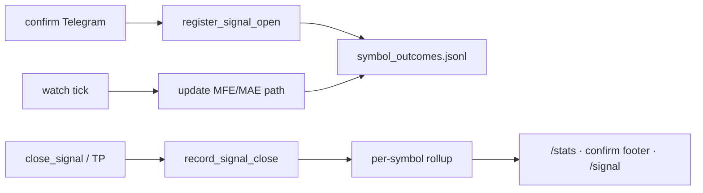

# Hunt: TG quality, signal outcomes, deep /signal

## Диагностика TG (P0 — без изменений)

| Симптом | Причина | Файлы |
|---------|---------|-------|
| `close` ×8 одинаковый payload | Слабая идемпотентность + mark после send в конце блока | [`signal_tracker.py`](hunt/hunt_watch/signal_tracker.py), [`cycle.py`](hunt/hunt_core/runtime/cycle.py) |
| `prep`/`start` ×2–4 | Два пайплайна `early` + `dump_hunt`, разные cooldown | [`cycle.py`](hunt/hunt_core/runtime/cycle.py), [`dispatch.py`](hunt/hunt_core/deliver/dispatch.py) |

**P0 fixes:** `close_notified` latch, mark-on-send, unified prep cooldown, RU-шаблоны — как в исходном плане.

---

## P1 — Уточнение по смыслу (по фидбеку)

### Что было неправильно сформулировано

«Трекинг сжатий/пре-пампов **без сигналов**» — это **не** главная цель. Имеет смысл наоборот:

> **Отслеживать реальные сигналы** (confirm TG + активные позиции в tracker): сработал ли тезис, на сколько % выросла/упала цена, вести **статистику по каждой монете** и использовать её для калибровки TP/SL и доверия к будущим сигналам.

Сжатия и пре-пампы без confirm — вторичный research-слой (`prep_shadow` остаётся offline), **не** user-facing продукт.

### Что уже есть в коде

| Источник | Что хранит | Пробел |
|----------|------------|--------|
| [`signal_tracker.py`](hunt/hunt_watch/signal_tracker.py) + `signal_history.jsonl` | close_reason, pnl_pct, mfe_pct, duration, feature_latch | Нет per-symbol rollup; n≈12 live closes |
| [`pump_history.py`](hunt/hunt_watch/pump_history.py) | `outcome_tp1/tp2/invalidate` counters per symbol | Только счётчики, без avg move % |
| [`stats_report.py`](hunt/hunt_watch/stats_report.py) | Глобальный WR, phase matrix | Не разбито по монетам в TG |
| `gate_edge_outcomes.jsonl` | hold-to-target на confirmed ticks | Offline, не привязано к live TG message_id |

### P1.1 Per-symbol Signal Outcome Registry

Новый модуль [`hunt/hunt_watch/symbol_outcomes.py`](hunt/hunt_watch/symbol_outcomes.py):

**Триггер записи:** каждый `confirmed` TG (open) и каждый `close` / `invalidate` / TP follow-up.

**Запись на один сигнал:**
```json
{
  "signal_id": "uuid",
  "symbol": "HUSDT",
  "direction": "short",
  "opened_at": "ISO",
  "closed_at": "ISO",
  "entry_mid": 0.0123,
  "exit_price": 0.0115,
  "pnl_pct": 6.5,
  "mfe_pct": 9.2,
  "mae_pct": 2.1,
  "close_reason": "tp1",
  "outcome": "win",
  "tp1_dist_pct": 5.0,
  "sl_dist_pct": 3.2,
  "lifecycle_phase_at_entry": "dump_active",
  "fuel": 72,
  "telegram_message_id": 12345
}
```

**Per-symbol rollup** (`hunt/data/symbol_outcomes.json`):
```json
{
  "HUSDT": {
    "n_signals": 8,
    "n_wins": 3,
    "n_losses": 5,
    "wr_pct": 37.5,
    "avg_pnl_pct": -1.2,
    "avg_mfe_pct": 4.8,
    "avg_mae_pct": 3.1,
    "median_hold_min": 142,
    "last_signal_at": "ISO",
    "by_direction": { "short": {...}, "long": {...} },
    "by_close_reason": { "tp1": 2, "stop_hit": 3, "lifecycle_stale": 3 }
  }
}
```

**Post-signal price path** (опционально, пока сигнал active):
- Каждый tick обновлять `peak_after_signal_pct` / `trough_after_signal_pct` в tracker state
- При close — финализировать в registry

### P1.2 Использование статистики

- **В TG confirm:** footer «История HUSDT: 3/8 win, avg +2.1% MFE» (если n≥3)
- **В `/stats`:** топ/худшие монеты по WR и avg PnL
- **В `/signal SYM`:** блок «прошлые сигналы на этой монете»
- **Калибровка:** feed в `param_store` / level_calibration — median TP1/SL distance per symbol

### P1.3 Wiring

- [`signal_tracker.py`](hunt/hunt_watch/signal_tracker.py): `register_signal_open` → `record_signal_open()`; `close_signal` → `record_signal_close()`
- [`cycle.py`](hunt/hunt_core/runtime/cycle.py): после confirm TG — link `message_id` → `signal_id`
- [`stats_report.py`](hunt/hunt_watch/stats_report.py) + [`telegram_commands.py`](hunt/hunt_watch/telegram_commands.py): per-symbol section

**Не делаем в P1:** расширенный shadow-трекинг squeeze без confirm (оставляем `prep_shadow` как internal only).



---

## P2 — Три равноправных вердикта (по фидбеку)

Не «два сценария + боковик как edge case», а **три явных исхода анализа**:

| Вердикт | Условие | Что показываем в TG |
|---------|---------|---------------------|
| **ЛОНГ** | long_score − short_score ≥ порог (0.15) AND HTF не против | Entry zone, SL, TP1/TP2, evidence bullets |
| **ШОРТ** | short_score − long_score ≥ порог AND HTF не против | То же |
| **БОКОВИК** | scores близки OR HTF конфликт OR ADX&lt;20 на 4h/1d | «Нет уверенного сигнала — рынок в боковике»; показать оба слабых сценария для справки, **без** рекомендации входа |

### Логика в [`pinned_forecast.py`](hunt/hunt_core/analysis/pinned_forecast.py)

```python
@dataclass
class PinnedVerdict:
    kind: Literal["long", "short", "sideways"]
    confidence: float  # 0..1
    long_scenario: ScenarioScore
    short_scenario: ScenarioScore
    reason: str  # human RU: почему боковик / почему выбран long
```

**Sideways triggers (любое из):**
- `abs(long.score - short.score) < 0.15`
- HTF: 1W bull + 1D bear (или наоборот) без доминанты
- ADX 4h &lt; 20 и range-bound structure
- Microstructure: funding + taker + CVD взаимно противоречат

**TG format** ([`telegram.py`](hunt/hunt_core/deliver/telegram.py) `format_pinned_deep_analysis`):

```
🔭 ГЛУБОКИЙ АНАЛИЗ · BTC-USDT
━━━━━━━━━━━━━━━━━━━━━━
📊 МТФ: 1W 🟢 | 1D 🟡 | 4H 🟢 | 15M 🔴

⚖️ ВЕРДИКТ: БОКОВИК — нет уверенного сигнала
Причина: HTF расходятся, ADX 4H=18, long 0.52 ≈ short 0.48

📈 Лонг (слабый, 0.52): entry … SL … TP1 …
📉 Шорт (слабый, 0.48): entry … SL … TP1 …
→ Вход не рекомендуется. Жди пробой зоны …

[или при long/short:]
✅ ВЕРДИКТ: ЛОНГ (уверенность 0.72)
📈 Основной сценарий: …
📉 Альтернатива (слабый шорт 0.41): …
```

### P2 остальное (без изменений по сути)

- `probe_pinned_deep`: full ccxt TF, microstructure, cross-exchange, full prepare для pinned
- `pinned_cache/{SYM}.json` в watch loop
- Fix MTF pivot keys (`pivot_point` vs `pp`)
- `/signal BTC` → deep probe, timeout 360s, split message if &gt;4096

---

## Верификация

| Фаза | Проверка |
|------|----------|
| P0 | logic_verify: closed signal → 1 TG max; no prep duplicate |
| P1 | После close → rollup обновлён; `/stats` показывает per-symbol WR |
| P2 | `/signal BTC` → один из трёх вердиктов явно в заголовке; sideways не маскируется под long |

## Порядок реализации (один PR, три фазы)

1. **P0** — TG bugs + readability
2. **P1** — symbol outcome registry (сигналы, не сжатия)
3. **P2** — deep /signal pinned с тремя вердиктами
