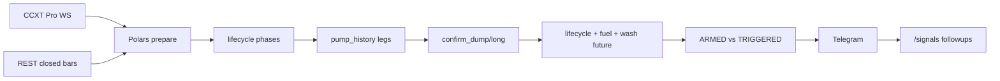
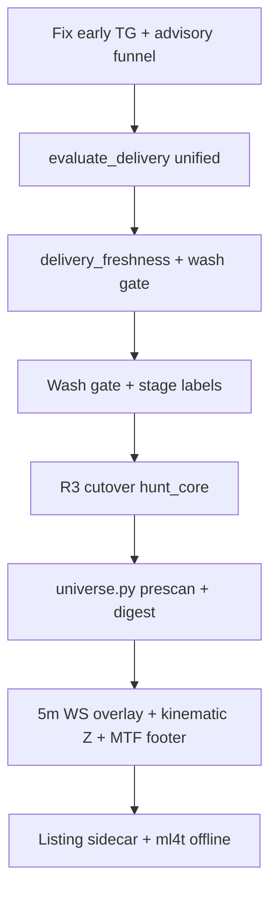

# Hunter Signal Research v2 — signal-only, human latency, deep gap vs Hunt

## 0. Product law (non-negotiable)

```text
INCLUDE:  Telegram advisory/confirm · closed-bar REST confirm · ARMED limit setup
EXCLUDE:  auto-trade · sniper · sub-second entry · Web3/Solana/wallet · LLM execution
INTERNAL: WS sub-minute / Hawkes / OBI — scoring ONLY, never sole TG trigger
```

**Human Latency Contract** (Hunt deploy):

| Tier | Min debounce | Bar rule | User action |
|------|--------------|----------|-------------|
| Advisory (watch) | ≥30s/symbol | optional WS trigger | add to watchlist, no market entry |
| Digest | 1h/3h/6h | top-N leaderboard | macro context |
| Confirm | 45m cooldown | **closed 5m or 1m REST** | manual market/limit |
| ARMED | same confirm | thesis valid, price off-zone | limit only |
| TRIGGERED | same confirm | price in zone ±0.2% | market OK |

**Blacklist — zero citations as reference, zero porting:**

- Auto-trade: freqtrade, Jesse, hummingbot, nautilus live, DeepAlpha, crypto-pump-scanner, OpenAlice, Erfaniaa, futurabot, onebitlab listing-sell, n-urs auto-buy, eliasiturri/pump-n-dump, chrisleekr grid bot
- Execution scalpers: smallfish_ router, Corax live HFT, signalflow live entry
- Web3/Solana: pump.fun, GMGN, Jito, rug bots, dump-detective, agent-z, bonding curve

- LLM firms: TradingAgents, ai-hedge-fund

### Research scope boundary (non-negotiable)

```text
IN SCOPE:   eligible external OSS (§2, §13)  ↔  Hunt (hunt/, hunt_core/, hunt_watch/)
OUT OF SCOPE: bot/ main signal bot · bot/strategies · delivery_orchestrator · config.toml [setups.*]
              — отдельный продукт; НЕ reference layer для этого research
              — пункты «port from main bot» удалены (plan v2.1 integrity fix)
```

**Цель:** улучшить/рефакторить **Hunt** по **внешним** signal-only OSS, без смешения с основным ботом.

\* pump.fun / Solana — **zero mentions** in further sections.

### Plan index

| § | Block | Depth |
|---|-------|-------|
| 0 | Product law + blacklist | Complete |
| 1 | Hunt moat + violations | Code-audited |
| 2 | 12 eligible OSS deep dives | Tier A/B/C + Borrow/Reject |
| 3 | Latency taxonomy L0–L4 | Complete |
| 4–5 | Concepts C1–C10, P1–P10 | Hunt-aligned, no auto-trade |
| 6 | ADD/FIX/CHANGE/DELETE | File-level; external refs only |
| 7 | Comparison matrix | eligible OSS vs Hunt only |
| 7b | CCXT + Polars compute plane | Hunt usage map |
| 8 | Implementation order | P0→P2 mermaid |
| 9–10 | Deliverables + sources | |
| 11 | **Universe/Discovery vs BPA** | Full flow + universe.py design |
| 12 | **Hunt delivery gaps vs external refs** | BPA/gatiella/shield |
| 13 | **Second-tier Borrow/Reject** | 12+ projects |
| 14 | **Microstructure** | microstructure.py gaps |
| 15 | **MTF confluence vs gatiella** | mtf_confluence.py |
| 16 | **Telemetry + config + verify** | Funnel + wiring fixes |
| **17** | **Hunt detectors / strategies inventory** | All paths + modules |
| **18** | **Filters & gates — full map** | Every code + threshold |
| **19** | **Fuel & raw score formulas** | cluster_fuel + triggers |
| **20** | **Lifecycle FSM** | 9 phases + transitions |
| **21** | **Shortlist vs BPA/gatiella** | score_hunt_row + prescan |
| **22** | **Parameters catalog** | env + param_store + toml |
| **23** | **External formulas → Hunt scoring gaps** | BPA, shield, volume refs |
| **24** | **Concepts ↔ Hunt formulas** | C1–C10, P1–P10 wired to code |
| **26** | **Large GitHub sample (Hunt-like)** | ~45 repos by function, not name |

---

## 1. Hunt today — strengths to preserve

Hunt already exceeds almost every eligible GitHub scanner on **delivery depth**:



**Moat (do not regress):** closed-bar confirm · lifecycle/fuel · ARMED/TRIGGERED · pump_history · logic_verify forensics · live_price before TG · CCXT Pro mux (liq/trades/book).

**Critical violations today** (audit [cycle.py](hunt/hunt_core/runtime/cycle.py), [early_alert.py](hunt/hunt_watch/early_alert.py)):

- `HUNT_EARLY_DUMP_TG=1` default → pre-confirm TG with "открывай шорт" before closed bar
- Triple path: early_alert + dump_hunt forming + confirm — not deduped
- Live confirm bypasses unified `evaluate_delivery()` (R1 incomplete)
- WS enriches **15m only**; confirm reads **5m closed** — microstructure gap on trigger bar
- [early_advisory.py](hunt/hunt_core/detect/early_advisory.py) is 14 LOC stub; migration doc falsely marks "done"

---

## 2. Eligible reference set — 12 projects (deep studied)

### Tier A — direct Hunt competitors (alert UX + pump/dump logic)

#### A1. [binance-pump-alerts](https://github.com/brianleect/binance-pump-alerts) (~153★, Dec 2024)

```
REST ticker 1s → rolling % per chartInterval × outlierInterval
→ spam filter + watchlist/blacklist → TG
Parallel: topPumpEnabled digest (1h/3h/6h top-N)
```

| Borrow | Reject |
|--------|--------|
| Multi-interval outlier matrix in one message | Raw 1s→TG as confirm path |
| Top-N hourly digest (P10) | REST-only architecture replacing WS |
| New listing auto-watch flag | % from window open without lifecycle (BEAT bugs) |
| Volume×price composite (issue #29) | Copy math without tests (issue #72) |

**Adaptation:** outlier → **candidate score** feeding watchlist prescan, debounced ≥30s, digest not spam.

#### A2. [gatiella/binance-trading-bot](https://github.com/gatiella/binance-trading-bot) (Go, Dec 2025, manual-only)

```
438 USDT pairs → filter vol≥$1M + 3% 24h → 2–10 hot coins
→ 4TF weighted score (5m/15m/1h/4h) ≥60% → TG Entry/SL/TP/RR
→ 10min cooldown per symbol
```

| Borrow | Reject |
|--------|--------|
| Hot-coin funnel before deep microstructure | Long-bias RSI 40–75 framing |
| Weighted MTF scorecard in TG footer | API keys for public data |
| Explicit 10min advisory cooldown | Win-rate marketing without outcomes |

#### A3. [VL-mwb/shield-regime](https://github.com/VL-mwb/shield-regime) (PyPI 0.1.3, May 2026)

```
OHLCV → velocity dP/dt, acceleration d²P/dt² → Z-scores
→ PumpDumpDetector: base→pump→dump (Z>2, vol>3×, dump -25% peak)
→ wash_trade_index, volume_price_divergence
```

| Borrow | Reject |
|--------|--------|
| Kinematic Z-scores on hunt leg | 40-day lookback defaults |
| Explicit pump→dump state machine | Plotly runtime dependency |
| wash_trade_index gate | GME equity demo assumptions |

**Port target:** Polars expr in [gate/pipeline.py](hunt/hunt_core/gate/pipeline.py) + JSONL `pump_stage` in [cycle.py](hunt/hunt_core/runtime/cycle.py).

#### A4. [RaySatish/Market-Surveillance-System](https://github.com/RaySatish/Market-Surveillance-System) (~15★, Apr 2026)

```
Binance aggTrade → Spark: wash (2m vol Z-score) + P&D (1m: pump bar → next dump bar)
→ Kafka → PostgreSQL → Streamlit
```

| Borrow | Reject |
|--------|--------|
| Sequential PUMP→DUMP with timeout window | Spark/Kafka/PostgreSQL stack |
| Cross-window volume Z (wash proxy) | 0.1% thresholds on majors |
| Severity tiers CRITICAL/HIGH/MEDIUM | 3-symbol demo scope |

#### A5. [ByBit-Signal-Bot](https://github.com/JusthackOne/ByBit-Signal-Bot) (~6★, Nov 2024)

Four alert types: PUMP, DUMP, OI, LIQUIDATION — per-user thresholds via Telegraf.

**Borrow:** OI/liq alert taxonomy for operator TG menu; standalone liq burst early warning.

### Tier B — modular / microstructure (research + advisory)

#### B1. [crypto-liquidity-ai-trading-bot](https://github.com/aitradingbotspro/crypto-liquidity-ai-trading-bot) (⚠️ Mar 2026, fork-farm)

Modular: data → analysis → alerts (walls, sweeps, gaps). **Caution:** execution modules in tree — **patterns only**, not merge.

**Borrow:** book vacuum / wall removal event types → extend [microstructure.py](hunt/hunt_core/features/microstructure.py).

#### B2. [tripolskypetr/volume-anomaly](https://github.com/tripolskypetr/volume-anomaly) (Mar 2026, TS)

```
aggTrade → Hawkes (0.4) + CUSUM imbalance (0.3) + BOCPD (0.3) → confidence >0.75
```

**Borrow:** CUSUM on signed taker imbalance; Hawkes intensity as **internal ignition trigger** (not TG).

**Port:** Python/Polars in `hunt_research/` first; never hot-path without closed-bar confirm.

#### B3. [ml4t/engineer](https://github.com/ml4t/engineer) (Apr 2026)

120 features: VPIN, Kyle λ, Amihud, dollar/tick bars, triple-barrier labels.

**Use:** offline calibration in [hunt_research/](hunt/hunt_research/) only — threshold research for fuel/gates.

#### B4. [hschickdevs/Telegram-Crypto-Alerts](https://github.com/hschickdevs/Telegram-Crypto-Alerts) (~103★)

Per-user `/newalert` + cooldown; optional Taapi indicators.

**Borrow:** operator command UX pattern; **reject** Taapi on hot path, MongoDB multi-user model.

### Tier C — discovery / events (sidecar, not hot path)

#### C1. [lowweihong/crypto_exchange_news_crawler](https://github.com/lowweihong/crypto_exchange_news_crawler) (~25★, PyPI 0.1.8)

12 CEX Scrapy+Playwright → normalized listing JSON.

**Borrow:** multi-exchange listing schema → **ARMED sidecar cron** (not inside [cycle.py](hunt/hunt_core/runtime/cycle.py) hot path).

#### C2. Additional eligible — now with Borrow/Reject (see §13 for full tables)

| Project | Borrow (summary) | Reject |
|---------|------------------|--------|
| abnormal-crypto-volume-alert | 60d vol z-score baseline | CoinGecko-only |
| binance-volume-alert | multi-TF vol spike TG format | instant TG |
| priceflare | WS rolling-window % | sub-second alerts |
| binance-oi-scanner | OI vs price divergence | auto-trade |
| tg-crypto-bot | listing cron 30m | merge whole bot |

---

## 3. Latency taxonomy — what Hunt may use

| Class | Examples | TG allowed? | Hunt use |
|-------|----------|-------------|----------|
| **L0 internal** | Hawkes, OBI 10s, liq burst | No | WS scoring, ignition candidate |
| **L1 advisory** | BPA outlier debounced 30s+ | Yes, capped | early_advisory watch tier |
| **L2 digest** | top-N 1h/3h/6h | Yes | hourly macro |
| **L3 confirm** | closed 5m/1m REST | Yes | confirm + tracker |
| **L4 sidecar** | listing scrape | ARMED only | external webhook ingest |

**Removed from v1:** concepts C3/C4 sub-second TG; P6 ML as live trigger; any DeepAlpha 3s scanner pattern.

---

## 4. Ten Hunt-aligned concepts (revised C1–C10)

All signal-only; sub-minute = **internal trigger only**, confirm = closed bar.

| ID | Name | Internal (L0) | Confirm (L3) | Primary ref |
|----|------|---------------|--------------|-------------|
| C1 | TradeBar Trigger | `build_ohlcvc` 15s/30s from watchTrades | REST 5m close | CCXT wiki |
| C2 | Cascade Radar | watchLiquidations rolling 1m/5m | fuel + lifecycle gate | liq alert repos |
| C3 | Flow Toxicity Gate | CUSUM/Hawkes on taker imbalance | block confirm if toxic | volume-anomaly |
| C4 | Kinematic Stage | velocity/accel Z on 5m | stage label in TG footer | shield-regime |
| C5 | Wash Suppressor | vol Z + narrow range | suppress advisory | RaySatish + shield |
| C6 | Dollar Bar Research | dollar bars offline | confirm stays time-bar | ml4t/polars-trading |
| C7 | Funding/OI Crowd Gate | extreme funding + OI spike | late-chase advisory | Hunt secondary WS |
| C8 | Cross-Venue Basis | mark spread REST/WS | context in explain | CCXT watchMarkPrices |
| C9 | Universe Prescan | fetch_tickers outlier debounced | candidate→watchlist | BPA |
| C10 | Top-N Digest | aggregate movers | scheduled TG digest | BPA topPumpEnabled |

**Spike pick (orthogonal, zero auto-trade):** C4 Kinematic + C5 Wash + C9 Prescan.

**Full code mapping:** see §24 (each concept → Hunt module + formula).

---

## 5. Pump/dump concepts P1–P10 (CEX-only, revised)

| ID | Concept | Latency | Hunt module |
|----|---------|---------|-------------|
| P1 | Vol Spike Prescan | L1 advisory | [data/universe.py](hunt/hunt_core/data/universe.py) |
| P2 | Dump Exhaustion | L3 confirm | [detect/short_dump.py](hunt/hunt_core/detect/short_dump.py) + RSI>80 decay |
| P3 | Listing Shock ARMED | L4 sidecar | webhook ingest → ARMED tier |
| P4 | Pump Stage Kinematics | L0+L3 | shield-regime port |
| P5 | Wash Trade Filter | L3 gate | [gate/pipeline.py](hunt/hunt_core/gate/pipeline.py) |
| P6 | OI Divergence Screener | L1 advisory | cross_exchange + OI refresh |
| P7 | Sector Contagion | L2 digest | watchTickers β-adjusted basket |
| P8 | Funding Overcrowd | L1 gate | secondary funding WS |
| P9 | L2 Sweep/Wall Event | L0 internal | [microstructure.py](hunt/hunt_core/features/microstructure.py) |
| P10 | Top Pump/Dump Digest | L2 | new digest scheduler |

**Removed permanently:** Web3 creator dump, Solana bundle/sniper, DeepAlpha 12-CEX auto listing, crypto-pump-scanner 3s loop.

---

## 6. Hunt gap — ADD / FIX / CHANGE / DELETE

### P0 — human latency + funnel (do first)

| Action | Source | File | Detail |
|--------|--------|------|--------|
| **FIX** Default `HUNT_EARLY_DUMP_TG=0` | Product law | [early_alert.py](hunt/hunt_watch/early_alert.py) L41 | Opt-in per watchlist only |
| **FIX** Remove "открывай шорт" pre-confirm | gatiella manual UX | early_alert.py L154–171 | "watch / wait closed-bar" copy |
| **ADD** Advisory funnel law | BPA digest | new env: `HUNT_ADVISORY_MAX_PER_HOUR`, `HUNT_ADVISORY_COOLDOWN_S≥30` | cap + digest mode |
| **FIX** Single dispatch live path | R1 | [cycle.py](hunt/hunt_core/runtime/cycle.py) ~L1310–1438 | call `evaluate_delivery(refresh_live_price=True)` only |
| **FIX** Price refresh before gate | F2 audit | cycle.py ~L1310 | `_refresh_live_price` before gate |
| **FIX** Dedupe early + dump_hunt + ignition TG | F3 | [dispatch.py](hunt/hunt_core/deliver/dispatch.py) | unified cooldown ledger |
| **ADD** Wash gate | shield-regime WTI | [gate/pipeline.py](hunt/hunt_core/gate/pipeline.py) | high vol_ratio + narrow range → suppress/downgrade |
| **ADD** Stage labels JSONL | shield + RaySatish | [cycle.py](hunt/hunt_core/runtime/cycle.py) | `pump_stage`: BASE\|PUMP\|PEAK\|DUMP\|EXhaust |
| **ADD** TG footer explain | gatiella clarity | [deliver/explain.py](hunt/hunt_core/deliver/explain.py) | stage, ws_microstructure_missing, cross age |

### P0 — Hunt delivery fixes (sourced from external refs + Hunt audit)

| Action | Source | File | Detail |
|--------|--------|------|--------|
| **WIRE** `delivery_freshness_block` on TRIGGERED | Hunt audit + gatiella late-chase UX | [delivery_freshness.py](hunt/hunt_core/gate/delivery_freshness.py) | adverse move past entry zone → ARMED/downgrade, not silent TRIGGERED |
| **ADD** Setup geometry validate before TG | gatiella Entry/SL/TP clarity | [hunt_core/contract.py](hunt/hunt_core/contract.py) via dispatch | Hunt-native contract; not imported from bot/ |
| **ADD** MTF scorecard in confirm footer | gatiella 4TF weighted | [mtf_confluence.py](hunt/hunt_core/analysis/mtf_confluence.py) + deliver | operator-readable confirm |
| **ADD** Telemetry funnel stages | BPA digest discipline | signal_events.jsonl | `prescan` \| `lifecycle` \| `fuel` \| `wash` \| `tier` \| `deliver` |

### P1 — architecture + discovery

| Action | Source | File |
|--------|--------|------|
| **CHANGE** `HUNT_CROSS_EXCHANGES` env | news-crawler multi-CEX | [cross_exchange.py](hunt/hunt_core/market/cross_exchange.py), [client.py](hunt/hunt_core/market/client.py), [streams.py](hunt/hunt_core/market/streams.py) |
| **ADD** Universe prescan queue | BPA outlier debounced | [data/universe.py](hunt/hunt_core/data/universe.py) |
| **ADD** Kinematic Z on lifecycle | shield-regime | detect/lifecycle assessor |
| **ADD** CUSUM taker imbalance | volume-anomaly | microstructure.py (internal) |
| **CHANGE** WS overlay on 5m frame | audit gap | [prepare.py](hunt/hunt_core/features/prepare.py) L619+ |
| **CHANGE** Merge ignition + BPA outlier | early_advisory | [detect/early_advisory.py](hunt/hunt_core/detect/early_advisory.py) — port from hunt_watch |
| **ADD** P10 digest scheduler | BPA topPumpEnabled | new `deliver/digest.py` or cycle background task |
| **ADD** Listing sidecar | news-crawler | cron script → ARMED webhook |

### P2 — research offline only

- VPIN/Kyle/Amihud calibration ([ml4t/engineer](https://github.com/ml4t/engineer))
- Dollar bars ([polars-trading](https://github.com/ngriffiths13/polars-trading))
- ML pump probability ([Wendy1890/crypto_pump_predictor_bot](https://github.com/Wendy1890/crypto_pump_predictor_bot)) — `hunt_research/` only, never hot-path

### R3 cutover (blocks clean architecture)

| Port from hunt_watch | To hunt_core |
|----------------------|--------------|
| `signal_engine.confirm_*` | [detect/short_dump.py](hunt/hunt_core/detect/short_dump.py) |
| `early_alert.evaluate_*` | [detect/early_advisory.py](hunt/hunt_core/detect/early_advisory.py) |
| `alert_explain.evaluate_alert_gate` | [gate/](hunt/hunt_core/gate/) |
| `deliver/telegram.py` | real port, stop re-export |
| cycle.py hunt_watch imports | zero after cutover |

Reference: [HUNT_REWRITE_MIGRATION.md](hunt/docs/HUNT_REWRITE_MIGRATION.md) R1–R3 checklist.

### DELETE

- Unused WS streams after R2 consumer audit
- `hunt_watch` duplicate detect post-R3 → `_legacy/`
- Duplicate sniper block in cycle.py L1236–1293
- Misleading `kline_5m_enabled` alias in [streams.py](hunt/hunt_core/market/streams.py) L159
- Any future auto-trade / Web3 / sub-second TG confirm paths

---

## 7. Comparison matrix (eligible external OSS vs Hunt only)

| Capability | BPA | gatiella | shield-regime | volume-anomaly | **Hunt** |
|------------|-----|----------|---------------|----------------|----------|
| Human can react | ❌ at 1s raw | ✅ 10min | ✅ batch/5m | ✅ if debounced | ⚠️ fix early_dump |
| Closed-bar confirm | ❌ | implied | 5m windows | N/A (L0 only) | ✅ **strength** |
| Cooldown/digest | top-N digest | 10min/symbol | — | — | ⚠️ 45m confirm only |
| Universe prescan | ✅ 1s all symbols | hot-coin funnel | — | — | ⚠️ 900s scan + 30s ignition |
| Pump stage labels | — | — | ✅ kinematics | changepoint | ⚠️ lifecycle only |
| Wash gate | — | — | ✅ WTI | vol Z proxy | ❌ |
| MTF scorecard in TG | — | ✅ 4TF | — | — | ⚠️ pinned only |
| Tracker/followups | — | — | — | — | ✅ JSON `/signals` |
| pump_history | — | — | — | — | ✅ unique |
| ARMED/TRIGGERED | — | — | — | — | ✅ unique |
| Lifecycle FSM | — | — | P&D states | — | ✅ 9-phase |
| Fuel / structural confirm | — | RSI/MACD/BB | — | Hawkes/CUSUM | ✅ cluster_fuel |

**Strategic position:** Hunt vs **external OSS only**. Улучшения Hunt — из BPA (digest/prescan), gatiella (MTF/cooldown), shield-regime (wash/kinematics), volume-anomaly (flow toxicity). **bot/ не участвует в сравнении.**

---

## 7b. CCXT + Polars — compute plane (eligible libs only)

### CCXT Pro (internal trigger, not TG)

| API | Hunt uses today | Concept | Latency class |
|-----|-----------------|---------|---------------|
| `watchTrades` / `ForSymbols` | ✅ mux → 15m rollups | C1 build_ohlcvc | L0 |
| `watchOrderBook` | ✅ TOB/depth | C3 toxicity, P9 walls | L0 |
| `watchLiquidations` | ✅ cascade rollups | C2 Cascade Radar | L0 |
| `watchMarkPrices` / funding | ✅ secondary WS | C7/C8 basis+funding | L0/L1 |
| `watchTickers` | REST batch each tick | C9 prescan candidate | L1 debounced |
| `build_ohlcvc` | ❌ not wired | C1 sub-minute bars | L0 only |

**Rule:** CCXT sub-minute data feeds **PrescanEngine** and **microstructure** — never sole TG confirm.

### Polars stack (research + prepare)

| Package | Hunt today | Use |
|---------|------------|-----|
| `polars` + prepare | ✅ hot path | frames, lazy groups |
| `polars_ta` | ✅ partial in prepare | RSI/ATR/ADX on confirm bars |
| `polars-ols` | dep declared | C8 sector β (P2) |
| `polars-trading` | not wired | C6 dollar bars offline |
| `ml4t/engineer` | not wired | VPIN/Kyle offline calibration |
| `quantwave` / `finasys` | not evaluated | streaming=batch parity audit (P2) |

**Spike:** benchmark `polars_ta` RSI/ATR on 22-symbol matrix vs confirm path columns actually read by `signal_engine`.

---

## 8. Implementation order



| Phase | Deliverable | Success metric |
|-------|-------------|----------------|
| **P0** | Funnel law + single dispatch + wash/stages + Hunt delivery fixes | TG advisory drops; logic_verify green |
| **P1** | R3 cutover + universe.py + cross config + microstructure 5m | cycle.py zero hunt_watch imports |
| **P2** | Listing sidecar + VPIN research + second-tier prescan patterns | JSONL calibration only |

---

## 9. Deliverables (research phase)

When user approves execution:

1. **[hunt/docs/HUNT_REFERENCE_GAP.md](hunt/docs/HUNT_REFERENCE_GAP.md)** — external OSS vs Hunt only (§6–§25)
2. **`hunt_core/data/universe.py`** — PrescanEngine + WatchlistStore + DigestScheduler
3. **`hunt_core/gate/`** — wire delivery_freshness; wash gate (shield-regime)
4. **Spike scripts** in `hunt/scripts/research/` — C4+C5+C9 JSONL proofs (no TG)
5. **Config wiring** — `config.defaults.toml` `[scanner]` loaded at bootstrap

**Not in scope:** auto-trade, Solana, freqtrade/Jesse, sub-second TG confirm.

---

## 10. Key sources (eligible only)

- [binance-pump-alerts](https://github.com/brianleect/binance-pump-alerts) · [gatiella/binance-trading-bot](https://github.com/gatiella/binance-trading-bot)
- [shield-regime](https://github.com/VL-mwb/shield-regime) · [Market-Surveillance-System](https://github.com/RaySatish/Market-Surveillance-System)
- [volume-anomaly](https://github.com/tripolskypetr/volume-anomaly) · [ml4t/engineer](https://github.com/ml4t/engineer)
- [Telegram-Crypto-Alerts](https://github.com/hschickdevs/Telegram-Crypto-Alerts) · [ByBit-Signal-Bot](https://github.com/JusthackOne/ByBit-Signal-Bot)
- [crypto-exchange-news-crawler](https://pypi.org/project/crypto-exchange-news-crawler/) · [CCXT build-ohlcv](https://github.com/ccxt/ccxt/wiki/calculate-ohlcvs-from-trades)
- Hunt: [HUNT_REWRITE_MIGRATION.md](hunt/docs/HUNT_REWRITE_MIGRATION.md) · [cycle.py](hunt/hunt_core/runtime/cycle.py) · [screener.py](hunt/hunt_watch/screener.py)

---

## 11. Hunt Universe / Discovery — deep dive vs BPA

### 11.1 Current Hunt flow (as-built)

```text
[Startup] refresh_market_regime (4h cross-section)
[Every 900s] scanner_runner.run_scan()
              → screener.rank_hunt_candidates() / score_hunt_row()
              → WRITE hunt/data/hunt_watchlist.json (top-30, score≥45)
[Every ~30s tick] client.fetch_ticker_24h() ALL USD-M
              → ignition.process_ticker_snapshots() (300s window delta)
              → optional ignition TG (IGNITION_TELEGRAM hardcoded False)
              → pump_history.record_pump_leg()
              → targets.resolve_watch_universe()
                  merge: PINNED → active ignitions → watchlist rows
                  cap: MAX_DYNAMIC_SYMBOLS=12 + pins + ignition_extra≤6
              → ws_feed.set_symbols(active) [max 24 WS streams, 1m kline]
              → run_tick(active) → snapshot_symbol() deep REST+WS per symbol
```

**Key files (all still in `hunt_watch/` — `universe.py` MISSING):**

| File | Functions | Role |
|------|-----------|------|
| [screener.py](hunt/hunt_watch/screener.py) | `score_hunt_row`, `rank_hunt_candidates`, thresholds 45/60 | 24h ticker scoring |
| [scanner_runner.py](hunt/hunt_watch/scanner_runner.py) | `run_scan` | Batch → watchlist JSON |
| [ignition.py](hunt/hunt_watch/ignition.py) | `process_ticker_snapshots`, `detect_ignitions` | Fast lane vs prev snapshot |
| [targets.py](hunt/hunt_watch/targets.py) | `resolve_watch_universe`, `PINNED_SYMBOLS` | Universe merge |
| [adaptive_thresholds.py](hunt/hunt_watch/adaptive_thresholds.py) | EWMA z-score tiers | Partial BPA outlier analog |
| [pump_history.py](hunt/hunt_watch/pump_history.py) | `score_bonus` | History → screener bonus |
| [cycle.py](hunt/hunt_core/runtime/cycle.py) L1666–1761 | orchestration | Imports hunt_watch discovery |

**Env/constants:** `SCAN_INTERVAL_S=900`, `HUNT_MIN_QUOTE_VOLUME_USD=10M`, tick `--interval 30`, `HUNT_PUMP_EXTREME_PCT=15`, `HUNT_RANGE_HOT_PCT=8`.

**Config drift:** `hunt/config.defaults.toml` `[scanner]` keys are **reference-only — not loaded**. `UniverseConfig.shortlist_limit` in domain config **unused**. `PINNED_SYMBOLS` in targets vs `settings.universe.pinned_symbols` (PAXG drift).

### 11.2 BPA prescan — what Hunt lacks

| BPA feature | Hunt today | Gap severity |
|-------------|------------|--------------|
| Multi-interval outlier matrix (1s…6h × % thresholds) | Single 24h tier + 300s ignition delta | **P1** |
| 1s all-symbol REST prescan | 30s tick + 900s scan | **P1** (acceptable if internal ≥30s debounce) |
| `topPumpEnabled` digest 1h/3h/6h | No digest scheduler | **P1** |
| `checkNewListingEnabled` | `young_listing` = confirm **veto** only | **P2** |
| watchlist/blacklist prescan filter | No blacklist | **P2** |
| `alertSkipThreshold` unified spam law | Per-path cooldowns, no hourly cap | **P0** |
| Ignition → persistent watchlist | In-memory only, lost on restart | **P2** |
| Volume×price composite | quote_volume + range/position only | **P2** |

**What Hunt has that BPA lacks:** closed-bar confirm, lifecycle FSM, pump_history, ARMED/TRIGGERED, market_regime calibration, cross-exchange intel, signal tracker.

### 11.3 Target `hunt_core/data/universe.py` design

```text
universe.py
├── PrescanEngine              # C9: rolling multi-interval % from ticker snapshots
│   ├── chart_intervals        # ("30s","1m","5m","15m","1h") — internal ≥30s poll
│   ├── outlier_thresholds     # per-interval % map (from config)
│   ├── debounce_s             # HUNT_ADVISORY_COOLDOWN_S
│   └── on_breach → PrescanCandidate (NOT instant TG)
├── WatchlistStore             # port watchlist_ops.py
├── run_universe_scan()        # port scanner_runner.run_scan
├── process_prescan_tick()     # merge ignition + prescan (replace dual path)
├── resolve_watch_universe()   # port targets.py; read settings.universe.pinned_symbols
├── DigestScheduler            # P10: top-N 1h/3h/6h → one TG message
└── ListingQueue ingest        # L4 sidecar → ARMED candidates
```

**Integration:** replace cycle.py L1666–1761 hunt_watch imports with `hunt_core.data.universe` only.

### 11.4 Universe ADD/FIX checklist

| ID | Action | Priority |
|----|--------|----------|
| U1 | Create `universe.py`; port screener/scanner/targets/ignition merge | P1 |
| U2 | Wire `config.defaults.toml` `[scanner]` → runtime settings | P1 |
| U3 | Fix pinned symbol drift (targets vs domain config) | P1 |
| U4 | Prescan debounce queue → watchlist promote (not TG) | P1 |
| U5 | Digest scheduler (`deliver/digest.py`) | P1 |
| U6 | Unified advisory funnel env vars | P0 |
| U7 | Optional `persist_ignition_to_watchlist` | P2 |
| U8 | Blacklist symbols in scanner | P2 |
| U9 | Listing sidecar cron → ARMED queue | P2 |

---

## 12. Hunt delivery gaps vs external references (NOT bot/)

| Gap in Hunt | External pattern to borrow | Hunt module |
|-------------|---------------------------|-------------|
| Pre-confirm TG spam | BPA digest + alertSkipThreshold | early_advisory + deliver/digest |
| No operator MTF clarity | gatiella 4TF score + SL/TP/RR in one message | mtf_confluence + deliver/explain |
| No wash / fake-volume gate | shield-regime WTI | gate/pipeline.py |
| No kinematic stage labels | shield-regime + Market-Surveillance | JSONL pump_stage |
| Late chase without downgrade | gatiella 10min cooldown + manual framing | delivery_freshness + delivery_tier |
| Flow toxicity not gated | volume-anomaly CUSUM/Hawkes | microstructure L0 → optional gate |
| Triple TG paths | BPA single-tier + digest | evaluate_delivery only |

**Hunt-native fixes (no bot/ import):** wire [delivery_freshness.py](hunt/hunt_core/gate/delivery_freshness.py) · validate via [hunt_core/contract.py](hunt/hunt_core/contract.py) · keep ARMED/TRIGGERED/lifecycle/pump_history.

## 13. Second-tier projects — Borrow / Reject

### Volume / prescan

| Project | Borrow | Reject | Hunt target |
|---------|--------|--------|-------------|
| [abnormal-crypto-volume-alert](https://github.com/dk4jo3/abnormal-crypto-volume-alert) | vol24h z-score vs 60d | CoinGecko-only | screener overlay |
| [binance-volume-alert](https://github.com/andylee20014/binance-volume-alert) | multi-TF vol spike format | raw TG | digest footer |
| [priceflare](https://github.com/BigFoot3/priceflare) | WS rolling % | sub-second TG | L0 internal |

### OI / liquidation

| Project | Borrow | Reject | Hunt target |
|---------|--------|--------|-------------|
| [binance-oi-scanner](https://github.com/Wendy1890/binance-oi-scanner-) | OI vs price divergence | auto-trade | P6 advisory |
| [oi-screener-bot-demo](https://github.com/shtykdanil/oi-screener-bot-demo) | OI% thresholds + anti-spam | multi-user | solo TG commands |
| [liquidation-cluster-scraper](https://github.com/leionion/liquidation-cluster-signal-scraper) | liq cluster zones | private build | C2 internal |

### Listing / news

| Project | Borrow | Reject | Hunt target |
|---------|--------|--------|-------------|
| [tg-crypto-bot](https://github.com/xifengxx/tg-crypto-bot) | 30m cron + diff poll | full merge | sidecar |
| [BinanceApis](https://github.com/cv-cat/BinanceApis) | CMS API poller | maintenance risk | Binance feed |
| [volume_pump_bot](https://github.com/Wendy1890/volume_pump_bot) | multi-CEX 24h scan | ML trigger | prescan rank |

### Research offline

| Project | Borrow | Reject | Hunt target |
|---------|--------|--------|-------------|
| [crypto_pump_predictor_bot](https://github.com/Wendy1890/crypto_pump_predictor_bot) | dedupe + features | live ML gate | hunt_research |
| [pump-and-dump-prediction](https://github.com/B0R0koko/pump-and-dump-prediction) | ranking methodology | academic live | labels |
| [quantitative-kinematics-trading](https://github.com/konvsys/quantitative-kinematics-trading) | Savitzky-Golay velocity | Pine as-is | kinematic port |

**Near-miss excluded:** alpha-scanner, chrisleekr grid, Binance-Futures-Signal-Bot auto, eliasiturri sniper.

---

## 14. Microstructure deep dive

**Current:** [microstructure.py](hunt/hunt_core/features/microstructure.py) — signed flow, TOB, microprice, depth, fuel; WS overlay on **15m only** in prepare.py.

**Port:** book vacuum (liquidity-ai), CUSUM/Hawkes L0 (volume-anomaly), VPIN offline (ml4t), wash index (shield-regime), liq burst type (ByBit-Signal-Bot).

**R2:** document `TF_EXPORT_KEYS`; trim dead WS streams; extend overlay to **5m** for confirm alignment.

---

## 15. MTF confluence vs gatiella

**Existing:** [mtf_confluence.py](hunt/hunt_core/analysis/mtf_confluence.py) — PINNED only, 1W/1D/4H/15M, ScenarioScore long/short.

**Adopt from gatiella:** hot-coin funnel (438→10), weighted MTF scorecard in confirm TG footer, 10min advisory cooldown.

**ADD:** extend mtf_confluence to watchlist symbols; `format_mtf_scorecard_footer()` in deliver/explain.

---

## 16. Telemetry, config, verification

**Telemetry funnel:** prescan → setup → lifecycle → fuel → wash → tier → deliver → followup.

**Config fixes:** load `[scanner]` from toml; `HUNT_EARLY_DUMP_TG=0` default; wire ignition_telegram from config; remove dead UniverseConfig or wire it.

**Verify on execute:** compileall, logic_verify green, clean_session_data + watch --once, delivery-path audit after gate changes.

---

## 17. Hunt detectors / strategies — complete inventory

Hunt использует **detector paths** + lifecycle (не catalog setup_id как у enterprise frameworks):

| Detector | Module | Output | TG default |
|----------|--------|--------|------------|
| **short_dump** | `signal_engine.confirm_dump` | fade / dump continuation short | ✅ wide mode |
| **long_bounce** | `signal_engine.confirm_long` | bounce / impulse / breakout long | ❌ `HUNT_LONG_TG=0` + edge_policy |
| **early_advisory** | `early_alert.py` / stub `early_advisory.py` | prep/imminent/start | ⚠️ `HUNT_EARLY_DUMP_TG=1` |
| **dump_hunt forming** | `dump_hunt_alert.py` + `dump_init_score.py` | prep/armed/likely | per watchlist flag |
| **ignition radar** | `ignition.py` | 300s ticker delta pump/dump | off |
| **screener radar** | `screener.score_hunt_row` | watchlist candidates | no TG |
| **squeeze alert** | cycle + `format_squeeze_telegram` | BB squeeze charged | 240m cooldown |
| **sniper slice** | `deliver/sniper.py` | short dump_active only | off in wide mode |
| **MTF confluence** | `mtf_confluence.py` | pinned scenario scores | `/signal` footer only |

**Router:** [detect/router.py](hunt/hunt_core/detect/router.py) → `SetupCandidate` list per tick.

**Raw scoring (blocked audit):** `collect.py` `snapshot_symbol()` builds `dump_score`/`long_score` trigger lists → fuel. **R3 priority:** port to `hunt_core/detect/scoring.py`.

### vs external detection patterns (pump/dump)

| External ref | Hunt analog today | Gap to close |
|--------------|-------------------|--------------|
| BPA outlier % multi-TF | adaptive_thresholds + ignition | no interval matrix |
| gatiella 4TF score | mtf_confluence (pinned only) | no meme-alt footer |
| shield-regime climax | rejection exhaustion hard trigger | no velocity Z |
| volume-anomaly | taker ratio + microstructure | no CUSUM/Hawkes |
| abnormal-volume 60d σ | screener 24h tier | no long baseline z |
| ByBit-Signal-Bot OI/liq types | partial in microstructure | no operator toggles |

---

## 18. Filters & gates — full map

### 18.1 Gate pipeline order ([gate/pipeline.py](hunt/hunt_core/gate/pipeline.py))

```text
edge_policy (long TG block)
  → delivery_hard_block (past TP1, bad geometry)
  → sniper_block (optional H-A)
  → evaluate_alert_gate (alert_explain stack)
  → classify_delivery_tier (ARMED/TRIGGERED)
```

### 18.2 Confirm gates ([signal_engine.py](hunt/hunt_watch/signal_engine.py))

**confirm_dump:** levels_viable · young_listing (<24×1h bars) · mtf_confirm_veto · lifecycle bias · hard triggers (5m/15m below support, rejection wick≥0.35+RSI15≥65, bear cascade, liq cascade score≤−0.30 + $25k) · fuel≥confirm_min (60) · structural≥2 OR in-zone relax · orderflow align (sell≤0.42).

**confirm_long:** symmetric + resistance chase veto (0.995/0.998) · weak accumulation fuel cap 72.

### 18.3 Alert gates ([alert_explain.py](hunt/hunt_watch/alert_explain.py)) — 20+ codes

Key thresholds: forming_min **45** · delivery min_fuel **72** · min_structural_hard **2** (1 dump continuation) · min_rr **1.15** (bounce 0.5) · tp2_room **6%** · exhaustion_short_min_fuel **78** · accumulation_long **74** · impulse pos **0.52** · OI 1h Δ **0.5%** · phase_matrix WR **<28%** (n≥12) · anomaly chg24 **8%** / range **15%**.

### 18.4 Directional filters ([directional_filters.py](hunt/hunt_watch/directional_filters.py))

ADX block **40** (soft −15/−8) · VWAP extreme **2.25 ATR** · Supertrend 1h −8 · OBV ±8 · phase softening for mid_dump/fade_prep/pump_prep.

### 18.5 MTF vetoes ([mtf_policy.py](hunt/hunt_watch/mtf_policy.py))

`mtf_post_dump_bounce_short` · 1h bull vs short (exempt fall≥15%) · funding squeeze **−0.001** · basis ±**120 bps** · volatile_chop vs long · missing closed 5m/15m bars.

### 18.6 Lifecycle gates ([lifecycle.py](hunt/hunt_watch/lifecycle.py))

`short_entry_ok` → exhaustion_at_high|distribution only · `short_confirm_ok` + dump_active · `invalidate_short` → closed 15m bullish break · premature exhaustion pos/bounce tiers.

### 18.7 Hunt filter gaps vs external reference patterns

| Pattern (external) | Hunt status | Borrow from |
|--------------------|-------------|-------------|
| Unified advisory spam cap | ❌ per-path cooldowns | BPA alertSkipThreshold |
| Multi-TF outlier in one view | ❌ single 24h tier | BPA chartIntervals |
| Wash / fake volume | ❌ | shield-regime WTI |
| Kinematic pump/dump stage | ⚠️ lifecycle only | shield-regime |
| Flow changepoint (CUSUM/Hawkes) | ❌ on hot path | volume-anomaly |
| 4TF weighted confirm footer | ⚠️ pinned only | gatiella |
| OI/liq alert taxonomy | partial | ByBit-Signal-Bot |
| 60d volume baseline z | ❌ | abnormal-crypto-volume-alert |
| Listing prescan promote | ❌ veto only | news-crawler + BPA listing watch |

**Hunt-internal (audit, not external port):** confirm 60 vs delivery 72 fuel ladder · delivery_freshness unwired · min_rr 1.15 in param_store.

---

## 19. Fuel & raw score formulas

### 19.1 cluster_fuel ([signal_engine.py:129–149](hunt/hunt_watch/signal_engine.py))

```text
triggers → clusters: exhaustion | structure | flow | micro
per-trigger weight: support break 28 · close break 22 · div 18 · wick 16 · default 12
each cluster CAP = 28
fuel = sum(clusters)
fuel = min(100, max(fuel, raw_score × 0.55))
```

### 19.2 Raw dump_score triggers (from ARCHITECTURE + collect.py)

| Trigger | Points |
|---------|--------|
| rsi15≥72 / rsi1h≥72 | +12 / +10 |
| bear div 4h/1h | +15 / +12 |
| rejection wick 1m/5m/15m | +16 / +14 / +10 |
| **5m below support** | **+28** |
| taker sell <0.98 | +10 |
| oi flush | +10 |
| microprice sell | +8 |
| regime 4h bear | +8 |
| funding >0.05% | +6 |
| bot_short hits | +6 each max 18 |
| + directional_filters delta | variable |

Long symmetric (RSI oversold, bull div, bounce wicks, broke resistance, taker buy, oi build).

### 19.3 microstructure bias ([microstructure.py](hunt/hunt_core/features/microstructure.py))

Weighted: funding 0.18 · L/S 0.15 · taker 0.18 · OI 0.16 · book 0.12 · microprice 0.07 · spread 0.06 · basis 0.07 · liq 0.08 → `bias_score` ∈ [−1,1], label at ±0.35.

### 19.4 dump_init_score ([dump_init_score.py](hunt/hunt_watch/dump_init_score.py))

Verdict tiers: LIKELY ≥85+trigger+2 setup · ARMED ≥70 · WATCH ≥50.

### 19.5 Known inconsistency (FIX P0)

| Layer | Threshold |
|-------|-----------|
| confirm_min_score (engine) | **60** |
| delivery min_fuel (alert_explain) | **72** |
| forming_min | **45** |

Document two-tier intent OR align to single ladder.

---

## 20. Lifecycle FSM — 9 phases

```text
exhaustion_at_high → distribution → dump_active → post_dump_bounce
  → recovery → accumulation → breakout_arming → impulse_initiating → no_setup
```

| Phase | Bias | short_entry_ok | short_confirm_ok |
|-------|------|----------------|------------------|
| exhaustion_at_high, distribution | short | ✅ | ✅ |
| dump_active | wait | ❌ monitor | ✅ |
| post_dump_bounce … impulse | long | ❌ | ❌ |

**Key thresholds** (`lifecycle_thresholds` / param_store): meaningful_dump **8%** · parabolic leg **20%** · mega **80%** · near_high pos **0.82** · post_dump_bounce pos **0.55** · bounce_min max(5%, 1.5×ATR1h%) · rsi_1h_ob **65** · taker buy **1.05** / sell **0.98** · cascade wick **0.25**.

**Sticky debounce** ([lifecycle_sticky.py](hunt/hunt_watch/lifecycle_sticky.py)): same bucket 2 ticks · cross-bucket 3 · long_leg→dump 4 (1 if fall≥15%).

**Setup phase labels:** confirmed → initiating → imminent → forming → watch → no_yet (fuel thresholds 25/45/60).

**vs shield-regime:** Hunt lifecycle = operator permission; shield kinematics = regulatory labels — **complement, not replace**.

---

## 21. Shortlist / screener vs BPA + gatiella

### 21.1 Hunt `score_hunt_row` ([screener.py](hunt/hunt_watch/screener.py))

**Gate:** quote_volume ≥ **$10M** · emit if score ≥ **25** · watchlist if ≥ **45** · priority **60**.

| Component | Formula |
|-----------|---------|
| Extreme 24h move | +30 (z-tier or ≥15%) |
| Hot move | +18 (≥8%) |
| Range expansion | +20 if range≥25% |
| Position | +15 pos≥0.85 short bias; +12 pos≤0.25 |
| Volume score | min(log10(qvol)−7, 2)/2 × 10 |
| Liquid mover | +8 if move≥25% & qvol≥$50M |
| Dump in progress | +15 range≥18%, pos≤0.45, chg≤−5% |
| pump_history bonus | `score_bonus()` |
| Cap | min(max(score,0), 100) |

**Watch bias:** pos≥0.85→short · pos≤0.25 + red→long · |chg|≥15% by sign · else both.

**Cadence:** scan **900s** · tick **30s** · max dynamic **12** + pins + ignition_extra **6** · WS cap **24**.

### 21.2 External prescan patterns vs Hunt screener

| Pattern | BPA | gatiella | Hunt today |
|---------|-----|----------|------------|
| All-symbol scan | ✅ REST 1s | 438→filter | 30s tick + 900s scan |
| Volume floor | implicit liquid | ≥$1M hot | **$10M** screener |
| Outlier / move tiers | multi-interval % | 3% 24h + score≥60% | +30/+18 score tiers |
| Hot-coin funnel | watchlist | 2–10 coins | top-30 watchlist |
| Digest vs spam | top-N 1h/3h/6h | 10min cooldown | ❌ digest |
| Listing watch | checkNewListing | — | young_listing veto only |

### 21.3 Shortlist ADD/FIX (external-sourced)

| Action | Source | Detail |
|--------|--------|--------|
| **ADD** | BPA | PrescanEngine outlier matrix → watchlist queue (debounced) |
| **ADD** | BPA | topPumpEnabled digest scheduler |
| **ADD** | gatiella | Hot-coin funnel before deep snapshot (vol+move pre-filter) |
| **ADD** | gatiella | 10min advisory cooldown per symbol |
| **ADD** | BPA | listing auto-watch → promote (not only veto) |
| **FIX** | Hunt | Wire `config.defaults.toml` `[scanner]` thresholds |

---

## 22. Parameters catalog

### 22.1 Environment (runtime)

| Env | Default | Effect |
|-----|---------|--------|
| `HUNT_WIDE_MODE` | 1 | wide hunter; sniper off |
| `HUNT_LONG_TG` | 0 | block long confirm TG |
| `HUNT_EARLY_DUMP_TG` | **1** → fix **0** | pre-confirm spam |
| `HUNT_SNIPER_*` | top_ls 2.0, chase 0.002 | H-A slice |
| `HUNT_ENTRY_CHASE_TOL` | 0.002 | entry zone |
| `HUNT_MAX_TP1_PROGRESS` | 0.25 | demote TRIGGERED |
| `COOLDOWN_MINUTES` | 45 | confirm cooldown |
| `SCAN_INTERVAL_S` | 900 | screener |
| tick `--interval` | 30 | REST poll |

### 22.2 param_store UNIVERSAL_DEFAULTS ([param_store.py](hunt/hunt_watch/param_store.py))

Gates: confirm **60**/68 · forming **45** · ADX block **40** · min_rr **1.15**.

Delivery: min_fuel **72** · min_structural **2** · exhaustion_short **78** · accumulation_long **74** · impulse_pos **0.52** · OI **0.5%** · orderflow **0.58/0.42** · liq score **0.30** / $25k · phase_matrix n=12 WR<28% · basis ±120 bps.

Lifecycle: meaningful_dump 8% · parabolic 20% · mega 80% · near_high 0.82 · bounce pos 0.55.

### 22.3 config.defaults.toml ([hunt/config.defaults.toml](hunt/config.defaults.toml)) — **NOT LOADED**

Reference values for scanner, confirm.short, levels.adaptive SL caps (8/11/14%), premature_exhaustion, pinned symbols. **P1: wire at bootstrap.**

### 22.4 Ignition constants ([settings.py](hunt/hunt_core/runtime/settings.py))

Window **300s** · delta **2.5%** · vol delta **$250k** · qvol **$3M** · TTL **7200s**.

---

## 23. External detection formulas → Hunt scoring gaps

### BPA outlier prescan
**External:** rolling % per chartInterval × outlierThreshold.  
**Hunt gap:** only 24h tier + 300s ignition delta.  
**Port:** PrescanEngine interval map → `score_hunt_row` bonus, not TG.

### gatiella 4TF weighted score
**External:** weighted bull/bear across 5m/15m/1h/4h ≥60%.  
**Hunt gap:** mtf_confluence PINNED only.  
**Port:** `format_mtf_scorecard_footer()` on confirm for watchlist symbols.

### shield-regime kinematics + wash
**External:** velocity Z>2, vol>3×, dump -25%; wash_trade_index.  
**Hunt gap:** lifecycle phases without kinematic labels; no wash gate.  
**Port:** Polars expr in gate/pipeline + JSONL `pump_stage`.

### volume-anomaly flow
**External:** 0.4 Hawkes + 0.3 CUSUM + 0.3 BOCPD >0.75.  
**Hunt gap:** taker ratio static thresholds only.  
**Port:** CUSUM on signed imbalance in microstructure (L0); optional confirm gate.

### abnormal-volume 60d baseline
**External:** (vol24h - mean60d) / σ60d.  
**Hunt gap:** no long-horizon vol z in screener.  
**Port:** screener overlay column.

### ByBit-Signal-Bot OI/liq taxonomy
**External:** per-type alerts with user thresholds.  
**Hunt gap:** liq in fuel triggers but no standalone advisory tier.  
**Port:** operator TG menu toggles (optional L1).

## 24. Concepts C1–C10 / P1–P10 ↔ Hunt code targets

| Concept | Hunt module to change | Formula / param |
|---------|----------------------|-----------------|
| C1 TradeBar Trigger | `market/streams.py` + `detect/scoring.py` | build_ohlcvc 15s/30s L0 |
| C2 Cascade Radar | `microstructure.py` | liq rollups, score≤−0.30 |
| C3 Flow Toxicity | `microstructure.py` + gate | CUSUM taker; block if toxic |
| C4 Kinematic Stage | `lifecycle.py` or gate | velocity Z from shield-regime |
| C5 Wash Suppressor | `gate/pipeline.py` | vol Z + narrow range WTI |
| C6 Dollar Bar | `hunt_research/` | offline ml4t |
| C7 Funding/OI Gate | `mtf_policy.py` | funding ±0.001, OI 0.5% |
| C8 Cross-Venue Basis | `cross_exchange.py` | basis ±120 bps existing |
| C9 Universe Prescan | `data/universe.py` NEW | score_hunt_row + outlier matrix |
| C10 Top-N Digest | `deliver/digest.py` NEW | rank by \|chg_24h\| |
| P1 Vol Spike Prescan | screener + PrescanEngine | +30 extreme tier |
| P2 Dump Exhaustion | confirm_dump + fuel | RSI15≥65 + vol decay |
| P3 Listing ARMED | sidecar + young_listing flip | bars_1h≥24 promote |
| P4 Pump Kinematics | JSONL pump_stage | shield-regime port |
| P5 Wash Filter | gate before alert_gate | WTI formula |
| P6 OI Divergence | cross_exchange + dump_init | OI Δ vs price |
| P7 Sector Contagion | prescan digest | β basket watchTickers |
| P8 Funding Overcrowd | mtf_policy + advisory | extreme funding |
| P9 L2 Sweep | microstructure events | liquidity-ai pattern |
| P10 Digest | DigestScheduler | BPA topPumpEnabled |

---

## 25. Strategies/filters — ADD/FIX/CHANGE (plan supplement)

### P0

- Align confirm **60** vs delivery **72** or document ladder
- Port `collect.py` scoring → `detect/scoring.py` (auditable triggers)
- Wire delivery_freshness on TRIGGERED; Hunt contract validate via hunt_core/contract.py
- FIX `HUNT_EARLY_DUMP_TG=0`; dedupe 3 TG paths

### P1

- BPA prescan matrix + digest; gatiella MTF footer; shield wash+kinematics
- volume-anomaly CUSUM internal; abnormal-volume screener overlay
- MTF scorecard footer for meme alts
- Load config.defaults.toml

### P2

- BPA-style prescan queue + gatiella hot-coin funnel
- phase_matrix calibration UI
- VPIN/dollar bars offline

---

## 26. Large GitHub sample — Hunt-functional similarity (NOT by name)

### 26.1 Search methodology

**Не искали:** «hunter», «охотник», имя продукта.

**Искали по функциональному профилю Hunt:**

```text
CEX USDT-M / USDT perp · Telegram alerts · pump OR dump OR vol-spike OR exhaustion
· manual/signal path · Python · (optional) CCXT, WS, multi-TF, OI, liq, wash, digest
```

**Queries used:** `binance pump dump telegram futures`, `volume spike scanner telegram`, `dump exhaustion fade signal`, `pump detector USDT perpetual python`, `liquidation alert telegram`, `market manipulation detector wash trading`, `CCXT pump alert multi-exchange`.

**Eligibility (same as §0):** signal-only eligible · **exclude** auto-trade primary · Web3/Solana DEX wash scanners · sniper/copy-trade.

**Sample size:** **45 repos** screened → **28 eligible** (Tier A+B) · **10 patterns-only** (Tier C) · **7 excluded** (Tier X).

### 26.2 Hunt functional fingerprint (comparison axes)

| Axis | Hunt has | What refs teach |
|------|----------|-----------------|
| Discovery | 900s screener + 30s ignition | BPA 1s outlier, gatiella hot-coin funnel, pwatch quality filters |
| Dump/fade thesis | lifecycle + fuel + confirm_dump | RSI>80 exhaustion (scanner README), Burry-style 4/5 signals |
| Confirm bar | closed 5m/1m REST | Most refs = instant % (we debounce) |
| Delivery | ARMED/TRIGGERED + tracker | gatiella Entry/SL/TP; BPA digest not spam |
| Microstructure | WS liq/trades/book | opencrypto 9-check; MSS wash Z |
| Reg labels | lifecycle phases | shield-regime kinematics + WTI |
| Multi-CEX | bybit/okx/bitget intel | Wendy1890, pwatch, price_pump_bot |

### 26.3 Tier A — eligible, high Hunt similarity (deep study candidates)

| # | Repo | ★ | Architecture (short) | Hunt overlap | Borrow |
|---|------|---|----------------------|--------------|--------|
| A1 | [brianleect/binance-pump-alerts](https://github.com/brianleect/binance-pump-alerts) | ~153 | REST 1s → outlier matrix → TG + top-N digest | prescan, digest, watchlist | matrix, digest, listing watch |
| A2 | [ogu83/binancePump](https://github.com/ogu83/binancePump) | ~56 | WS trades → aggregate vol/price anomaly → TG | ignition-like internal | trade aggregation before TG |
| A3 | [gatiella/binance-trading-bot](https://github.com/gatiella/binance-trading-bot) | ~1 | 438→10 hot coins → 4TF score → TG Entry/SL/TP | MTF confirm footer, cooldown | funnel, scorecard, 10min cooldown |
| A4 | [hschickdevs/Telegram-Crypto-Alerts](https://github.com/hschickdevs/Telegram-Crypto-Alerts) | ~103 | user rules + cooldown → TG | operator UX | /newalert pattern |
| A5 | [JusthackOne/ByBit-Signal-Bot](https://github.com/JusthackOne/ByBit-Signal-Bot) | ~6 | PUMP/DUMP/OI/LIQ types → TG | advisory taxonomy | OI/liq alert types |
| A6 | [andylee20014/binance-volume-alert](https://github.com/andylee20014/binance-volume-alert) | small | multi-TF vol×price thresholds → TG | screener multi-TF | 5m/15m/1h/4h/1d tiers |
| A7 | [Xeron2000/pwatch](https://github.com/Xeron2000/pwatch) | ~18 | multi-CEX WS, velocity + vol spike, quality filters | prescan quality | min OI, listing age, vol filters |
| A8 | [moo-22/opencrypto](https://github.com/moo-22/opencrypto) | new | OHLCV + 9 manipulation checks → optional TG | wash, P&D, OBI, liq cascade | shield_guard formulas |
| A9 | [RaySatish/Market-Surveillance-System](https://github.com/RaySatish/Market-Surveillance-System) | ~3 | Spark: wash vol Z + PUMP→DUMP windows | stage + wash | sequential P&D, vol Z |
| A10 | [VL-mwb/shield-regime](https://github.com/VL-mwb/shield-regime) | ~2 | velocity/accel Z, WTI, P&D FSM | kinematics gate | WTI, stage machine |
| A11 | [dk4jo3/abnormal-crypto-volume-alert](https://github.com/dk4jo3/abnormal-crypto-volume-alert) | ~36 | 24h vol vs 60d σ → dashboard | baseline anomaly | z-score overlay |
| A12 | [2perday/binance-liquidation-telegram](https://github.com/2perday/binance-liquidation-telegram) | ~4 | !forceOrder@arr threshold → TG | cascade radar | liq burst advisory |
| A13 | [dansus021/byebyefunds](https://github.com/dansus021/byebyefunds) | ~1 | Binance+Bybit liq categories → TG | liq tier labels | whale/mega formatting |
| A14 | [Wendy1890/price_pump_bot](https://github.com/Wendy1890/price_pump_bot) | 0 | multi-CEX 24h price≥30% → TG hourly | cross-venue prescan | best-exchange dedupe |
| A15 | [Wendy1890/volume_pump_bot](https://github.com/Wendy1890/volume_pump_bot) | 0 | multi-CEX vol +500% → TG | vol anomaly prescan | 24h vol delta pattern |
| A16 | [Wendy1890/binance-oi-scanner](https://github.com/Wendy1890/binance-oi-scanner-) | 0 | OI vs price divergence | P6 OI gate | divergence screener |
| A17 | [tripolskypetr/volume-anomaly](https://github.com/tripolskypetr/volume-anomaly) | ~4 | Hawkes+CUSUM+BOCPD on trades | L0 flow toxicity | CUSUM port |
| A18 | [davccavalcante/kucoin-pumpdump-alerts](https://github.com/davccavalcante/kucoin-pumpdump-crypto-alerts-telegram-bot) | ~3 | KuCoin RSI/MACD → TG | indicator alert bot | multi-indicator template |

### 26.4 Tier B — eligible, partial similarity

| # | Repo | ★ | Why partial | Still borrow |
|---|------|---|-------------|--------------|
| B1 | [yebyeb/crypto_ta](https://github.com/yebyeb/crypto_ta) | ~3 | 4h/1D TA + pump/dump flags; immature | candle pattern + P&D labels |
| B2 | [SokinjoNS/CEX_volume_tracker_B](https://github.com/SokinjoNS/CEX_volume_tracker_B) | small | simple vol mean threshold | tiered vol alert levels |
| B3 | [codertjay/CryptoPricePumpBot](https://github.com/codertjay/CryptoPricePumpBot) | ~1 | generic CCXT % threshold | minimal prescan |
| B4 | [MarcinDudekDev/crypto-signals-mcp](https://github.com/MarcinDudekDev/crypto-signals-mcp) | new | vol/mcap anomaly API | CRITICAL tier pattern |
| B5 | [Eptelligence/Candlestick-Signal-Bot](https://github.com/Eptelligence/Candlestick-Signal-Bot) | low | 4H/1D patterns, claims not trading | pattern scan architecture |
| B6 | [BigFoot3/priceflare](https://github.com/BigFoot3/priceflare) | 0 | WS rolling % | L0 internal trigger |
| B7 | [xifengxx/tg-crypto-bot](https://github.com/xifengxx/tg-crypto-bot) | small | listing cron 30m | listing sidecar |
| B8 | [cv-cat/BinanceApis](https://github.com/cv-cat/BinanceApis) | small | Binance CMS listing poller | listing feed |
| B9 | [shtykdanil/oi-screener-bot-demo](https://github.com/shtykdanil/oi-screener-bot-demo) | demo | OI% thresholds + anti-spam | solo operator OI menu |
| B10 | [viren-wadehra/CryptoSentimentAnalysis](https://github.com/viren-wadehra/CryptoSentimentAnalysis) | 0 | wash heuristics + social | wash research offline |
| B11 | [TradeAIcode/SignalEdge-Spike](https://github.com/TradeAIcode/SignalEdge-Spike) | ~1 | EMA+vol spike GUI | spike detection params |
| B12 | [rizesky/trading_signal_bot](https://github.com/rizesky/trading_signal_bot) | small | MTF signals + cooldown; heavy filters | MTF cooldown matrix |
| B13 | [mathiasfc/crypto-alert](https://github.com/mathiasfc/crypto-alert) | stale | minimal % bot | reference only |
| B14 | [andylee20014/binance-volume-alert](https://github.com/andylee20014/binance-volume-alert) | — | (also A6) | — |
| B15 | [xiaoshulittletree/binanceliquidationlistener](https://github.com/xiaoshulittletree/binanceliquidationlistener) | small | CSV liq log only, no TG | liq aggregation research |

### 26.5 Tier C — detection patterns ONLY (repo has auto-trade; do NOT merge)

| Repo | Why excluded as product | Formulas worth studying |
|------|-------------------------|-------------------------|
| [stefanoviana/crypto-pump-scanner](https://github.com/stefanoviana/crypto-pump-scanner) | 3s auto-trade + circuit breaker | vol 5x, RSI, buy ratio, dump RSI>80 |
| [stefanoviana/deepalpha](https://github.com/stefanoviana/deepalpha) | full auto-trade stack | multi-CEX listing module, exhaustion module |
| [lalomorales22/python-claude-trader](https://github.com/lalomorales22/python-claude-trader) | Burry/Penguin auto strategies | RSI>80+ADX<30 exhaustion checklist |
| [Erfaniaa/binance-futures-trading-bot](https://github.com/Erfaniaa/binance-futures-trading-bot) | auto multi-strategy (~398★) | indicator pickle pattern only |
| [mixma5ter/binance_trading_bot](https://github.com/mixma5ter/binance_trading_bot) | RSI auto-trade | RSI region alerts |
| [pkdoddamani/binance-futures-bot](https://github.com/pkdoddamani/binance-futures-bot) | live execution | — |
| [Whit1985/Binance-Futures-Signal-Bot](https://github.com/Whit1985/Binance-Futures-Signal-Bot) | auto execution + leverage | strategy config shape |
| [shivpatel-dev/binance-futures-bot](https://github.com/shivpatel-dev/binance-futures-bot) | TG parser → auto orders | — |
| [amirphl/Telegram-Trading-Bot](https://github.com/amirphl/Telegram-Trading-Bot) | copy-trade execution | signal extraction ideas |
| [Rantoniaina/copy-trade-telegram](https://github.com/Rantoniaina/copy-trade-telegram) | copy-trade | — |

### 26.6 Tier X — hard exclude (not Hunt-like product)

| Repo | Reason |
|------|--------|
| [eliasiturri/pump-n-dump](https://github.com/eliasiturri/pump-n-dump) | sniper buy, sub-second, Telegram pump groups |
| [Yog-Sotho/Wash-Trade-Scanner](https://github.com/Yog-Sotho/Wash-Trade-Scanner) | Web3 DEX on-chain |
| [Arash-Mansourpour/ultimate-crypto-trading-bot](https://github.com/Arash-Mansourpour/ultimate-crypto-trading-bot) | AI SaaS + auto |
| freqtrade / Jesse / hummingbot | auto-trade frameworks |

### 26.7 Cross-sample: what Hunt has that almost NO ref has

1. **Closed-bar confirm** on REST 5m/1m (refs = instant %)
2. **Lifecycle FSM** 9 phases + sticky debounce
3. **ARMED vs TRIGGERED** delivery tiers
4. **pump_history** per-symbol leg memory
5. **cluster_fuel** with structural hard triggers
6. **Signal tracker** + followups (`/signals`)
7. **logic_verify** forensics (BEAT/PLAY/WLD)

### 26.8 Cross-sample: what refs have that Hunt lacks (prioritized)

| Priority | Pattern | Best refs | Hunt target |
|----------|---------|-----------|-------------|
| P0 | Advisory digest vs spam | A1 BPA | deliver/digest.py |
| P0 | Multi-interval outlier matrix | A1, A6 | PrescanEngine |
| P0 | Wash / manipulation gate | A8, A9, A10 | gate/pipeline.py |
| P1 | Hot-coin funnel 438→10 | A3 gatiella | universe.py |
| P1 | 4TF scorecard in TG | A3 | mtf_confluence footer |
| P1 | Multi-CEX quality prescan | A7 pwatch, A14-A15 | cross_exchange + screener |
| P1 | Liq burst advisory tier | A12-A13, A5 | microstructure / advisory |
| P1 | OI divergence screener | A16, B9 | P6 advisory |
| P2 | CUSUM/Hawkes flow | A17 | microstructure L0 |
| P2 | Listing sidecar | B7, B8 | ARMED webhook |
| P2 | 60d vol baseline z | A11 | screener overlay |

### 26.9 Recommended deep-dive order (external OSS only)

```text
1. A1 binance-pump-alerts     — prescan + digest UX
2. A3 gatiella                — MTF manual setup message
3. A10 shield-regime          — wash + kinematics formulas
4. A8 opencrypto              — manipulation check list
5. A9 Market-Surveillance     — PUMP→DUMP sequential
6. A7 pwatch                  — universe quality filters
7. A17 volume-anomaly         — flow changepoint math
8. A6 binance-volume-alert    — multi-TF vol tiers
```

### 26.10 Tier A deep notes (implementation sketches)

**A1 binance-pump-alerts:** `pumpAlerts.py` loop — `fetch_all_tickers` → rolling arrays per `chartIntervals` → compare to `outlierIntervals` → optional `topPumpEnabled` aggregate. **Hunt port:** PrescanEngine not TG at 1s.

**A3 gatiella:** Go binary — filter `vol≥$1M`, `change≥3%`, score 4 TFs, `≥60%` → single TG with levels. **Hunt port:** footer format + cooldown, not long-bias framing.

**A8 opencrypto:** `ShieldGuard.detect_manipulation(df)` — 9 checks including wash 4σ, P&D pattern, taker imbalance, liq cascade, OBI. **Hunt port:** wash + P&D labels to gate; optional telegram plugin pattern.

**A7 pwatch:** YAML config — `autoModeMinQuoteVolume24h`, `MinOpenInterestUsd`, `MinListingAgeDays`, `MaxRecentVolatilityPct` — quality funnel before alerting. **Hunt port:** screener hard gates beyond $10M qvol.

---

## 27. Plan integrity note (v2.1)

- **Removed:** all `bot/` main signal bot as reference layer (§12 rewritten, §7 matrix cleaned, §23 replaced).
- **Added:** §26 large external sample (45 repos) by **functional similarity** to Hunt.
- **Scope:** external eligible OSS ↔ Hunt improvements only.
