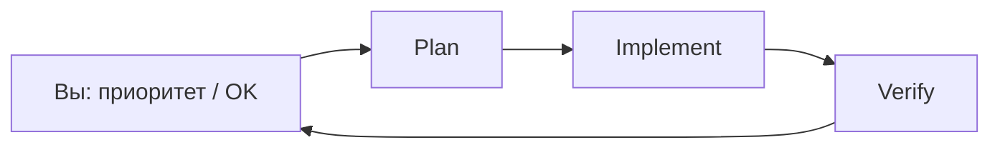

# Solo operator playbook (1 человек + Cursor + Claude)

> Вы задаёте **направление и acceptance**. Все команды, config, proxy, тесты, терминалы — **только агент**.

## Модель работы

| Фаза | Кто | Инструмент |
|------|-----|------------|
| Explore + Plan | Cursor Plan mode или `/plan-task` | Без правок кода |
| Implement | Cursor Agent или Claude Code | Код + hooks |
| Verify | subagent `verifier` или `/verify` | compileall, wave pytest, live |
| Live ops | subagent `live-ops` или `/supervised-6h` | 6h + calibration |

## Старт сессии (агент делает сам)

1. `/prime-context` (Cursor) или открыть Claude в корне репо
2. Проверить `.venv` Python 3.14, `config.toml` из example
3. Прочитать `docs/PROJECT_ROADMAP_AND_STATUS.md` — P0–P4
4. `graphify query "…"` если есть `graphify-out/graph.json` (см. [GRAPHIFY_SETUP.md](GRAPHIFY_SETUP.md))
5. Если graphify не установлен: `make graphify-install` (агент выполняет сам)

## Типовые запросы (копируйте в чат)

| Цель | Промпт |
|------|--------|
| Новая фича | «P0: включи weighted confluence после разбора telemetry run X — plan, потом implement, verifier в конце» |
| Баг | «/fix-and-verify: [симптом]. Не ослабляй delivery gates» |
| Live | «/supervised-6h, потом /calibrate-run для run_id» |
| Live (macOS, фон) | `./scripts/live_supervised_session_mac.sh --hours 2` — экран может блокироваться, процесс не спит |
| Рефактор | «/de-bloat memory.py — один модуль, потом verifier» |
| Конец дня | «/handoff — обнови статус в roadmap, что осталось» |

## Cursor vs Claude Code

| Задача | Предпочтительно |
|--------|-----------------|
| Большие multi-file рефакторы | Cursor Agent + subagents |
| Длинный live 6h | Cursor `/supervised-6h` (терминалы, Await) |
| Быстрый CLI, hooks, `/hooks` | Claude Code |
| Delivery audit | subagent `delivery-guardian` (readonly) |

Оба читают: `CLAUDE.md`, `.cursor/rules/`, skills, hooks.

## Контекст (не раздувать)

- **Always-on rules:** только guardrails + sole executor + solo workflow (~3 файла)
- **Agent-decided:** architecture, graphify, strategies, delivery, features
- **Skills:** подгружаются по задаче (live verify, calibration, triage)
- **Длинные docs:** `docs/research/*` — по ссылке из промпта, не в каждый чат

## Инварианты (hooks + rules)

- Delivery: `contract → hard_confluence_gate → deliver`
- No auto-trading, no private Binance
- `clean_session_data` перед live/smoke
- Не коммитить: `.env`, `config.toml`, `data/`

## Когда Plan обязателен

- F12 de-bloat, pipeline/memory split
- Изменения delivery / confluence
- Любая задача >3 файлов или неясный scope

Мелкий фикс (1 файл, очевидный diff) — сразу Agent + `/verify`.

## Параллель (опционально)

Один человек может запустить **2–3 subagents** параллельно только если задачи независимы:

- `verifier` + `delivery-guardian` (readonly) после PR-волны
- Не параллелить два live-run на одном `config.toml`

## Ссылки

- [CURSOR_CLAUDE_DEV_SETUP.md](CURSOR_CLAUDE_DEV_SETUP.md)
- [CURSOR_SETUP.md](CURSOR_SETUP.md)
- [PROJECT_ROADMAP_AND_STATUS.md](PROJECT_ROADMAP_AND_STATUS.md)
