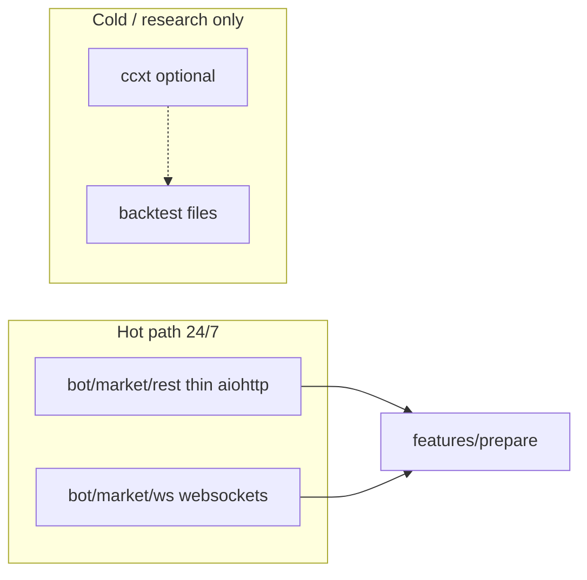

> **Production stack (2026-06):** `aiohttp` + `websockets` in `bot/market/` — **not** CCXT, python-binance, or TA-Lib on the live path.

Решение для **public-only** USD-M signal bot (без ключей, без торговли).

## 1. Варианты

| Вариант | Описание |
|---------|----------|
| **A. Thin aiohttp** (текущий `BinanceClientImpl`) | Прямые URL `fapi.binance.com` + WS routes; registry public paths |
| **B. CCXT / CCXT Pro** | Унифицированный exchange API + optional WS |
| **C. Official `python-binance` / binance-connector** | Официальные обёртки Binance |
| **D. Binance «market data only» hosts** | Spot: `data-api.binance.vision` ([docs](https://developers.binance.com/docs/binance-spot-api-docs/faqs/market_data_only)); futures — по-прежнему `fapi` |

## 2. Требования нашего data plane

| Требование | Почему generic SDK часто не хватает |
|------------|-------------------------------------|
| `/fapi/v1/*` + `/futures/data/*` | OI hist, L/S, taker — отдельный IP budget 1000/5min |
| WS `/public` vs `/market` routing | `!bookTicker`, `!forceOrder@arr`, `@depth@500ms` |
| `TRADIFI_PERPETUAL` (XAU, XAG) | Специфика exchangeInfo |
| PUBLIC_PATH guard | Блок private endpoints на уровне кода |
| Weight tracking 2400/min | Per-endpoint weights в registry |
| Polars klines | Прямой parse без лишних dict layers |

## 3. Сравнение

| Критерий | A Thin aiohttp | B CCXT Pro | C Official python-binance |
|----------|----------------|------------|---------------------------|
| Public без ключей | Да | Да ([keyless](https://www.coingecko.com/learn/best-free-crypto-api)) | Да, но SDK тянет trading surface |
| USD-M futures streams | Полный контроль URL | Абстракция; lag новых stream types | Не всегда актуален под WS v2 |
| `/futures/data` batch | Явный scheduler | `fetch_*` может отличаться | Частично |
| Guard «no orders» | `_ALLOWED_PUBLIC_REST_PATHS` | Легко вызвать `create_order` по ошибке | То же |
| Зависимость | aiohttp (уже есть) | ccxt + pro опционально | binance-connector |
| Соответствие AGENTS.md | **Да** | **Не на hot path** ([REFACTOR](../REFACTOR_PLAN.md)) | **Не рекомендуется** |

## 4. Рекомендация (целевая архитектура)

| Слой | Решение |
|------|---------|
| **Production ingest** | **Оставить и доработать thin connector** (`bot/infrastructure/binance_client.py` → `bot/market/rest.py`) |
| **Не использовать** | CCXT / python-binance на live signal loop |
| **CCXT Pro** | Только если появится **offline** задача: сравнить OHLCV с fapi, разовый backfill, не prod |
| **Официальный SDK** | Не нужен без private API |

### Почему не CCXT на hot path (даже «только public»)

1. **Scope creep:** один `create_order` в эксперименте — риск для compliance «signal-only».  
2. **Скрытые URL:** Binance меняет WS routes ([Important WebSocket Change](https://developers.binance.com/docs/derivatives/usds-margined-futures/websocket-market-streams/Important-WebSocket-Change-Notice)) — thin client обновляем точечно.  
3. **Производительность:** 50 symbols × 4 TF × Polars — лишний слой dict в CCXT.  
4. **Проектное правило:** «Do not use python-binance/ccxt on production signal path» ([SIGNAL_BOT_LANDSCAPE.md](SIGNAL_BOT_LANDSCAPE.md)).

### Когда CCXT имеет смысл

| Use case | OK? |
|----------|-----|
| Jupyter: скачать 90d klines для калибровки | Да, offline |
| Сравнить RSI с TA-Lib / TradingView | Да, research |
| Live WS kline + forceOrder | **Нет** — свой WS manager |

## 5. Что улучшить в текущей оболочке (не заменять)

| Улучшение | Файл |
|-----------|------|
| Физический перенос в `bot/market/rest.py` | Phase 2 REFACTOR |
| Единый `PublicStreamCatalog` | WS + REST registry |
| Интеграционные тесты public paths | live smoke only |
| Документировать отличие от TA-Lib | features doc (как Crypto-Signal FAQ) |

## 6. Ответ на вопрос «писать оболочку или готовое?»

**Писать/держать свою тонкую public-оболочку** (уже есть как `BinanceClientImpl` + PUBLIC registry) — это не дублирование велосипеда, а **контракт безопасности** signal-only.

**Готовые решения (CCXT Pro, official SDK)** — не подключать к 24/7 signal loop; максимум offline/research.

## 7. Ссылки

- [Binance USD-M General Info](https://developers.binance.com/docs/derivatives/usds-margined-futures/general-info)
- [CCXT technical guide](https://medium.com/neural-engineer/cryptocurrency-market-data-with-ccxt-a-technical-guide-08a9943f9639) — public `init_exchange` without keys
- [CoinGecko: exchange-native vs aggregated APIs](https://www.coingecko.com/learn/best-free-crypto-api)
