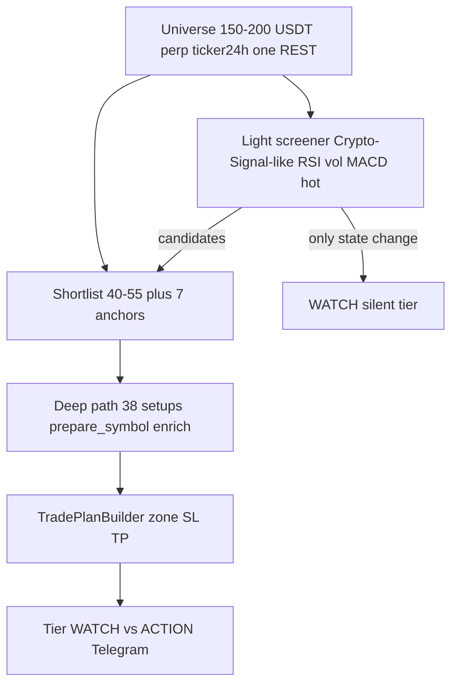

# Crypto-Signal vs наш signal-only bot

Источник: [CryptoSignal/Crypto-Signal](https://github.com/CryptoSignal/Crypto-Signal) (~5.6k★), [config docs](https://github.com/CryptoSignal/Crypto-Signal/blob/master/docs/config.md), [default-config.yml](https://github.com/CryptoSignal/Crypto-Signal/blob/master/default-config.yml).

## 1. Что это за проект

| Аспект | Crypto-Signal | Наш целевой bot |
|--------|---------------|-----------------|
| Назначение | CLI **TA automation** + alerts | **Trade plans** для ручного входа |
| README | «implement **algorithm trading**» | Explicit **no** auto-trading |
| Индикаторы | TA-Lib: RSI, MACD, Ichimoku, MFI, OBV, VWAP… | Polars pipeline + 38 **setup** detectors |
| Биржи | 500+ coins, multi-exchange | Binance **USD-M** public only |
| Доставка | Telegram template «RSI hot» | HTML plan: zone, SL, TP1–3, why |
| Исполнение | Нет в core (но экосистема → trading) | **Запрещено** by design |

Disclaimer Crypto-Signal совпадает с нашим: *«educational tool, not financial adviser»* ([README](https://github.com/CryptoSignal/Crypto-Signal)).

## 2. Почему «огромное количество сигналов»

Комбинация настроек ([config.md](https://github.com/CryptoSignal/Crypto-Signal/blob/master/docs/config.md)):

```yaml
settings:
  update_interval: 300   # опрос каждые 5 минут

indicators:
  rsi:
    - candle_period: 5m
      alert_enabled: true
      alert_frequency: always   # каждый цикл пока условие true
```

| Фактор | Эффект |
|--------|--------|
| **Много пар** | `market_pairs` или форки `all_pairs` — сотни рынков |
| **Много индикаторов** | RSI, stoch_rsi, macd, momentum… каждый со своим TF |
| **`alert_frequency: always`** | Повтор при каждом `update_interval`, не только смена статуса |
| **5m / 15m candles** | Частые пересечения hot/cold |
| **Нет shortlist** | Нет funnel / confluence / caps |
| **Нет trade plan** | Нет SL → подписчик не может bracket за 20 сек |

**Оценка объёма (порядок величины):**

```text
100 пар × 3 индикатора × alert_frequency always × 288 циклов/день (5m poll)
→ теоретически тысячи сообщений (форки добавляют webhook + prices)
```

Для **ручного** канала это не цель, а предупреждение.

## 3. `alert_frequency: once` vs `always`

| Режим | Поведение | Для нас |
|-------|-----------|---------|
| **once** | Алерт при **смене** hot/cold | Близко к **WATCH** state change |
| **always** | Каждый poll при true | Anti-pattern для TG |

Наш аналог: **WATCH** при forming setup; **ACTION** один раз на valid close + dedup.

## 4. Что взять из Crypto-Signal

| Идея | Адаптация |
|------|-----------|
| Модульные индикаторы | Уже есть `features_*` + plugins |
| Notifier templates | `messaging.py` HTML + variables |
| `alert_frequency: once` | State machine WATCH (не спам) |
| Docker / config.yml | У нас `config.toml` + pydantic |
| TA-Lib trust | Мы: Polars Wilder — документировать расхождения с TV ([FAQ Crypto-Signal](https://github.com/CryptoSignal/Crypto-Signal)) |

## 5. Чего не брать

| Anti-pattern | Причина |
|--------------|---------|
| 500 coins scanner | Шум, нет liquidity filter |
| Indicator-only messages | Нет edge для manual без levels |
| 5m always alerts | Пользователь не успевает |
| Multi-exchange в v1 | Размывает Binance USD-M depth/OI |
| Algorithm trading path | Против signal-only |

## 6. Позиционирование для подписчика

**Crypto-Signal-like volume** = indicator radar (опциональный **silent WATCH** tier).  
**Наш ACTION** = curated trade plans, caps, confluence — ближе к [binance-signal-engine](https://github.com/eplt/binance-signal-engine) + Mudrex format, не к Crypto-Signal defaults.

## 7. Индикаторное пересечение

| Crypto-Signal | Наш pipeline |
|---------------|--------------|
| RSI | `rsi14` |
| MACD | `macd_*` |
| Ichimoku | `ichi_*` |
| MFI, OBV | `mfi14`, `obv` |
| VWAP | `vwap_*` |
| SMA/EMA | `ema20/50/200` |
| Momentum | `slope5`, `price_velocity` (R-class для ACTION) |

SMC (FVG, OB, sweep) в Crypto-Signal **нет** — наше отличие.

## 8. Идея «как Crypto-Signal: 500 монет, а SL/TP/зону — мы»

**Вопрос:** почему не взять широкий скрин [Crypto-Signal](https://github.com/CryptoSignal/Crypto-Signal) (500 монет) и поверх доработать — сами считать entry zone, SL, TP?

**Ответ:** идея **правильная по слоям**, но **не как fork Crypto-Signal**, а как **двухэтажная архитектура** у нас.

### 8.1 Что на самом деле делает «500 монет» в Crypto-Signal

| Слой | Crypto-Signal | Нагрузка |
|------|---------------|----------|
| Universe | Сотни пар, multi-exchange | Лёгкий poll OHLCV / ticker |
| Анализ | Индикатор hot/cold (RSI, MACD…) | TA-Lib на закрытых свечах |
| Выход | Текст «ETH/BTC RSI cold» | **Нет** SL/TP/зоны |

«500» — это **ширина радара**, не глубина: нет OI/funding/depth на каждую монету, нет 38 SMC-детекторов, нет confluence.

### 8.2 Почему не «форкнуть и доработать» репозиторий

| Причина | Деталь |
|---------|--------|
| Стек | Python + TA-Lib + multi-exchange vs Polars + USD-M + `futures/data` |
| Продукт | Их TG = индикатор; нам нужен trade plan + tracking + tiered caps |
| Объём алертов | Без нашего funnel 500×always = непригодно для **ручного** канала |
| Поддержка | Fork = чужой `app/`, Docker, не наш `bot/runtime` |
| Guard signal-only | Наш `PUBLIC_PATH` registry не переносится в fork одной кнопкой |

**Вывод:** взять **паттерн** (широкий лёгкий скрин → узкий глубокий анализ), не кодовую базу.

### 8.3 Целевая гибридная модель (рекомендуется)



| Этап | Сколько монет | Что считаем | Аналог Crypto-Signal |
|------|---------------|-------------|----------------------|
| **A. Universe** | 150–200 | `ticker/24hr`, volume, spread proxy | «500 coins» (у нас только ликвидные USD-M) |
| **B. Light screener** | 150–200 | RSI/MACD/squeeze **flag** на 1h/15m, `alert_frequency: once` | Их индикаторы без SL |
| **C. Shortlist** | 40–55 + anchors | Pin BTC ETH SOL XRP XAU XAG PAXG | Отбор, чего у них нет |
| **D. Deep + plan** | 40–55 only | 38 setups, OI, funding, depth, **zone SL TP** | **Наш слой** — «доработка» |

**SL/TP/зону считаем только на этапе D** — там есть structure, ATR, liquidity. На 200 монетах полный `prepare_symbol` + depth — упрётся в [лимиты Binance](BINANCE_PUBLIC_DATA_MATRIX.md) и CPU.

### 8.4 Почему не 500 с полным trade plan на каждую

| Ограничение | Оценка |
|-------------|--------|
| `/futures/data` 1000 req / 5 min | 500×5 endpoints невозможно каждые 5 мин |
| WS klines 500×15m | ~500 streams — формально OK, но CPU 500×38 detectors на close — нет |
| Качество | 300+ illiquid alts → SL/TP нереалистичны для ручного входа |
| Подписчик | 500 ACTION/день физически не исполним вручную |

Поэтому **500 в стиле Crypto-Signal = только WATCH/radar**; **ACTION 15–40/день** — только shortlist.

### 8.5 Что добавить в roadmap (опционально)

| Фича | Приоритет | Описание |
|------|-----------|----------|
| `universe_screener` | P2 | Модуль light indicators на 150–200 (как CS), output → WATCH |
| `TradePlanBuilder` | P1 | Единый zone/SL/TP поверх любого setup hit |
| Fork Crypto-Signal | **No** | Только идеи из [config.md](https://github.com/CryptoSignal/Crypto-Signal/blob/master/docs/config.md) |

Связь: [STRATEGY_MANUAL_SUITABILITY.md](STRATEGY_MANUAL_SUITABILITY.md), [TARGET_ARCHITECTURE.md](TARGET_ARCHITECTURE.md) Phase B shortlist.
