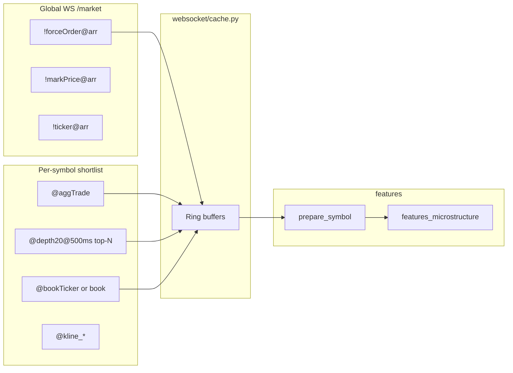

# Order flow и ликвидации `[spec]`

Целевой ingest microstructure + сравнение OSS. Официальные лимиты: [WEB_RESEARCH_SUPPLEMENT.md](WEB_RESEARCH_SUPPLEMENT.md) §1–2.

## 1. Архитектура ingest



| Поток | WS / REST | Кэш | Поля в `PreparedSymbol` |
|-------|-----------|-----|-------------------------|
| **Agg trade (CVD)** | `@aggTrade` per shortlist symbol | `deque` + batch flush | `agg_trade_delta_30s`, `signed_order_flow` на 15m |
| **Book** | `!bookTicker` / `@depth` | bid/ask, depth walls | spread, `microprice_bias`, depth imbalance |
| **Liquidations** | `!forceOrder@arr` global | ring buffer | `liquidation_score` — **max 1 event/symbol/1000ms, largest order** (Binance docs); proxy, не full tape |
| **Positioning** | REST `/futures/data/*` | batch 5–15 min | funding, OI, L/S, taker ratio |

Код: [`ws_manager.py`](../../bot/ws_manager.py), [`websocket/cache.py`](../../bot/websocket/cache.py), [`features_microstructure.py`](../../bot/features_microstructure.py).

## 2. Order flow (aggTrade + depth)

### 2.1 AggTrade

1. Подписка только на **shortlist** symbols (не 500).
2. `handle_agg_trade`: буфер → ring `max_agg_trade_buffer`, flush interval ms.
3. `get_short_flow` / delta за ~30s → `agg_trade_delta_30s`.
4. `_enrich_with_ws_data` пишет `signed_order_flow` в `work_15m` ([`features.py`](../../bot/features.py)).
5. Strategies: `cvd_divergence`, `absorption`, `aggression_shift`, `indicator_divergence`.

**Приоритет в очереди WS:** kline close (100) > forceOrder (90) > aggTrade (40) — при backpressure aggTrade может дропаться ([`MessageBuffer`](../../bot/ws_manager.py)).

### 2.2 Depth / microprice

| Источник | Использование |
|----------|---------------|
| `@depth20@500ms` | top-20 shortlist: walls, imbalance |
| `!bookTicker` | spread, microprice fallback |
| `get_microprice_bias` | confluence microstructure |

Strategies **R-class** для manual ACTION: `depth_imbalance`, `whale_walls`, `spread_strategy` — см. [STRATEGY_MANUAL_SUITABILITY.md](STRATEGY_MANUAL_SUITABILITY.md).

### 2.3 Чего нет (gap vs HFT stacks)

| Возможность | Статус bot2 | Пример OSS |
|-------------|-------------|------------|
| Full L3 replay | Нет | [Hummingbot download_order_book_and_trades](https://github.com/hummingbot/hummingbot/blob/master/scripts/download_order_book_and_trades.py) |
| Footprint chart | Нет | TradeZella / terminal tools |
| Sub-second CVD | Нет (30s aggregate) | Достаточно для 15m signal-only |

## 3. Ликвидации (forceOrder)

### 3.1 Binance official

| Stream | URL | Семантика |
|--------|-----|-----------|
| All market | `!forceOrder@arr` on `/market` | [All Market Liquidation Streams](https://developers.binance.com/docs/derivatives/usds-margined-futures/websocket-market-streams/All-Market-Liquidation-Order-Streams) |
| Per symbol | `@forceOrder` | Max **1** liquidation per symbol per **1000ms** (largest) |

**Важно:** это **не полная** картина всех ликвидаций — snapshot largest/interval ([Liquidation Order Streams](https://developers.binance.com/docs/derivatives/usds-margined-futures/websocket-market-streams/Liquidation-Order-Streams)). Для signal-bot — **proxy**, не ground truth как Coinglass.

### 3.2 bot2

```text
_handle_force_order → _force_order_buffer (ts, symbol, side, qty, price)
get_liquidation_sentiment(symbol, window_seconds=60) → [-1, +1]
```

- **BUY** forceOrder = ликвидация **short** (bullish squeeze proxy).
- Используется в: `liquidation_heatmap`, scoring/confluence, universe `liquidation_score` rank.

Исторические CSV: [data.binance.vision](https://data.binance.vision/) (см. [python-binance issue #1060](https://github.com/sammchardy/python-binance/issues/1060)) — для **offline** калибровки, не hot path.

### 3.3 OSS сравнение

| Проект | Подход | Урок |
|--------|--------|------|
| [binanceliquidationlistener](https://github.com/xiaoshulittletree/binanceliquidationlistener) | Dual USD-M + COIN-M `!forceOrder@arr` → CSV | Простой listener; мы — in-memory + sentiment |
| [VoiceOfChain WS guide](https://voiceofchain.com/academy/binance-api-websocket) | mark + liquidation на futures WS | Документация потоков |
| Coinglass / Coinalyze | Агрегаторы (не public API) | Не дублировать в v1; proxy достаточен |

## 4. Target improvements (spec)

| # | Улучшение | Зачем |
|---|-----------|-------|
| 1 | Rollup liq notional per symbol 5m/15m в enrichment | Стабильнее `liquidation_heatmap` |
| 2 | CVD session reset UTC (как в STRATEGY_CATALOG) | Согласованность cvd_divergence |
| 3 | Якоря BTC/ETH: aggTrade + depth **always** | [BENCHMARK_ANCHORS.md](BENCHMARK_ANCHORS.md) |
| 4 | Telemetry: aggTrade drop rate under load | SLO operator |
| 5 | Optional: liq heatmap digest в daily TG | Innovation backlog |
| 6 | **Не** подписывать aggTrade на 200+ символов | Rate + CPU |

## 5. Connector

Сбор только через **thin WS** ([CONNECTOR_DECISION.md](CONNECTOR_DECISION.md)) — не CCXT для `!forceOrder@arr`.

## 6. Связь со стратегиями

| setup_id | Data deps |
|----------|-----------|
| cvd_divergence | aggTrade ring |
| absorption, aggression_shift | aggTrade + taker REST |
| depth_imbalance, whale_walls | depth WS |
| spread_strategy | bookTicker |
| liquidation_heatmap | forceOrder + OI |

Все **R-class** или **M2** для manual ACTION — не голый tick alert.
