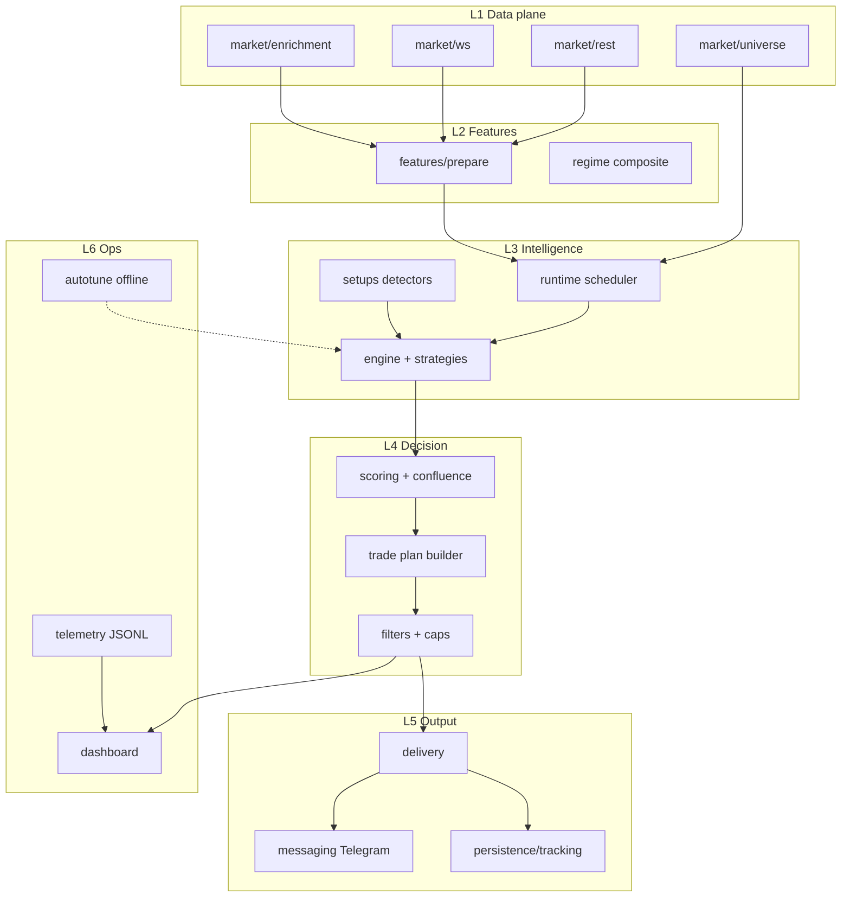
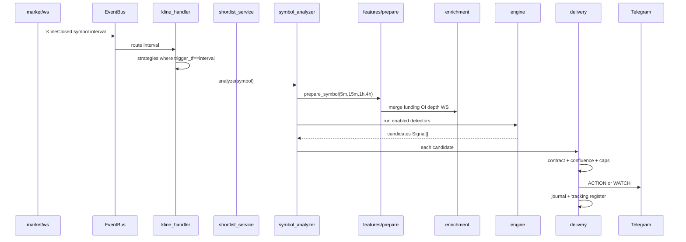
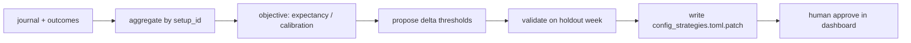

# Project Architecture Specification

Полная целевая архитектура signal-bot: **модули**, **данные**, **индикаторы**, **таймфреймы**, **свечной/SMC-анализ**, **хранение**, **дашборд**, **автотюн**.  
Дополняет [TARGET_ARCHITECTURE.md](TARGET_ARCHITECTURE.md) и [STRATEGY_CATALOG.md](STRATEGY_CATALOG.md). Сопоставление с текущим кодом: [GAP_ANALYSIS_BOT2.md](GAP_ANALYSIS_BOT2.md).

---

## 1. Назначение системы

**Продукт = signal-only:** только аналитика и Telegram; подписчик **вручную** выставляет ордера. Подробно: [SIGNAL_ONLY_PRODUCT.md](SIGNAL_ONLY_PRODUCT.md).

| Входит | Не входит (никогда) |
|--------|---------------------|
| Публичные данные Binance USD-M (REST + WS) | API keys, signed endpoints |
| 38 детекторов → **trade plan** (зона entry, SL, TP) | Размещение/отмена ордеров, auto-trading, copy-trading |
| Tiered Telegram (WATCH / ACTION) | Исполнение сделок от имени пользователя |
| Tracking исходов по mark price (информирование) | Бэктест на hot path |
| Operator dashboard (локально) | Публичный dashboard без auth |

| Связанные spec | Тема |
|----------------|------|
| [SIGNAL_EVALUATION.md](SIGNAL_EVALUATION.md) | Полный pipeline оценки сигнала |
| [BENCHMARK_ANCHORS.md](BENCHMARK_ANCHORS.md) | BTC ETH SOL XRP XAU XAG PAXG — max data |
| [SIGNAL_ONLY_PRODUCT.md](SIGNAL_ONLY_PRODUCT.md) | Веб-исследование manual channel, TF/фильтры |

---

## 2. Логические слои



---

## 3. Карта модулей (целевой v9)

| Пакет / модуль | Ответственность | Вход | Выход |
|----------------|-----------------|------|-------|
| **domain/** | Контракты, `BotSettings`, `PreparedSymbol`, `Signal`, events | TOML config | Типизированные модели |
| **market/rest** | HTTP public `fapi`, rate limit, retry | URL, symbol | JSON / Polars frames |
| **market/ws** | Подписки, reconnect 24h, book/agg/kline | shortlist | EventBus events |
| **market/universe** | Light scan 150–200 → shortlist 40–55, buckets (пороги: [WEB_RESEARCH_SUPPLEMENT.md](WEB_RESEARCH_SUPPLEMENT.md) §5) | ticker24h | `UniverseSymbol[]` |
| **market/enrichment** | OI, funding, L/S, basis batch | shortlist | Context cache per symbol |
| **market/data** | Kline cache multi-TF, merge REST backfill | symbol, interval | Raw OHLCV Polars |
| **features/prepare** | `_prepare_frame` per TF, `prepare_symbol` | frames + WS ctx | `PreparedSymbol` |
| **regime/** | HMM/composite regime, BTC phase | HTF frames | `market_regime`, biases |
| **engine/registry** | Реестр 38 plugins, enable flags | config | `BaseSetup` instances |
| **engine/engine** | Bounded run detectors per event | `PreparedSymbol` | `Signal[]` |
| **strategies/** | `detect()` per setup_id | prepared, settings | `Signal \| None` |
| **setups/** | SMC primitives: FVG, OB, sweep, swings | Polars work_* | pattern hits |
| **runtime/bot** | Lifecycle, wiring, health | container | running app |
| **runtime/kline_handler** | **On KlineClose(interval)** → schedule | WS event | analyze jobs |
| **runtime/symbol_analyzer** | Orchestrate prepare → engine → delivery | symbol, interval | delivered / rejected |
| **runtime/shortlist_service** | Refresh ranks, WS diff | ticker | shortlist delta |
| **runtime/delivery_orchestrator** | Contract → confluence → caps → TG | Signal | telegram + journal |
| **delivery/** | `signal_contract`, `confluence`, filters | Signal | pass/fail + reasons |
| **messaging** | aiogram format HTML, tiers | Signal | Telegram message |
| **persistence/journal** | Audit log всех сигналов | Signal | SQLite/JSONL rows |
| **persistence/tracking** | TP/SL states vs mark price | active signals | events |
| **persistence/outcomes** | Post-hoc stats per setup | tracking | win rate, RR |
| **persistence/diary** | Operator manual trades overlay | API | diary entries |
| **dashboard/** | FastAPI operator UI | bot refs | REST + WS |
| **telemetry** | Funnel, rejects, metrics | runtime hooks | JSONL / metrics |
| **scoring** | Dynamic score adjustments | Signal + prepared | `ScoringResult` |
| **autotune/** (target) | Offline calibration порогов | outcomes + journal | patched TOML |

### Текущий `bot2` (scaffold vs legacy)

| Целевой | Сейчас в репо |
|---------|---------------|
| `bot/market/*` | scaffold + legacy `ws_manager`, `universe.py` |
| `bot/runtime/*` | scaffold + legacy `bot/application/*` |
| `bot/persistence/*` | re-export + root `tracking.py`, `journal.py` |
| `bot/features/` package | monolith `bot/features.py` + `features_*.py` |
| `bot/delivery/` package | root `delivery.py`, `confluence.py`, `messaging.py` |
| `bot/dashboard/` | `bot/dashboard.py` + `static/` |

---

## 4. Поток событий (как всё крутится)



**Условие запуска анализа (целевое):**

```text
ON KlineClose(S, interval):
  IF S NOT IN shortlist: RETURN
  setups = enabled ∧ strategy_fits(S) ∧ trigger_tf == interval
  IF setups empty: RETURN
  prepared = prepare_symbol(S, required_tfs = ⋃ setups.required_tfs)
  FOR setup IN setups: signal = setup.detect(prepared)
  FOR signal IN candidates: delivery_pipeline(signal)
```

**`[spec]`:** scheduler на каждый `KlineClose(interval)` по `trigger_tf`; на символ — **8–15 lanes**, не 38× на каждый tick (P0 в [GAP_ANALYSIS_BOT2.md](GAP_ANALYSIS_BOT2.md)).

---

## 5. Data plane — откуда что берётся

### 5.1 Источники

| Источник | Что даёт | Кто потребляет |
|----------|----------|----------------|
| `GET /fapi/v1/klines` | OHLCV 5m/15m/1h/4h backfill | `market/data` |
| WS `@kline_{tf}` | Live close events | `kline_handler` |
| `!ticker@arr` | Volume, 24h change | `universe`, shortlist refresh |
| `!markPrice@arr` | Mark, funding snapshot | `PreparedSymbol`, tracking |
| `!bookTicker` | Spread | filters, micro strategies |
| `@depth` / REST depth | L2 imbalance | depth_imbalance, whale_walls |
| `@aggTrade` | CVD, delta 30s | cvd_divergence, absorption |
| `!forceOrder@arr` | Liquidations | liquidation_heatmap |
| `premiumIndex` / `fundingRate` | Funding | funding_reversal |
| `openInterest` + `openInterestHist` | OI | oi_divergence |
| `globalLongShortAccountRatio` | L/S | ls_ratio_extreme |
| `takerlongshortRatio` | Taker skew | aggression_shift |
| BTC + alts klines | btc_correlation, ASI proxy | cross-asset |

Полная таблица: [BINANCE_PUBLIC_DATA_MATRIX.md](BINANCE_PUBLIC_DATA_MATRIX.md).

### 5.2 Кэши и свежесть

| Кэш | TTL / обновление | Поля свежести в `PreparedSymbol` |
|-----|------------------|----------------------------------|
| Kline ring per (symbol, tf) | append on WS; REST gap fill | bar count |
| Enrichment REST | 5–15 min batch | `context_snapshot_age_seconds` |
| Mark/ticker global | WS stream | `mark_price_age_seconds`, `ticker_price_age_seconds` |
| Book top-N | 500ms–1s WS | `book_ticker_age_seconds`, `depth_book_age_seconds` |
| aggTrade ring | 30s rolling | `agg_trade_delta_30s` |

**Degraded mode:** если `context_snapshot_age_seconds` > порога или missing required enrichment → WATCH only или reject с reason `data.stale`.

### 5.3 Как данные попадают в `PreparedSymbol`

1. **Frames** — `SymbolFrames`: `df_5m`, `df_15m`, `df_1h`, `df_4h` (минимум 30 баров после drop NaN).
2. **`_cached_prepare_frame`** — per (symbol, interval, last_close_time) LRU; внутри `_prepare_frame`.
3. **`_enrich_with_ws_data`** — depth, microprice, agg delta на `work_15m`.
4. **REST context** — funding, OI, L/S, liquidation score, benchmarks (BTC/ETH/SOL…).
5. **Structure** — `structure_1h`, `regime_4h_confirmed`, `regime_1h_confirmed`, POC.
6. **Regime** — `market_regime`, `bias_1h`, `bias_4h`, `btc_bias`, `altcoin_season_index`.

---

## 6. Таймфреймы и условия

### 6.1 Две оси (обязательно)

**Ось A — стратегия** (`StrategyTimeframeProfile`):

| Поле | Пример fvg_setup |
|------|------------------|
| trigger_tf | 15m |
| pattern_tf | 15m |
| required_tfs | 15m, 1h, 4h |
| ttl_bars | 20 |

**Ось B — актив** (`AssetTimeframeProfile`):

| Поле | Пример alt |
|------|------------|
| primary_timeframe | 15m (подпись в TG) |
| context_timeframes | 1h, 4h |
| min_trigger_tf | 15m (no ACTION on 5m) |
| excluded_setups | illiquid micro on low rank |

### 6.2 WS intervals per symbol

```text
intervals(S) = ⋃ { trigger_tf ∪ required_tfs | setup ∈ enabled ∧ fits(S) }
```

Пример: только 15m-trigger SMC → `@kline_15m` достаточно.  
Добавили `funding_reversal` с eval на 1h → +`@kline_1h` для символов с этим setup.

### 6.3 Условия по типам сигналов

| Условие | Где проверяется |
|---------|-----------------|
| Shortlist membership | `strategy_fits` + universe |
| Min bars 30 on each required_tf | `prepare_symbol` |
| ADX / chop | filters, per-strategy |
| Session window | `session_killzone` only |
| Funding/OI present | asset_fit `requires_funding/oi` |
| HTF bias alignment | scoring, confluence |
| R:R ≥ 1.5 | `signal_contract`, trade plan |
| Confluence ≥ 3/5 | `hard_confluence_gate` |
| Daily / burst caps | delivery orchestrator |

### 6.4 Таблица trigger_tf по 38 стратегиям

См. [STRATEGY_CATALOG.md](STRATEGY_CATALOG.md) summary matrix. Правило продукта: **ACTION только на trigger_tf ≥ 15m**; 5m — WATCH/confirm only.

---

## 7. Feature pipeline и индикаторы

### 7.1 Точка входа

- **`prepare_symbol(symbol, frames, settings, ws_ctx)`** — единая сборка перед engine.
- **`work_15m`, `work_1h`, `work_4h`, `work_5m`** — Polars DataFrame с полным набором колонок после `_prepare_frame`.
- **`work_primary`** — по `primary_timeframe` актива (default 15m).

### 7.2 Правила расчёта (инварианты)

| Правило | Реализация |
|---------|------------|
| RSI / ATR Wilder | `_rsi`, `_atr`, `_adx` |
| Bollinger std | ddof=1 |
| No future leak | no `shift(-N)` on live path |
| VWAP | session cum (UTC date on `close_time`) |
| Cache | keyed by last bar `close_time` |

### 7.3 Колонки на каждый TF (`_prepare_frame`)

**Тренд / MA**

- `ema20`, `ema50`, `ema200`
- `close_ols_slope20`, `close_ols_slope_pct20`, `close_ols_slope_atr20`

**Осцилляторы**

- `rsi14`, `adx14`, `macd_line`, `macd_signal`, `macd_hist`
- `stoch_k14`, `stoch_d14`, `stoch_h14`
- `cci20`, `willr14`, `mfi14`, `cmf20`, `uo` (ultimate oscillator)
- `fisher`, `fisher_signal`

**Волатильность / каналы**

- `atr14`, `atr_pct`
- `bb_pct_b`, `bb_width` (Bollinger)
- `kc_upper`, `kc_lower`, `kc_width` (Keltner)
- `squeeze_hist`, `squeeze_on`, `squeeze_off`, `squeeze_no`
- `donchian_low20`, `donchian_high20`, `prev_*`

**Объём / поток**

- `volume_mean20`, `volume_ratio20`
- `vwap`, `vwap_std`, `vwap_upper1/2`, `vwap_lower1/2`, `vwap_deviation_pct`
- `delta_ratio` (from `taker_buy_base_volume` if present)
- `obv`, `obv_ema20`, `obv_above_ema`

**Свеча / позиция в баре**

- `close_position` — где закрылась свеча в диапазоне H-L (0–1); используется wick/sweep/depth strategies

**Тренд-следящие**

- `supertrend`, `supertrend_dir`
- `psar_long`, `psar_short`, `psar_reversal`
- `chandelier_long`, `chandelier_short`, `chandelier_dir`
- `hma9`, `hma21`
- `aroon_up14`, `aroon_down14`, `aroon_osc14`

**Ichimoku**

- `ichi_tenkan`, `ichi_kijun`, `ichi_senkou_a`, `ichi_senkou_b`

**Сессии (UTC hour on close_time)**

- `session_asia`, `session_london`, `session_ny`, `session_overlap`
- `session_*_vol_20`

**Прочее**

- `zscore30`, `slope5` (ROC5)
- `volume_profile` (POC proxy per window)
- `realized_volatility` (в modules)

### 7.4 Snapshot для ML/audit (`PUBLIC_FEATURE_FIELDS`)

Сжатый вектор в journal/telemetry ([`bot/domain/contracts.py`](../../bot/domain/contracts.py)):

`rsi_15m/1h/4h`, `adx_1h/4h`, `atr_pct_15m`, `volume_ratio_15m`, `macd_histogram_15m`, EMA stack flags, `supertrend_dir_*`, `bb_*`, funding/OI/L-S, liquidation, spread/depth/microprice, ages, `market_regime`.

### 7.5 Декомпозиция файлов (текущий код → цель)

| Модуль сейчас | Содержание |
|---------------|------------|
| `features.py` | `_prepare_frame`, `prepare_symbol`, cache |
| `features_core.py` | ema, rsi, atr, adx, vwap, roc |
| `features_oscillators.py` | stoch, cci, willr, mfi, cmf |
| `features_structure.py` | structure helpers |
| `features_advanced.py` | supertrend, squeeze, ichimoku, … |
| `features_microstructure.py` | depth context builder |
| **Цель** | `bot/features/prepare.py` + submodules |

---

## 8. Свечной анализ и SMC

### 8.1 Уровни

| Уровень | Модуль | Что делает |
|---------|--------|------------|
| **Индикаторы на OHLCV** | `features` | MA, bands, ATR, RSI — см. §7 |
| **Свечные метрики** | `close_position`, range/body в strategies | Wick trap, climax, velocity |
| **Структура рынка** | `features` + `PreparedSymbol` | `structure_1h`, `regime_*_confirmed`, swing |
| **SMC-детекторы** | `setups/smc.py`, `strategies/spec_patterns.py` | FVG, OB, BOS, sweep, turtle, spring |

### 8.2 SMC primitives (общие для многих strategies)

| Primitive | Используется в |
|-----------|----------------|
| Swing high/low | liquidity_sweep, turtle_soup, stop_hunt |
| FVG 3-candle gap | fvg_setup |
| Order block zone | order_block, breaker_block |
| BOS / CHoCH | bos_choch, structure_break_retest |
| Equal highs/lows | stop_hunt_detection |
| Wyckoff spring | wyckoff_spring |
| BB/Keltner squeeze | bb_squeeze, squeeze_setup, keltner_breakout |

### 8.3 Условия свечи (типовые)

| Метрика | Назначение |
|---------|------------|
| `close_position` > 0.55 long / < 0.45 short | Rejection / acceptance |
| Wick / ATR | Wick trap, climax, liq proxy |
| `volume_ratio20` | Confirm breakouts |
| Body / range ratio | price_velocity |
| Engulf / pin (pattern detectors) | Confirm reversals |

Детекторы не дублируют TA-Lib на live path — всё Polars / polars_ta.

---

## 9. Regime и macro context

| Поле | Источник | Кто использует |
|------|----------|----------------|
| `market_regime` | 4h/1h ADX + slope | filters, scoring |
| `bias_1h`, `bias_4h` | EMA structure | MTF strategies |
| `regime_4h_confirmed`, `regime_1h_confirmed` | N-bar confirm | multi_tf_trend, gates |
| `btc_bias`, `btc_phase` | BTC 1h/4h | btc_correlation |
| `altcoin_season_index` | breadth ticker | altcoin_season_index |
| `macro_risk_mode` | composite | dashboard, optional veto |
| HMM (`regime/hmm_regime.py`) | optional advanced | research / soft weight |

---

## 10. Engine и стратегии

| Компонент | Поведение |
|-----------|-----------|
| `StrategyRegistry` | 38 classes, `enabled` from config |
| `SignalEngine` | Thread pool / bounded queue per symbol |
| `BaseSetup` | Rich `detect`, `get_optimizable_params` |
| `RoadmapSetup` | Template + `_build_atr_signal` |
| `reject_log` on `PreparedSymbol` | Telemetry per reject reason |

**`[spec]`:** subset по `trigger_tf` + `strategy_fits` / lanes (8–15 families на shortlist symbol). Registry 38 plugins, но runtime вызывает только lane bucket для данного close event.

Каталог логики каждой: [STRATEGY_CATALOG.md](STRATEGY_CATALOG.md).

---

## 11. Scoring и confluence

### 11.1 Scoring (`bot/scoring.py`)

Динамический score после детектора:

| Factor | Описание |
|--------|----------|
| MTF alignment | 1h structure + 4h regime vs direction |
| Volume quality | volume_ratio tiers |
| Structure clarity | swing cleanliness |
| Risk/reward | TP1 distance |
| Funding contrarian | extreme funding alignment |
| OI momentum | OI change direction |
| Crowd position | L/S extremes |

Output: `ScoringResult(base, adjustments, final_score)`.

### 11.2 Confluence (`bot/confluence.py`)

**Hard gate 3-of-5** (delivery path):

| # | Factor |
|---|--------|
| 1 | Trend / MTF |
| 2 | Structure |
| 3 | Volume |
| 4 | Positioning (funding/OI/L-S) |
| 5 | Microstructure (depth/CVD) |

`ConfluenceResult` → pass/fail + component breakdown for dashboard «confluence lab».

---

## 12. Delivery path

```text
Signal candidate
  → validate_signal_contract (entry, SL, TP, RR, TTL)
  → score_signal (scoring.py)
  → hard_confluence_gate (confluence.py)
  → tier_classifier (WATCH vs ACTION)
  → rank + dedup (symbol, setup, cycle caps)
  → format Telegram (messaging.py)
  → journal.record + tracker.register
```

Шаблоны: [TELEGRAM_CHANNEL_SPEC.md](TELEGRAM_CHANNEL_SPEC.md).

---

## 13. Хранение данных и сигналов

### 13.1 Что хранить

| Store | Содержание | Назначение |
|-------|------------|------------|
| **SQLite `journal`** | Все сигналы: JSON contract, reasons, scores, feature snapshot | Audit, replay, autotune input |
| **SQLite `tracking`** | Active plans, state transitions, TP hits | Telegram updates |
| **SQLite `outcomes`** | Aggregated PnL proxy, setup stats | Dashboard analytics |
| **Diary store** | Manual operator trades | Compare human vs bot |
| **Telemetry JSONL** | Funnel: detect → reject → deliver | Debugging, dashboard live |
| **Config TOML** | `config.toml`, `config_strategies.toml` | Runtime + per-strategy thresholds |
| **Optional Timescale** | Tick-level audit if scale | Future |

### 13.2 Жизненный цикл записи сигнала

```text
1. candidate_created_at
2. validation_pass/fail + reasons[]
3. confluence components[]
4. tier: watch | action
5. telegram_message_id (if sent)
6. tracking_state: pending → active → tp1|tp2|tp3|sl|expired
7. outcome_label (after close)
8. feature_snapshot (PUBLIC_FEATURE_FIELDS)
```

### 13.3 Публичный audit (целевое)

Daily export: `signals_YYYYMMDD.csv` + SHA256 для подписчиков (см. plan §13 innovation).

### 13.4 In-memory (не персистент)

| Данные | Где |
|--------|-----|
| Kline rings | ws cache / market data |
| Shortlist | universe service |
| PreparedSymbol cache | per-cycle discard |
| Dashboard WS broadcast | funnel snapshot |

---

## 14. Dashboard (оператор)

FastAPI app (`bot/dashboard.py` + `dashboard_live.py` + `ws_dashboard.py`). **Не для подписчиков** — local/VPN token.

### 14.1 Экраны

| Экран | API / route | Функции |
|-------|-------------|---------|
| **Overview** | `/api/live/overview`, `/api/status` | Uptime, WS, REST weight, shortlist size |
| **Health** | `/api/health`, `/api/v1/status` | Lag, stale symbols, reconnects |
| **Universe / shortlist** | `/api/live/shortlist` | Rank, bucket, allowed setups |
| **Funnel** | `/api/live/funnel` | detect → filter → rank → sent counts |
| **Rejections** | `/api/live/rejections` | By setup_id, reason code |
| **Strategy arena** | `/api/strategies`, `/api/v1/strategies/health` | Hits 7d, zero-hit alert, enabled flags |
| **Decisions** | `/api/live/decisions`, `/api/strategy/decisions` | Last N per setup |
| **Active signals** | `/api/signals/active`, `/api/v1/signals/active` | Open tracking |
| **History** | `/api/signals/recent`, `/api/v1/signals/history` | Paginated journal |
| **Market regime** | `/api/market/regime`, `/api/v1/market/regime` | BTC, altseason, macro |
| **Metrics** | `/api/metrics` | Throughput, latency |
| **Delivery** | `/api/live/delivery` | Last sent, tier breakdown |
| **Telegram preview** | `/api/live/telegram-preview` | HTML dry-run |
| **Confluence lab** | `/api/v1/confluence/*` | Heatmap, simulate, distribution, vetos |
| **Config editor** | `/api/v1/config/strategies`, `scoring`, `killzone` | PATCH enable/thresholds |
| **Diary** | `/api/v1/diary/*` | CRUD manual trades |
| **Analytics** | `/api/analytics/report`, `/api/v1/diary/analytics` | Win rate, setup correlation |
| **Sandbox replay** | `/api/v1/sandbox/replay` | Replay last 24h with what-if weights |
| **Audit** | `/api/live/audit` | Strategy audit snapshot |
| **Alerts** | `/api/v1/alerts` | Zero-hit, WS down, cap breached |
| **Live WS** | `/ws/dashboard` | Push funnel + health |

### 14.2 Operator workflows

1. Утром: regime board + shortlist diff.  
2. В сессию: funnel + rejections (почему нет ACTION).  
3. При zero-hit: strategy arena → config patch или disable.  
4. Перед изменением порогов: confluence simulate + sandbox replay.  
5. Вечером: analytics + outcomes export.

---

## 15. Autotune (калибровка параметров)

### 15.1 Цель

Подстроить пороги детекторов **offline** по журналу исходов, без изменения логики на hot path.

### 15.2 Источники параметров

| Источник | Содержание |
|----------|------------|
| `config_strategies.toml` | Per-setup: `min_rr`, `sl_buffer_atr`, `base_score`, detection thresholds |
| `BotSettings.filters.setups` | Runtime merge в `get_optimizable_params()` |
| `BaseSetup.get_optimizable_params()` | Defaults per class |
| `RoadmapSetup.DEFAULTS` | Shared ATR-template setups |

### 15.3 Целевой pipeline autotune



| Этап | Описание |
|------|----------|
| Extract | Win rate, avg RR, reject reasons top-N |
| Objective | Maximize calibrated expectancy, penalize overfitting |
| Bounds | Never violate min_rr < 1.5, max signals/day |
| Output | Patch TOML + report PDF in dashboard |
| Safety | No auto-apply without operator toggle |

### 15.4 Self-learner / quality monitor (сейчас)

- `quality_monitor.py` — метрики для dashboard/telemetry.
- `config_strategies.toml` — комментарии «ML/AI Optimizable».
- Legacy `autotuner.py` — orphan (REFACTOR_PLAN: delete); логику перенести в `bot/autotune/` offline job.

### 15.5 Что автотюнить по семействам

| Family | Примеры параметров |
|--------|-------------------|
| SMC | `min_trend_score`, FVG CE tolerance, sweep pierce % |
| Funding | `funding_threshold`, z window |
| Volume | `min_volume_ratio`, climax percentile |
| Micro | `min_depth_imbalance`, persistence bars |
| Scoring | confluence weights (dashboard PATCH) |

**Не автотюнить на v1:** WS URLs, delivery caps (product rules), shortlist size.

---

## 16. Telemetry и diagnostics

| Компонент | Назначение |
|-----------|------------|
| `telemetry.py` | Counters, cycle timing |
| `signal_diagnostics.py` | Deep reject tracing (→ slim `diagnostics/`) |
| `core/diagnostics/strategy_audit.py` | Registered 38 audit |
| `reject_log` on PreparedSymbol | Per-cycle strategy rejects |
| `structlog` | JSON logs |

Dashboard читает telemetry + live funnel endpoints.

---

## 17. Конфигурация

| File | Содержание |
|------|------------|
| `config.toml` | Bot, WS intervals, shortlist, delivery caps, Telegram, dashboard |
| `config_strategies.toml` | Per-setup thresholds |
| `BotSettings` pydantic | Single validated model |
| Feature flags | `feature_flags.py` |

Validate: `python scripts/validate_config.py --config config.toml`.

---

## 18. Связанные документы

| Doc | Тема |
|-----|------|
| [STRATEGY_CATALOG.md](STRATEGY_CATALOG.md) | 38 стратегий (веб) |
| [BINANCE_PUBLIC_DATA_MATRIX.md](BINANCE_PUBLIC_DATA_MATRIX.md) | API |
| [TELEGRAM_CHANNEL_SPEC.md](TELEGRAM_CHANNEL_SPEC.md) | Продукт канала |
| [GAP_ANALYSIS_BOT2.md](GAP_ANALYSIS_BOT2.md) | Разрыв target vs код |
| [../REFACTOR_PLAN.md](../REFACTOR_PLAN.md) | Фазы переноса модулей |

---

## 19. Приоритет внедрения в код

1. **P0** Multi-TF scheduler + WS union (§4, §6).  
2. **P1** Tiered delivery + caps (§12).  
3. **P1** Trade plan builder unified (§12).  
4. **P2** Split `features/` package (§7).  
5. **P2** Dashboard funnel parity (§14).  
6. **P3** Autotune offline job (§15).

Проверка API — отдельно, не ядро архитектуры; см. [BINANCE_PUBLIC_DATA_MATRIX.md](BINANCE_PUBLIC_DATA_MATRIX.md#coverage-checklist-live).
