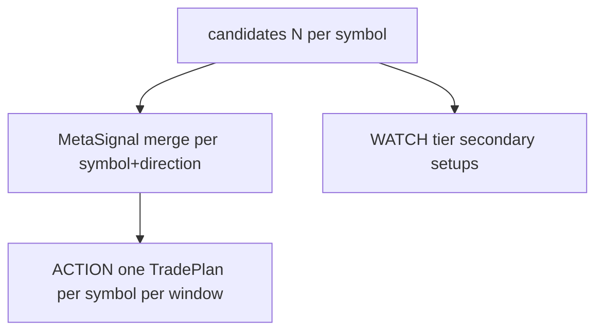

# Коллизии сигналов: 5 или 38 setup на одну монету

Целевая модель merge/dedup **`[spec]`** и уроки OSS. Legacy снимок — [LEGACY_CODE_SNAPSHOT.md](LEGACY_CODE_SNAPSHOT.md) (не эталон).

## 1. Сценарий

На закрытии 15m по `ETHUSDT` срабатывают несколько детекторов (5 или все 38). Вопросы:

- Будут ли **дубли** в Telegram?
- Будут ли **противоречивые** LONG и SHORT?
- Как подписчик должен это видеть?

## 2. Целевая модель `[spec]`

### 2.1 Три уровня выхода



| Уровень | Что уходит в TG | Когда |
|---------|-----------------|-------|
| **Meta ACTION** | **Один** trade plan: лучший setup как primary + «supported by: fvg, ob, multi_tf» | score ≥ action, confluence, caps |
| **WATCH** | «5 setups forming long on ETH» без полного плана | secondary hits, score < action |
| **Telemetry only** | Funnel / dashboard | все 38 для оператора |

### 2.2 Правила merge

| # | Правило | Обоснование |
|---|---------|-------------|
| 1 | **1 ACTION / symbol / 4h** (config) | Ручной вход ([United Kings](https://unitedkings.net/telegram-forex-signals-the-complete-2025-strategy-guide-8/)) |
| 2 | **1 direction** — если long и short, выигрывает **выше score**; второй → WATCH «conflict» | [Contradictory blocker pattern](https://github.com/yakub268/algo-trading-platform) |
| 3 | **Family cluster** — max 1 ACTION из {fvg, ob, breaker, sweep} | Один SMC narrative |
| 4 | **Canonical TradePlan** — entry = пересечение зон или union с cap ATR | Один bracket для человека |
| 5 | **Secondary setups** → reasons[], не отдельные TG | Как confluence_N сейчас, но явно в шаблоне |
| 6 | **Не гонять 38 detect** на каждый символ | Lanes 8–15 + `trigger_tf` scheduler |

### 2.3 Пример для подписчика (N hits → 1 ACTION)

```text
[ACTION] ETHUSDT LONG
Primary: liquidity_sweep · 15m · Score 78%
Also aligned: fvg_setup, order_block, multi_tf_trend (3/5 confluence components)
Entry zone: 3,420 – 3,438  |  SL: 3,395  |  TP1/2/3: ...
Invalidate: 15m close below 3,388
```

### 2.4 Сравнение с другими проектами

| Проект | Дедуп / коллизии | Урок |
|--------|------------------|------|
| [Crypto-Signal](https://github.com/CryptoSignal/Crypto-Signal) | Нет — много независимых indicator alerts | Anti-pattern для TG |
| [gary-bot](https://github.com/alhaannn/gary-bot) | Изолированный state per channel; stale message reject | State + validation |
| [kairos-quantum](https://github.com/Enmilo-dev/kairos-quantum) | Redis ZSet — один alert per threshold | O(1) dedup key |
| [algo-trading-platform](https://github.com/yakub268/algo-trading-platform) | Contradictory + 30m re-entry cooldown | Нужно для long/short |
| [binance-signal-engine](https://github.com/eplt/binance-signal-engine) | Один trade plan per evaluation | Близко к нашему ACTION |

## 3. Связь с оценкой сигнала

См. [SIGNAL_EVALUATION.md](SIGNAL_EVALUATION.md): merge **после** scoring, **перед** tier и `deliver()` — модуль `MetaSignalMerger`.

Пороги score **не заменяют** merge — см. [STRATEGY_MANUAL_SUITABILITY.md](STRATEGY_MANUAL_SUITABILITY.md).

## 4. Roadmap реализации spec

| P | Задача |
|---|--------|
| P1 | `MetaSignalMerger` + TG template «Also aligned» |
| P1 | Direction conflict: block opposite ACTION within 4h |
| P2 | Setup family clusters в config |
| P2 | Scheduler: не вызывать все 38 на каждый kline |
| P3 | Dashboard: collision view (N candidates → 1 delivered) |
