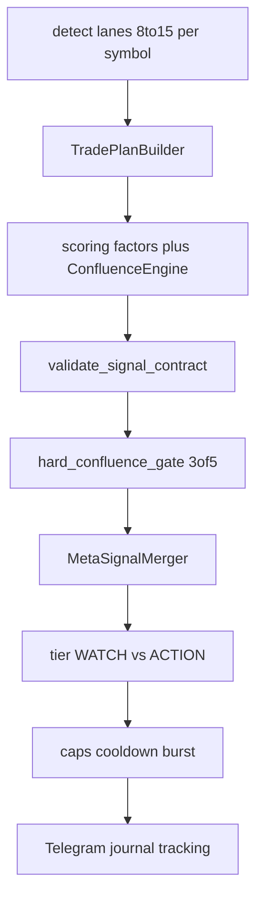

# Оценка сигнала (полный pipeline)

Как кандидат от детектора превращается в WATCH/ACTION в Telegram. **`[spec]`** — нормативный pipeline большого изменения. Текущий код — см. [LEGACY_CODE_SNAPSHOT.md](LEGACY_CODE_SNAPSHOT.md), не эталон.

См. также: [SIGNAL_ONLY_PRODUCT.md](SIGNAL_ONLY_PRODUCT.md), [PROJECT_ARCHITECTURE.md](PROJECT_ARCHITECTURE.md) §11–12, [PLAN_CRITICAL_REVIEW.md](PLAN_CRITICAL_REVIEW.md).

## 1. Обзор стадий `[spec]`



| # | Стадия | Выход |
|---|--------|-------|
| 0 | Детекция по `trigger_tf` + lanes | `Signal` + prior + trade plan draft |
| 1 | Scoring + ConfluenceEngine | blended `final_score` + components |
| 2 | Contract | pass / issues[] |
| 3 | Hard gate | ≥3 из 5 confirmations |
| 4 | MetaSignal merge | 1 canonical plan / symbol / window |
| 5 | Tier + policy | WATCH или ACTION; caps |
| 6 | Deliver | TG + persistence (no execution) |

**Два слоя качества (spec):** взвешенный ConfluenceEngine + отдельный boolean hard gate (trend, momentum, volume, htf, positioning/book — раздельные keys, см. §6).

## 2. Стадия 0 — детектор (`base_score`)

Каждый `BaseSetup.detect(prepared)`:

- Возвращает `None` или `Signal` с полями entry zone, SL, TP, `setup_id`, `direction`, `reasons`.
- `signal.score` — **prior** детектора (часто `base_score` из `config_strategies.toml`).
- `reject_log` на `PreparedSymbol` — почему не сработало (telemetry).

**Signal-only:** детектор не знает про биржевой аккаунт; только качество паттерна на данных.

## 3. Стадия 1 — scoring + ConfluenceEngine `[spec]`

Факторы (модуль scoring/confluence в целевой раскладке v9):

| Factor | Функция | Смысл (0–1) |
|--------|---------|-------------|
| MTF alignment | `_mtf_alignment` | 1h structure 70% + 4h regime 30% vs direction |
| Volume quality | `_volume_quality` | `volume_ratio20` на 15m |
| Structure clarity | `_structure_clarity` | Близость к EMA/POC/swing |
| Risk/reward | `_risk_reward_quality` | Качество TP1 distance |
| Funding contrarian | `_funding_contrarian` | Extreme funding vs reversal family |
| OI momentum | `_oi_momentum` | OI change согласован с direction |
| Crowd position | `_crowd_position` | L/S ratios + taker (contrarian для reversal) |

`adjustments` суммируются с clamp ±0.5 — **не переворачивают** направление.

## 4. Стадия 2 — `ConfluenceEngine` ([`bot/confluence.py`](../../bot/confluence.py))

Взвешенная модель (веса из `BotSettings.scoring`):

| Component | Weight field | Raw source |
|-----------|--------------|------------|
| mtf_alignment | `weight_mtf_alignment` | как scoring |
| volume_quality | `weight_volume_quality` | volume_ratio20 |
| structure_clarity | `weight_structure_clarity` | swings / levels |
| risk_reward | `weight_risk_reward` | RR TP1 |
| funding_score | часть crowd | funding contrarian |
| crowd_position | `weight_crowd_position` | L/S stack |
| oi_momentum | `weight_oi_momentum` | OI change |
| microstructure | derived | depth/CVD context, min confidence 0.35 |

**Blend:**

```text
final = edge_fn( prior_w * calibrated_prior(signal.score)
               + (1 - prior_w) * calibrated_model(sum contributions) )
```

История setup (`setup_history_count`) калибрует prior — больше样本 → стабильнее prior.

## 5. Стадия 3 — contract validation

[`validate_signal_contract`](../../bot/signal_contract.py) — hard invariants:

- Направление long/short
- Entry low ≤ high, внутри разумного % от mark
- SL на правильной стороне
- TP1..TP3 монотонны
- `risk_reward` TP1 ≥ min (1.5)
- TTL / timestamps

Fail → **не идёт** в Telegram, reason в journal.

## 6. Стадия 4 — hard confluence gate (3-of-5)

[`DeliveryOrchestrator._hard_confluence_gate`](../../bot/runtime/delivery_orchestrator.py) — **независимые** подтверждения (ADR-003):

| Key | Условие (упрощённо) |
|-----|---------------------|
| trend | close vs EMA20 vs EMA50 по direction |
| momentum | RSI в «здоровой» зоне (не перекуплен для long) |
| volume | volume > 1.2× mean20 |
| htf | 1h/4h regime не против direction |
| microstructure | \|funding\| < 0.001 и \|oi_change\| < 12% |

**Нужно ≥ 3 true** для прохода. Это **отдельно** от взвешенного score в ConfluenceEngine.

**Якоря (target):** опционально требовать **4/5** для ACTION — см. [BENCHMARK_ANCHORS.md](BENCHMARK_ANCHORS.md).

## 7. Стадия 5 — policy filters

| Filter | Блокирует если |
|--------|----------------|
| Cooldown | тот же symbol+direction недавно |
| Open signal | уже есть active plan |
| Quality monitor | setup paused / throttle |
| Asset fit | setup не в `strategy_fits(symbol)` |
| Data stale | `context_snapshot_age` > max |

Все reject → `delivery.jsonl` + dashboard rejections API.

## 8. Стадия 6 — rank & dedup

`select_and_rank(candidates, max_signals)`:

1. Сортировка: `(score, risk_reward)` desc.
2. **Setup diversity:** сначала лучший per `setup_id`, потом fill.
3. **One symbol per cycle** в selected (антиспам).
4. **Same-direction confluence boost:** если несколько setup на symbol+direction → +0.015…0.05 к score, reasons `confluence_N_setups`.

## 9. Tier WATCH vs ACTION `[spec]`

| Tier | Условие | Telegram |
|------|---------|----------|
| **ACTION** | `final_score` ≥ action_threshold + contract + gate + caps | Полный trade plan, loud |
| **WATCH** | ≥ watch_threshold, ниже action или soft gate | Silent / radar |

Пороги в `config.toml` delivery; metals/anchors — выше порог ACTION. См. [TELEGRAM_CHANNEL_SPEC.md](TELEGRAM_CHANNEL_SPEC.md).

## 10. Стадия 8 — deliver

- HTML format, confidence label от score (`delivery._confidence_label`).
- Confluence summary в тексте (`confluence_N_setups`).
- Journal row + `SignalTracker.register` (tracking **не** торгует).
- Updates: TP/SL hit → отдельные TG сообщения.

## 11. Что видит подписчик vs оператор

| Поле | Подписчик (TG) | Оператор (dashboard) |
|------|----------------|----------------------|
| Score % | Да | Да + component breakdown |
| Confluence 3/5 | Кратко | confluence lab heatmap |
| Reject reason | Нет | funnel / rejections API |
| Feature snapshot | Нет | journal / sandbox replay |

## 12. Signal-only калибровка оценки

Из веб-практик manual channels ([Mudrex](https://mudrex.com/learn/best-crypto-signal-providers-on-telegram/), [United Kings](https://unitedkings.net/how-to-execute-forex-signals-like-a-professional-trader-10/)):

1. Повышать вес **HTF + structure** vs чистый momentum.
2. Штрафовать сигналы без **zone** (слишком узкий entry).
3. Не ACTION при **spread stale** или extreme funding без reversal bar.
4. Публиковать **invalidation** явно — часть «оценки» для человека.

## 13. Целевые метрики качества оценки

| Метрика | Назначение |
|---------|------------|
| Precision ACTION | % ACTION с TP1 до SL (tracking) |
| Reject rate by stage | funnel dashboard |
| Score deciles vs outcome | autotune input |
| Anchor vs alt ACTION win rate | отдельные cohorts |

Autotune **не** меняет gate на hot path — только offline пороги в `config_strategies.toml` после approve.
