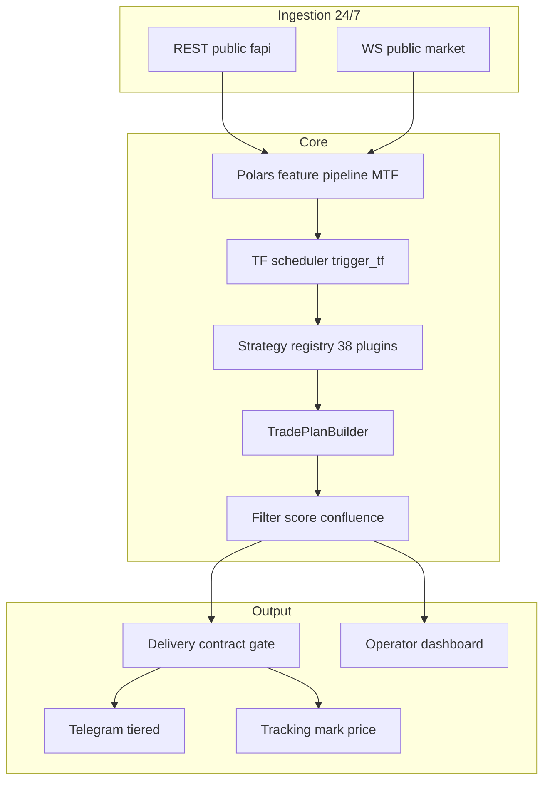

# Target Architecture

Greenfield target for a Binance USD-M **public** futures signal factory with Telegram delivery.

> **Полная спецификация** (модули, индикаторы, хранение, дашборд, автотюн, свечной анализ): **[PROJECT_ARCHITECTURE.md](PROJECT_ARCHITECTURE.md)**. Этот файл — краткий обзор слоёв и pipeline.

## Layer diagram



## Non-negotiables

- No private/auth Binance endpoints, no order placement.
- Delivery path: `validate_signal_contract` → hard confluence (e.g. 3-of-5) → `deliver`.
- Detectors in strategy plugins; orchestration in runtime scheduler.

## Two-axis timeframe model

### StrategyTimeframeProfile (per setup_id)

| Field | Meaning |
|-------|---------|
| `trigger_tf` | Candle close that runs `detect()` |
| `pattern_tf` | TF where pattern is measured |
| `required_tfs` | Frames that must be in cache |
| `ttl_bars` | Validity in `pattern_tf` bars |

### AssetTimeframeProfile (per symbol)

| Field | Meaning |
|-------|---------|
| `primary_timeframe` | Presentation label, TTL human factor |
| `context_timeframes` | HTF always loaded |
| `min_trigger_tf` | No ACTION faster than X |
| `excluded_setups` | Illiquid / wrong fit |

### Scheduler

On `KlineClose(symbol, interval)`:

1. Load union of `required_tfs` for strategies with `trigger_tf == interval` and enabled for symbol.
2. `prepare_symbol` once.
3. Run only matching detectors (not all 38).

WS kline intervals per symbol:

```text
intervals(symbol) = ⋃ { trigger_tf, required_tfs | setup enabled ∧ fits(symbol) }
```

## Pipeline phases

### Phase A — Continuous ingestion

- Sync time; `exchangeInfo`.
- Global: `!ticker@arr`, `!markPrice@arr`, `!forceOrder@arr`.
- Shortlist: klines per `intervals(symbol)`; prefer `!bookTicker` over N×`@bookTicker`.
- aggTrade buffer for CVD.
- Scheduled REST: OI, funding, L/S for shortlist (batch, 5–15 min).

### Phase B — Universe & shortlist

- Universe: USDT perp, TRADING, age > 90d, volume floor.
- Score → shortlist **40–55** (balanced profile).
- Refresh: light 60–120s (ticker rank), medium 15–30m (spread/OI), full 2–4h (listings).

### Phase C — Feature materialization

Polars: Wilder ATR/RSI, BB ddof=1, no `shift(-N)` on live path.

### Phase D — Detection

Plugin `detect(prepared, settings)` → candidate `Signal`.

### Phase E — TradePlanBuilder

- Entry **zone** (ATR % band), scale-in weights.
- SL beyond structure + ATR buffer.
- TP1/2/3 by R-multiples or liquidity levels.
- `valid_until`, textual invalidation.

### Phase F — Filter & score

1. Data freshness (all required TFs).
2. Spread / book staleness.
3. Mark–index deviation.
4. Min/max ATR regime.
5. HTF alignment (soft/hard by family).
6. Weighted confluence score.
7. Hard veto: R:R, missing SL, blacklist.
8. Human-grade gate: ≥3 independent factors.

### Phase G — Rank & deliver (tiered)

| Tier | Cadence |
|------|---------|
| WATCH | 30–120/day, silent TG |
| ACTION | 15–40/day, burst 8–15 per 15m |
| Dedup | 1 ACTION / symbol / direction / 2–4h |

### Phase H — Tracking

States: pending → active → tp/sl/be/expired. Mark price + kline H/L. Public audit hash per signal.

## Shortlist capacity (engineering)

| Profile | N symbols | Notes |
|---------|-----------|-------|
| Conservative | 25–35 | v1 stable |
| Balanced | 40–55 | Recommended |
| Aggressive | 60–80 | Strict REST scheduler |

Bottlenecks: Polars CPU (50×detectors×15m), `/futures/data` 1000/5min IP, WS 10 msg/s bursts — not the 1024 stream cap for typical configs.

## Python stack (target)

| Component | Choice |
|-----------|--------|
| Runtime | Python 3.12–3.14 asyncio |
| Frames | Polars |
| HTTP | aiohttp |
| WS | websockets |
| Telegram | aiogram 3 |
| Config | pydantic + TOML |
| Hot serialize | msgspec |
| Persistence | SQLite → TimescaleDB if needed |
| Dashboard | FastAPI + SPA |

**Exclude from production hot path:** ccxt, python-binance, pandas loops, Redis until proven need.

## Implementation phases (suggested)

1. Research docs (this folder) — done.
2. `StrategyTimeframeProfile` in registry + scheduler (multi `trigger_tf`).
3. Shortlist refresh + WS diff resubscribe.
4. Trade plan builder unification.
5. Tiered Telegram + caps.
6. Operator dashboard funnel.
7. Live calibration per family (`PYTEST_LIVE`).
