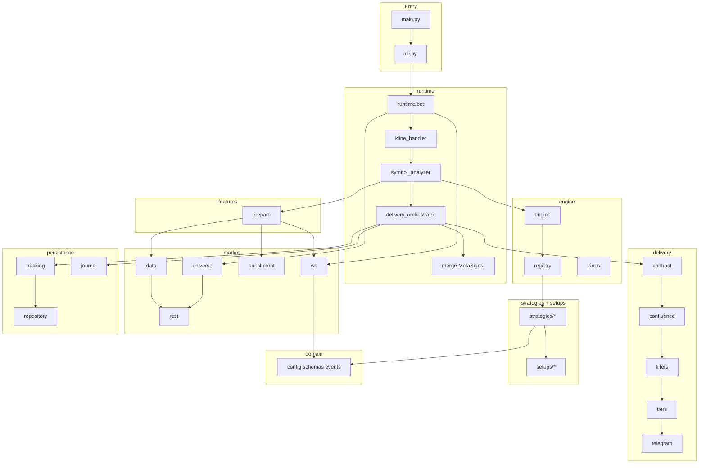
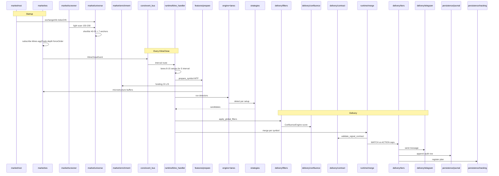

# Целевая структура репозитория (файлы, удаление, зависимости)

**Назначение:** один проход рефакторинга без бесконечных правок. **Источник истины:** [PROJECT_ARCHITECTURE.md](PROJECT_ARCHITECTURE.md) + [GAP_ANALYSIS_BOT2.md](GAP_ANALYSIS_BOT2.md) + [docs/REFACTOR_PLAN.md](../REFACTOR_PLAN.md).

**Правило миграции:** перенос тела → один массовый сдвиг импортов → удаление legacy. **Не** держать `application/` и `runtime/` с одним кодом дольше одного PR.

---

## 1. Сводка

| Метрика | Сейчас (~) | Цель |
|---------|------------|------|
| Python в `bot/` | ~187 | **~85–95** |
| Дубли пакетов | `application` + `runtime`, `core/engine` + `engine`, root + `persistence` | **один путь** |
| Entry | `main.py` → `cli` → `application.bot` | `main.py` → `cli` → **`runtime.bot`** |
| Monoliths >1k LOC | 10+ | **0** (макс ~800 `market/rest`) |

---

## 2. Что удалить (по фазам)

### Фаза A — сразу (orphan / дубликат, нет live-path)

| Файл / каталог | Причина |
|----------------|---------|
| `bot/features_shared.py.orig` | merge artifact |
| `bot/autotuner.py` | не подключён |
| `bot/config_loader.py` | заменён `domain/config.py` |
| `bot/dashboard_ui.py` | stub |
| `bot/monitor_bot.py` | дубль `cli` / health |
| `bot/telegram/` (4 файла) | live path = `messaging.py` (grep: 0 imports) |

**Проверка перед удалением:** `rg "bot\.telegram"`, `compileall`.

### Фаза B — после переноса тела в v9-пакеты

| Удалить | Куда переехало |
|---------|----------------|
| `bot/application/` (весь каталог, 14 модулей) | `bot/runtime/` |
| `bot/core/engine/` (3 файла) | `bot/engine/` (уже есть — **заменить re-export на тело**) |
| `bot/infrastructure/binance_client.py` | `bot/market/rest.py` + `market/rate_limit.py` |
| `bot/ws_manager.py` | `bot/market/ws.py` |
| `bot/market_data.py` | `bot/market/data.py` |
| `bot/universe.py` | `bot/market/universe.py` + `market/screener.py` |
| `bot/public_intelligence.py` | `bot/market/enrichment.py` |
| `bot/websocket/` (connection, cache, subscriptions, reconnect, health, enrichment) | `bot/market/ws_*.py` / `market/cache.py` |
| Root `bot/tracking.py`, `journal.py`, `outcomes.py`, `diary_store.py` | `bot/persistence/` |
| `bot/features.py` + `features_*.py` (6 root) | `bot/features/` package |
| `bot/delivery.py`, `confluence.py`, `filters.py`, `scoring.py`, `signal_contract.py`, `telegram_formatter.py` | `bot/delivery/` |
| `bot/messaging.py` | `bot/delivery/telegram.py` |
| `bot/dashboard.py` + `dashboard_live.py` + `ws_dashboard.py` | `bot/dashboard/` |
| `bot/signal_diagnostics.py` | `bot/diagnostics/signals.py` (~250 LOC) |
| `bot/startup_reporter.py` | `cli` startup block + `scripts/ops_report.py` |
| `bot/config_audit.py` | только `scripts/validate_config.py` |
| `bot/quality_monitor.py` | `telemetry` + dashboard tab |
| `bot/live_audit.py` | `scripts/live_check_*.py` |
| `bot/setup_base.py` | `bot/setups/base.py` |
| `bot/market_regime.py` | `bot/regime/composite.py` (merge) |
| `bot/strategy_asset_fit.py` | `bot/market/universe/fit.py` |
| `bot/tracked_signals.py` | merge в `persistence/tracking.py` |
| `bot/analytics.py` | `delivery/analytics.py` или dashboard only |

### Фаза C — опционально / offline-only

| Модуль | Действие |
|--------|----------|
| `bot/backtest/` | **оставить** offline; не в hot path |
| `bot/regime/hmm_regime.py`, `gmm_var.py` | оставить; v2 feature |
| `bot/core/analyzer/` | merge в `diagnostics/` или удалить если unused |
| `bot/core/memory/repository.py` (2105 LOC) | split → `persistence/repository/` |

### Не удалять

| Модуль | Роль |
|--------|------|
| `bot/strategies/*.py` (38) | детекторы (rewrite по волнам, не удалять) |
| `bot/domain/` | config, schemas, contracts, events |
| `bot/setups/` | SMC primitives |
| `bot/telemetry.py` | JSONL funnel |
| `bot/alerts.py` | watch→entry (интегрировать в delivery tiers) |
| `bot/cli.py`, `main.py` | entry |
| `bot/feature_flags.py`, `runtime_policy.py`, `secrets.py`, `migrations.py`, `logging_config.py` | ops |
| `tests/live/` | truth tests |
| `scripts/live_check_*.py`, `validate_config.py` | verification |

---

## 3. Что изменить (rewrite / move)

### P0 — runtime + market (блокирует spec)

| Файл | Действие |
|------|----------|
| `runtime/kline_handler.py` | **REWRITE:** multi-TF scheduler, не только 15m |
| `runtime/bot.py` | MOVE из `application/bot.py`; wiring на `bot.market`, `bot.runtime` |
| `market/universe.py` | ADD screener 150–200 → 40–55 + 7 anchors pinned |
| `market/ws.py` | union `intervals(symbol)` по shortlist + lanes |
| `engine/lanes.py` | **NEW:** 8–15 families / symbol / event |
| `domain/config.py` | поля caps, lanes, anchor floors |

### P1 — delivery + merge

| Файл | Действие |
|------|----------|
| `runtime/merge.py` | **NEW** MetaSignalMerger |
| `runtime/delivery_orchestrator.py` | MOVE; tier WATCH/ACTION |
| `delivery/tiers.py` | **NEW** |
| `delivery/trade_plan.py` | **NEW** TradePlanBuilder |
| `runtime/symbol_analyzer.py` | **SLIM** <400 LOC, только orchestration |
| `alerts.py` | merge logic с `delivery/tiers` |

### P2 — features package

| Действие |
|----------|
| Split `features.py` → `features/prepare.py` + submodules |
| `symbol_analyzer` не считает индикаторы — только вызывает `prepare_symbol` |

### P3 — persistence + dashboard

| Действие |
|----------|
| Split `core/memory/repository.py` |
| `dashboard/app.py` один FastAPI |
| Public audit CSV job в `scripts/` |

### Import migration (один раз)

```text
bot.application.*     →  bot.runtime.*
bot.core.engine.*     →  bot.engine.*
bot.market_data       →  bot.market.data
bot.ws_manager        →  bot.market.ws
bot.universe          →  bot.market.universe
bot.public_intelligence → bot.market.enrichment
bot.infrastructure.binance_client → bot.market.rest
bot.tracking/journal/... → bot.persistence.*
bot.delivery (root)   →  bot.delivery.*
bot.__init__: SignalBot from bot.runtime.bot
```

**Файлы вне `bot/`:** `scripts/live_*.py`, `historical_strategy_audit.py` — те же замены.

---

## 4. Конечное дерево файлов (~90 файлов)

```text
main.py
config.toml.example
config_strategies.toml.example
pyproject.toml

bot/
  __init__.py                 # SignalBot, BotSettings, load_settings → runtime, domain
  cli.py                      # slim: no startup_reporter monolith
  logging_config.py
  secrets.py
  feature_flags.py
  runtime_policy.py           # anchor deep-analysis flags
  migrations.py
  telemetry.py
  alerts.py                   # until merged into delivery/tiers

  domain/
    __init__.py
    config.py
    schemas.py
    contracts.py
    events.py
    strategies.py               # strategy metadata types

  market/
    __init__.py
    rest.py                     # HTTP public fapi (from binance_client)
    rate_limit.py
    data.py                     # kline cache, backfill
    ws.py                       # FuturesWSManager
    cache.py                    # aggTrade, depth, forceOrder buffers
    subscriptions.py
    reconnect.py
    universe.py                 # shortlist, buckets, strategy_fits
    screener.py                 # light scan 150-200
    enrichment.py               # OI, funding, L/S batch
    scheduler.py                # trigger_tf registry

  features/
    __init__.py
    prepare.py                  # prepare_symbol, _prepare_frame
    core.py
    structure.py
    oscillators.py
    microstructure.py
    advanced.py

  regime/
    __init__.py
    composite_regime.py
    hmm_regime.py                 # optional
    gmm_var.py                    # optional

  setups/
    __init__.py
    base.py                     # from setup_base
    smc.py
    utils.py
    detectors/                  # from spec_patterns split
      fvg.py
      ob.py
      ...

  engine/
    __init__.py
    base.py
    registry.py
    engine.py                   # bounded concurrency
    lanes.py                    # which setups run per event

  strategies/                   # 38 × *.py (unchanged names)
    __init__.py
    common.py
    roadmap_base.py
    fvg.py
    ... (36 more)

  runtime/
    __init__.py
    bot.py                      # SignalBot lifecycle
    container.py
    kline_handler.py
    cycle_runner.py
    fallback_runner.py
    symbol_analyzer.py
    shortlist_service.py
    market_context_updater.py
    oi_refresh_runner.py
    intra_candle_scanner.py
    delivery_orchestrator.py
    merge.py                    # MetaSignalMerger
    health_manager.py
    telemetry_manager.py

  delivery/
    __init__.py
    contract.py                 # validate_signal_contract
    confluence.py
    filters.py
    scoring.py
    tiers.py                    # WATCH / ACTION
    trade_plan.py
    deliver.py                  # ex delivery.py
    telegram.py                 # ex messaging.py + formatter
    queue.py                    # TG rate limit / 429

  persistence/
    __init__.py
    tracking.py
    journal.py
    outcomes.py
    diary.py
    repository/
      __init__.py
      schema.py
      queries.py
      migrations_hook.py

  diagnostics/
    __init__.py
    signals.py                  # slim reject funnel
    runtime_analysis.py
    strategy_audit.py           # from core/diagnostics

  dashboard/
    __init__.py
    app.py                      # FastAPI
    live.py
    ws_broadcast.py
    static/                     # existing js/html

  core/
    event_bus.py                # keep; used by WS → runtime
    runtime_errors.py

  backtest/                     # offline only
    __init__.py
    engine.py
    metrics.py

scripts/
  validate_config.py
  live_check_binance_api.py
  live_check_enrichments.py
  live_check_indicators.py
  live_check_pipeline.py
  live_check_strategies.py
  live_smoke_bot.py
  apply_migrations.py
  ... (ops scripts stay)

tests/live/
  test_binance_public_api.py
  test_binance_enrichments.py
  test_binance_indicators.py
  test_binance_pipeline.py

docs/research/                  # spec pack (не код)
```

**Удалённые каталоги в финале:** `bot/application/`, `bot/infrastructure/`, `bot/telegram/`, `bot/core/engine/`, `bot/core/memory/` (после split), `bot/websocket/` (влит в market).

---

## 5. Граф зависимостей (разрешён только вниз)



| From | To | Запрещено |
|------|-----|-----------|
| `domain` | — | imports из `bot.*` кроме stdlib |
| `market` | `domain` | `runtime`, `strategies` |
| `features` | `domain`, `market` (types) | `delivery`, `runtime` |
| `setups` | `domain` | `strategies`, `runtime` |
| `strategies` | `domain`, `setups` | `delivery`, `runtime` |
| `engine` | `domain`, `strategies` | `delivery` |
| `delivery` | `domain`, `persistence` | `runtime` (кроме callback injection) |
| `runtime` | all above | `dashboard` не импортирует `strategies` напрямую |
| `persistence` | `domain` | `delivery` |
| `dashboard` | read-only APIs / SQL | hot path |

---

## 6. Полный pipeline (end-to-end)



**Инварианты (не ломать):**

1. `validate_signal_contract` → `hard_confluence_gate` (≥3/5) → `deliver` — [delivery rules](../../.cursor/rules/delivery.mdc)
2. No private Binance endpoints
3. Publish on **candle close** (config)
4. Journal row **before** Telegram send ([WEB_RESEARCH_SUPPLEMENT.md](WEB_RESEARCH_SUPPLEMENT.md) §7)

---

## 7. Порядок PR (чтобы не крутить бесконечно)

| PR | Scope | Delete after |
|----|-------|--------------|
| **PR1** | Phase A deletes + `bot/__init__` → `runtime.bot` + scripts imports | orphans |
| **PR2** | Move `application/*` → `runtime/*` (real files); delete `application/` | application |
| **PR3** | Move `core/engine` → `engine`; implement `lanes.py` | core/engine |
| **PR4** | Market: rest/ws/universe/enrichment bodies; delete ws_manager, binance_client, public_intelligence | legacy market root |
| **PR5** | P0 scheduler + screener + WS union | — |
| **PR6** | `delivery/` package + merge + tiers | root delivery/*.py |
| **PR7** | `features/` package | root features*.py |
| **PR8** | `persistence/repository` split | core/memory, root tracking |
| **PR9** | `dashboard/` + diagnostics slim | dashboard_live, signal_diagnostics |
| **PR10** | Strategy wave rewrites (6–8 per PR) | — |

После **PR4** новый код импортирует **только** `bot.market`, `bot.runtime`, `bot.engine` — grep gate в CI.

---

## 8. Конфиг и data (не забыть)

| Файл | Назначение |
|------|------------|
| `config.toml` | runtime, ws, shortlist, delivery caps, anchors |
| `config_strategies.toml` | 38 setups enable/threshold |
| `data/bot.db` | SQLite persistence |
| `data/telemetry/*.jsonl` | funnel |
| `data/journal/` | audit |

---

## 9. Связанные документы

- [IMPLEMENTATION_READY.md](IMPLEMENTATION_READY.md) — gate перед execute
- [LEGACY_CODE_SNAPSHOT.md](LEGACY_CODE_SNAPSHOT.md) — что есть сейчас (не эталон)
- [../REFACTOR_PLAN.md](../REFACTOR_PLAN.md) — фазы 0–5
