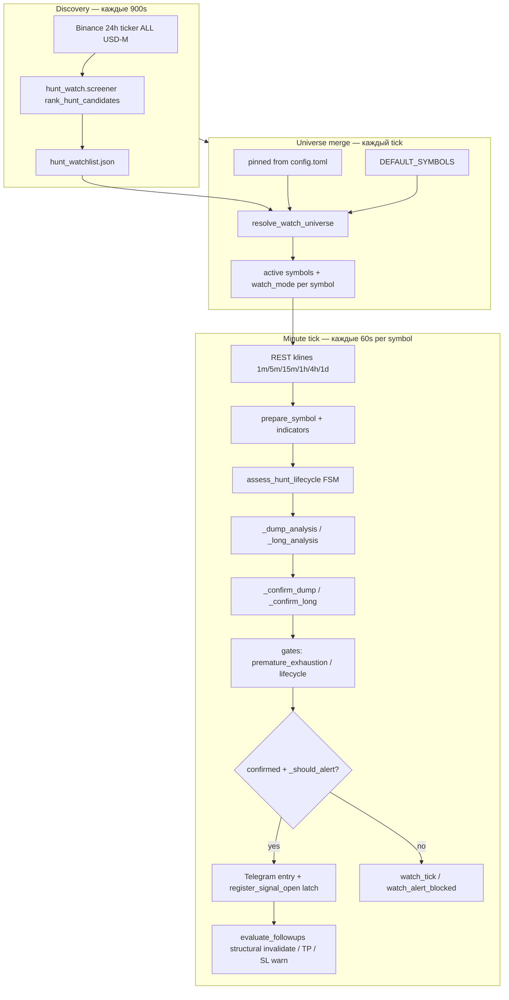
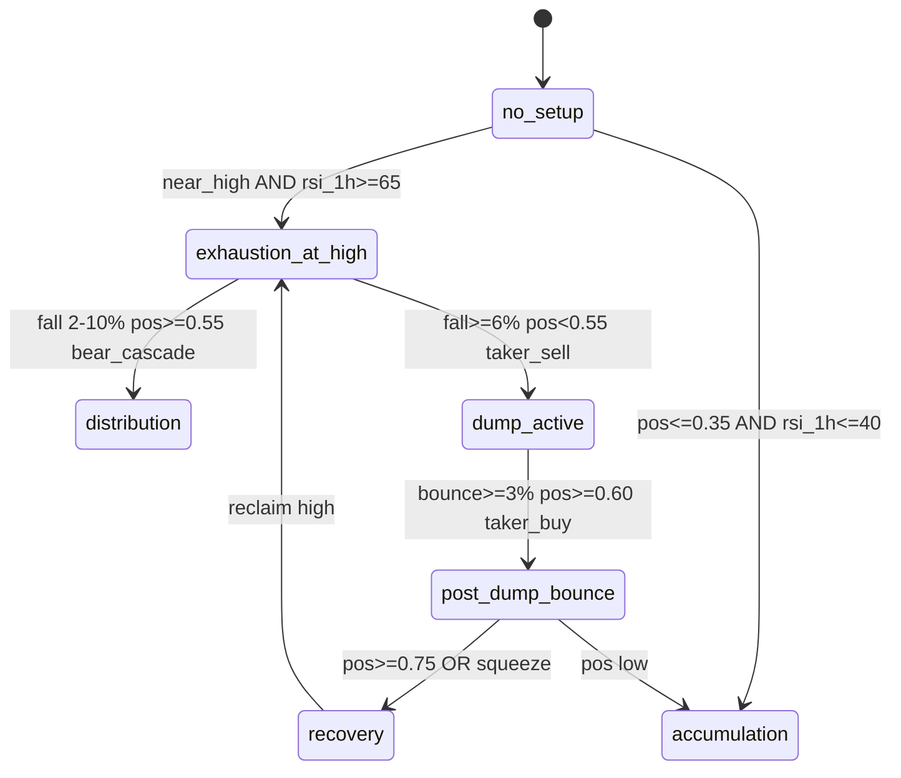

# Hunt Watch — Architecture & Strategy

Подсистема **memecoin pump/dump hunt**: REST-only, minute poll, Telegram on confirm.  
Отделена в `hunt-watch/`; использует data plane основного бота (`bot/market`, `bot/features`, `bot/engine`).

---

## 1. Назначение и границы

### Что делает
- Находит волатильные USD-M пары (radar → watchlist → minute watch)
- Классифицирует **фазу** импульса (exhaustion, distribution, dump, bounce, recovery)
- Считает **score** short/long setup на closed bars
- Шлёт **Telegram** только при `confirmed` + gates
- Ведёт **active signal tracker** с structural invalidation (не score-flicker)

### Что не делает
- Не ставит ордера, не использует private Binance API
- Не заменяет main-bot delivery path (`validate_signal_contract` → `hard_confluence_gate` → deliver)
- Для pinned hunt-символов TG идёт по hunt-heuristic даже при `htf_conflict` в main bot (advisory audit в сообщении)

### Уроки, заложенные в дизайн
| Кейс | Урок | Fix |
|------|------|-----|
| **VELVET** short | Fade на impulse high + cascade = valid | Confirm на 1m/5m bear cascade |
| **BEAT** short | Sticky confirm после −8% → squeeze | Lifecycle invalidate + local support |
| **JCT** short | Fade на вершине (pos 92%, fall 2%) + мгновенный confirm_lost | `blocks_premature_exhaustion_short` + latch |

---

## 2. Pipeline (end-to-end)



### Шаги по порядку

1. **Scanner** (`scanner_runner.run_scan`, каждые 900s из watch loop)
   - Все 24h tickers → `score_hunt_row` → top-N в `hunt-watch/data/hunt_watchlist.json`

2. **Universe** (`targets.resolve_watch_universe`)
   - Merge: `config.universe.pinned_symbols` → `DEFAULT_SYMBOLS` → watchlist (score ≥ 45 или `suggest_minute_watch`)
   - Cap: `MAX_DYNAMIC_SYMBOLS + len(pinned)`
   - Mode: pinned table + scanner `watch_bias`; `effective_watch_mode` учитывает lifecycle

3. **Symbol tick** (`watch._snapshot_symbol`, timeout 180s)
   - REST: klines, OI, funding, taker, basis, depth, LS ratios
   - Feature prep (Polars, Wilder RSI, ATR)
   - Main bot engine: 28 strategies → delivery audit (advisory)

4. **Lifecycle FSM** (`lifecycle.assess_hunt_lifecycle`)
   - Фаза → `recommended_bias`, `short_entry_ok`, `invalidate_short`

5. **Analysis + Confirm**
   - Short: `_dump_analysis` → score + triggers → `_confirm_dump` → `apply_short_invalidation`
   - Long: `_long_analysis` → `_confirm_long`

6. **Alert gate** (`_should_alert`)
   - `confirmed` + score ≥ forming min
   - Short: lifecycle `short_entry_ok`, not `invalidate_short`
   - Short: **не** `blocks_premature_exhaustion_short`

7. **Telegram**
   - Cooldown 45 min per `symbol:direction`
   - On send: `register_signal_open(telegram_sent=True)` с support/invalidation levels

8. **Follow-ups** (`signal_tracker.evaluate_followups`)
   - Только для `telegram_sent` active signals
   - Invalidate: lifecycle bounce, structural reclaim, SL hit — **не** `confirm_lost`

9. **Persistence**
   - `dump_minute_watch.jsonl` — full tick rows
   - `hunt_signal_state.json` — active/closed signals
   - `dump_watch_telegram_state.json` — entry cooldown

---

## 3. Архитектура модулей

```
hunt-watch/hunt_watch/
├── paths.py           # DATA paths (single source)
├── screener.py        # 24h ticker scoring (radar)
├── scanner_runner.py  # batch scan → watchlist JSON
├── targets.py         # universe + watch_mode merge
├── lifecycle.py       # HuntPhase FSM + gates
├── levels.py          # structural entry/SL/TP (fib + swing)
├── signal_tracker.py  # latch + follow-up events
└── bootstrap.py       # sys.path for scripts

hunt-watch/scripts/watch.py   # orchestrator (~1800 LOC)
  ├── imports bot.market.data, bot.features, bot.engine, bot.delivery.*
  └── hunt-specific logic inline: _dump_analysis, _confirm_*, _format_telegram
```

### Зависимости от main bot

| Hunt Watch | Main bot module | Зачем |
|------------|-----------------|-------|
| watch.py | `bot.market.data` | REST klines, ticker, OI |
| watch.py | `bot.features.prepare` | Polars frames, indicators |
| watch.py | `bot.engine` | Strategy hits для score + delivery audit |
| watch.py | `bot.delivery.*` | ConfluenceEngine advisory, TelegramBroadcaster |
| targets.py | `bot.domain.config` | pinned_symbols, proxy |

---

## 4. Discovery (Radar)

**Файл:** `screener.py`

### Фильтры candidacy
- `quote_volume ≥ $10M` / 24h
- `hunt_score ≥ 25` после scoring

### Scoring (0–100)

| Фактор | Баллы | Flag |
|--------|-------|------|
| \|change_24h\| ≥ 15% | +30 | pump_extreme |
| \|change_24h\| ≥ 8% | +18 | range_hot |
| range_24h ≥ 25% | +20 | range_expansion |
| pos_in_range ≥ 0.85 | +15 | pos_near_high |
| pos_in_range ≤ 0.25 | +12 | pos_near_low |
| log10(volume) bonus | до +10 | — |
| move ≥ 25% + vol ≥ $50M | +8 | liquid_mover |

### Watch bias (scanner)
- pos ≥ 0.85 → **short**
- pos ≤ 0.25 и change ≤ −8% → **long**
- change ≥ +15% → **short**; ≤ −15% → **long**
- иначе → **both**

### Пороги watchlist
- `score ≥ 45` → в watchlist
- `score ≥ 60` → `suggest_minute_watch` (priority)

---

## 5. Lifecycle FSM (фазы)

**Файл:** `lifecycle.py` — `HuntPhase`



### Поля HuntLifecycle

| Поле | Смысл |
|------|-------|
| `short_entry_ok` | Можно **новый** TG short (exhaustion, distribution) |
| `short_confirm_ok` | Confirm не demote (не bounce/recovery) |
| `invalidate_short` | Bounce/recovery/accumulation → закрыть short |
| `fall_from_high_pct` | (hunt_high − price) / hunt_high |
| `bounce_from_low_pct` | (price − session_low) / session_low |
| `local_support` | pivot low 5m/15m (не impulse high!) |

### Support break level
- `exhaustion_at_high` → `impulse_high × 0.998`
- иначе → `local_support` (BEAT fix)

### apply_short_invalidation
Demote `confirmed` если lifecycle bounce или late short (fall ≥ 10% без entry_ok).

---

## 6. Стратегия: SHORT (dump fade)

### Impulse context
- **Fast alts** (JCT, BEAT, VELVET): swing на **1h**, window 48 bars
- **BTC**: swing на **4h**, window 30 bars
- `hunt_high` / `hunt_low` — leg для fib и fall_from_high

### Score `_dump_analysis` (triggers)

| Trigger | Баллы |
|---------|-------|
| rsi15 ≥ 72 | +12 |
| rsi1h ≥ 72 | +10 |
| bear RSI div 4h/1h | +15 / +12 |
| 1m rejection wick | +16 |
| 5m rejection wick | +14 |
| 15m rejection | +10 |
| at fib 1272 | +10 |
| extended above impulse high | +8 |
| **5m below support** | **+28** |
| below impulse_high×0.998 | +12 |
| taker sell (<0.98) | +10 |
| oi flush | +10 |
| microprice sell | +8 |
| regime 4h bear | +8 |
| funding > 0.05% | +6 |
| bot_short hits | +6 each, max 18 |

### Confirm `_confirm_dump` (все closed bar)

Hard confirms (любой набор):
- `5m_close_below_support`
- `15m_close_below_support`
- `5m_rejection_exhaustion` (bear + wick + rsi15≥65)
- `1m_5m_bear_cascade`

**Confirmed =** `hard` non-empty **AND** score ≥ 60 **AND** (bear div **OR** score ≥ 68 **OR** oi_flush)

### Gate: premature exhaustion (JCT fix)

**Не слать TG short** если одновременно:
- phase = `exhaustion_at_high`
- `fall_from_high < 5%`
- `pos_in_range > 0.85`
- `bounce_from_low > 15%`
- нет bear div 1h/4h

### Levels `_dump_analysis` → `structural_short_levels`
- **Entry zone:** price .. impulse_high×0.995
- **SL:** max(impulse_high×1.006, entry + 1.1×ATR15)
- **TP1:** fib 0.382 retrace (или mid leg)
- **TP2:** fib 0.5 / impulse_low
- **Invalidation:** SL level (reclaim above → close signal)

---

## 7. Стратегия: LONG (bounce / recovery)

### Score `_long_analysis`

| Trigger | Баллы |
|---------|-------|
| rsi15 ≤ 32 | +12 |
| rsi1h ≤ 35 | +10 |
| bull div 4h/1h | +15 / +12 |
| 1m/5m/15m bounce wick | +16 / +14 / +10 |
| at fib support (ret_382) | +10 |
| deep below impulse_low | +8 |
| reclaim resistance (impulse_high×0.998) | +12 |
| taker buy, oi build, micro buy | +8–10 |
| bot_long hits | +6 each |

### Confirm `_confirm_long`
- Hard: 5m/15m close above resistance, bull wick + rsi, 1m_5m_bull_cascade
- score ≥ 60 AND (bull div OR score ≥ 68 OR oi_build)

### Levels `structural_long_levels`
- **SL:** below impulse_low / local_support − ATR
- **TP1:** local_resistance / impulse_high
- **TP2:** fib 1272 extension

### Invalidate long (follow-up)
- phase → `exhaustion_at_high` or `distribution` после bounce entry

---

## 8. Таймфреймы

| TF | Роль |
|----|------|
| **1m** | session 24h stats, 1m closed candle, cascade |
| **5m** | **primary confirm**, rejection, support break |
| **15m** | confirm, RSI, ATR for levels |
| **1h** | impulse swing (fast alts), RSI, div |
| **4h** | impulse swing (BTC), regime, div |
| **1d** | fib anchors (90 bars) |

**Confirm = closed bars only** (не live wick на forming candle).

---

## 9. Signal tracker (latch)

### Register
Только после **успешного Telegram** (`telegram_sent=True`):
- entry_lo/hi, SL, TP1/TP2
- support_break_level, invalidation_above/below
- lifecycle_phase at open

### Follow-up events

| Event | Условие |
|-------|---------|
| `invalidate` (short) | lifecycle.invalidate_short |
| `invalidate` (short) | price > invalidation_above × 1.001 |
| `invalidate` (short) | price ≥ stop_loss |
| `invalidate` (long) | phase exhaustion/distribution после bounce |
| `invalidate` (long) | price < invalidation_below |
| `fix_profit_tp1/tp2` | price crosses TP |
| `stop_warning` | price within 0.2% of SL |
| `phase_change` | lifecycle phase changed (info) |

**Убрано:** `confirm_lost` при score 66 < 68 без движения цены.

---

## 10. Telegram & cooldowns

| Param | Value |
|-------|-------|
| Entry cooldown | 45 min / symbol:direction |
| Follow-up cooldown | 5 min / message_key |
| Preflight | 3 retries, soft-fail → watch без TG |

### Message types
- **Entry:** `DUMP SHORT` / `LONG` · CONFIRMED · score · confirm reasons · levels · main-bot blocked (advisory)
- **Follow-up:** `SIGNAL OFF` · reclaim / lifecycle / SL
- **TP:** fix profit TP1/TP2

---

## 11. Default pinned universe

| Symbol | Mode | Rationale |
|--------|------|-----------|
| JCTUSDT | short | memecoin pump fade |
| BEATUSDT | both | lifecycle flips post-dump |
| VELVETUSDT | long | post-dump bounce hunt |
| HYPEUSDT | long | bounce |
| BTCUSDT | both | context anchor |

Scanner может добавить до 12 dynamic symbols; pinned modes **не перезаписываются** scanner bias для DEFAULT_SYMBOLS.

---

## 12. Independent verification

`scripts/independent_batch.py` + `beat_check.py`:
- Raw REST klines, собственный RSI
- Scoring long vs short без hunt FSM
- Snapshot: `hunt-watch/data/snapshots/hunt_independent_batch.json`

Использовать для **сверки** hunt TG vs sanity check (JCT invalid_short кейс).

---

## 13. Ops

```bash
# smoke hygiene (main repo)
python scripts/clean_session_data.py --mode smoke --config config.toml

# run watch
python hunt-watch/scripts/watch.py --interval 60

# logs
tail -f hunt-watch/data/dump_minute_watch.log

# grep blocks
grep watch_alert_blocked hunt-watch/data/dump_minute_watch.log
```

### Health signals
- `watch_telegram_ready` — TG ok
- `watch_alert_blocked` — gate сработал (premature exhaustion)
- `watch_followup_sent` — structural invalidate / TP
- `hunt_scan_refresh` — scanner ok
- `data_missing` in watch_tick — REST partial fail

---

## 14. Roadmap (не реализовано)

- VELVET pinned mode override vs scanner short bias
- HTF gate: require bear div OR dump_active for exhaustion short
- Cap universe: core 5 + top-3 scanner (latency)
- Follow-up TG telemetry dashboard
- Optional: WS 1m trigger вместо 60s REST poll

---

## 15. File map (data)

| Path | Content |
|------|---------|
| `hunt-watch/data/hunt_watchlist.json` | Scanner output |
| `hunt-watch/data/dump_minute_watch.jsonl` | All ticks |
| `hunt-watch/data/hunt_signal_state.json` | Active signals |
| `hunt-watch/data/dump_watch_telegram_state.json` | TG cooldown |
| `hunt-watch/data/snapshots/` | Independent analysis |

Legacy `data/hunt_*` в корне — deprecated; migrate to `hunt-watch/data/`.
