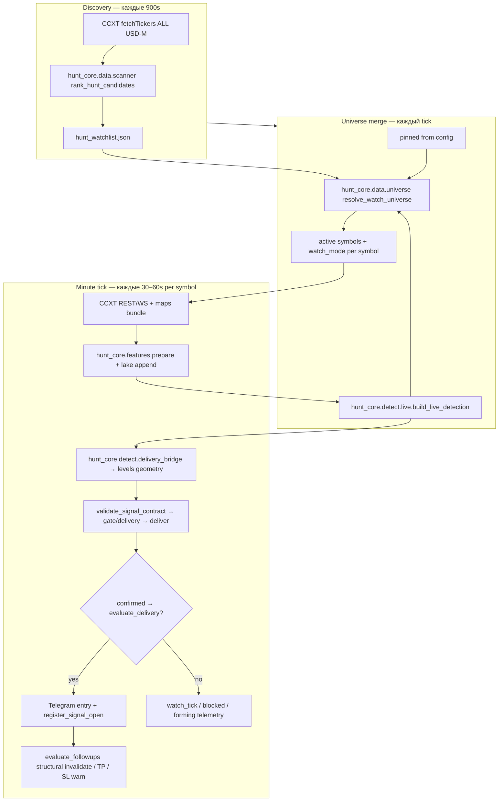
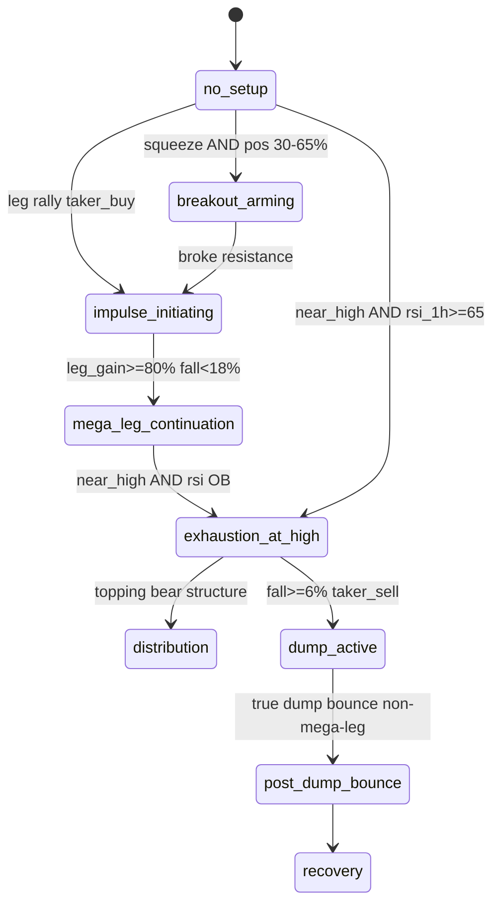

# Hunt Watch — Architecture & Strategy

> **Deprecated (pre-fusion, 2026-06-20).** Canonical architecture: [`docs/HUNT_ARCHITECTURE.md`](docs/HUNT_ARCHITECTURE.md).
> Sections 4–9 below describe the **removed** predump/prepump lifecycle (`screener.py`, `lifecycle.py`, `HuntPhase`).
> Live detection is **`hunt_core/detect/*`** (fusion + CUSUM phase). Threshold matrix and missing-data policy: same canonical doc.

Подсистема **memecoin pump/dump hunt**: REST minute poll + CCXT Pro WS (liq/trades/OHLCV/mark/book) + spot lead-lag, Telegram on confirm.  
Отдельный пакет **`hunt_core`** в `hunt/` — **standalone**, market plane **100% CCXT** ([`docs/CCXT.md`](docs/CCXT.md)). Не импортирует `bot.*` / `engine.*`.

### Professional maps (`hunt_core/maps/`)

Три карты на **реальных** CCXT public данных (без matplotlib):

| Map | Модуль | Данные |
|-----|--------|--------|
| Orderbook heatmap | `maps/orderbook.py` | WS L2 + cross merge, sticky walls, voids, footprint Δ-by-price |
| Liquidation map | `maps/liquidation.py` | Real `watchLiquidations` (Binance+Bybit+OKX) + entry-anchored forward overlay с confidence |
| Volume profile (Order map) | `maps/volume_profile.py` | POC/VAH/VAL multi-period, developing VP, HVN/LVN, naked POC |

Оркестрация: `maps/engine.py` (`MapTimeSeriesStore`, `build_map_bundle`, `derive_map_features`) → `tick_assembly` → `row["market"]` + scoring/gate/delivery.

---

## 1. Назначение и границы

### Что делает
- Находит волатильные USD-M пары (radar → watchlist → minute watch)
- Классифицирует **фазу** импульса (exhaustion, distribution, dump, bounce, recovery)
- Считает **score** short/long setup на closed bars
- Шлёт **Telegram** только при `confirmed` + gates
- Ведёт **active signal tracker** с structural invalidation (не score-flicker)

### Что не делает
- Не ставит ордера, не использует private Binance API
- **Standalone signal-only** — delivery path: `validate_signal_contract` → gates (mission → playbook → RR/EV → contract) → `deliver`
- Не дублирует main-bot strategies (28 strategies) — Hunt uses **playbook N-of-M** + fusion rank (pass ratio) + three archetypes

### TO-BE modules (Pass A)
| Module | Path | Role |
|--------|------|------|
| Fusion | `analysis/manipulation_fusion.py` | Archetype scores + OI regime + playbook checks |
| Playbook | `analysis/playbook_eval.py` | N-of-M boolean gates (default delivery path) |
| Forecasts | `maps/forecast.py` | predump / prepump / ignition target bands |
| Deep | `analysis/deep/` | `/signal` fusion + 3 verdicts + forecasts |
| OI regime | `maps/oi.py` | Axel Adler 4-state from OI×price |
| Ledger | `track/outcome_ledger.py` | deliver/block JSONL for calibration |
| Price oracle | `market/live_price.py` | `PriceQuote` unified staleness |

### Уроки, заложенные в дизайн
| Кейс | Урок | Fix |
|------|------|-----|
| **VELVET** short | Fade на impulse high + cascade = valid | Confirm на 1m/5m bear cascade |
| **BEAT** short | Sticky confirm после −8% → squeeze | Lifecycle invalidate + local support |
| **JCT** short | Fade на вершине (pos 92%, fall 2%) + мгновенный confirm_lost | `blocks_premature_exhaustion_short` + latch |

---

## 2. Pipeline (end-to-end)



### Шаги по порядку

1. **Scanner** (`hunt_core.data.scanner.run_scan`, каждые 900s из watch loop — shared `HuntCcxtClient`)
   - CCXT `fetchTickers` → `rank_hunt_candidates` → top-N в `hunt/data/hunt_watchlist.json`

2. **Universe** (`hunt_core.data.universe.resolve_watch_universe`)
   - Merge: `config.universe.pinned_symbols` → `DEFAULT_SYMBOLS` → watchlist (score ≥ 45 или `suggest_minute_watch`)
   - Cap: `MAX_DYNAMIC_SYMBOLS + len(pinned)`
   - Mode: pinned table + scanner `watch_bias`; `effective_watch_mode` учитывает lifecycle

3. **Symbol tick** (`tick_assembly.snapshot_symbol`, timeout 180s)
   - REST/WS: klines, OI, funding, taker, basis, depth, maps bundle
   - Feature prep (Polars, Wilder RSI, ATR) + parquet lake append
   - Setup catalog EV audit (advisory, `setups/catalog.py`)

4. **Fusion detection** (`detect/live.py` + `detect/delivery_bridge.py`)
   - Trailing window from lake + current bar → six self-calibrated factors
   - `build_detection`: fuse → PRE/MID phase → single gate (`gate_open`)
   - MID ⇒ watch gate closed by construction (`detect/phase.py`)
   - Geometry from preserved `levels.py` (entry/SL/TP)

5. **Delivery gate** (`evaluate_delivery` confirm / `evaluate_forming_gate` forming)
   - Confirm: declarative rules (`_rules_table.py`) — data → mission → playbook → RR → EV → structural triggers → contract
   - Default path: `HUNT_PWIN_GATE=0` — playbook + EV floor; fuel/score legacy off (`HUNT_LEGACY_FUEL=0`)
   - Forming: telemetry only when gate blocks below forming min score

6. **Telegram**
   - Cooldown 45 min per `symbol:direction`
   - On send: `register_signal_open(telegram_sent=True)` с support/invalidation levels

7. **Follow-ups** (`signal_tracker.evaluate_followups`)
   - Только для `telegram_sent` active signals
   - Invalidate: lifecycle bounce, structural reclaim, SL hit — **не** `confirm_lost`

8. **Persistence**
   - `dump_minute_watch.jsonl` — full tick rows
   - `hunt_signal_state.json` — active/closed signals
   - `dump_watch_telegram_state.json` — entry cooldown

---

## 3. Архитектура модулей

```
hunt/hunt_core/           # standalone package (python -m hunt_core)
  ├── market/            # CCXT REST + Pro — see docs/CCXT.md (13 modules)
  ├── data/scanner.py    # 24h ticker scan → watchlist JSON
  ├── data/universe.py   # pinned + watchlist merge
  ├── runtime/cycle/     # watch loop orchestrator
  ├── runtime/tick_assembly.py
  └── data/collect.py    # REST pack via HuntCcxtClient only
```

### Market data (100% CCXT)

| Component | Module | Зачем |
|-----------|--------|-------|
| REST + metrics | `hunt_core.market.client` | OHLCV, OI, funding, fapiData implicit |
| Live WS | `hunt_core.market.streams` | Pro `watch*` multiplex |
| Spot lead-lag | `hunt_core.market.spot` | CCXT spot companion |
| Entry | `create_hunt_market_plane_from_settings()` | Factory bootstrap |

**Never** `engine.market.*` or raw `fapi.binance.com` in hunt. CI: `python -m hunt_core._dev.check_ccxt`.

---

## 4. Discovery (Radar)

**Файл:** `screener.py`

### Фильтры candidacy
- `quote_volume ≥ $10M` / 24h
- `hunt_score ≥ 25` после scoring

### Scoring (0–100)

| Фактор | Баллы | Flag |
|--------|-------|------|
| \|change_24h\| ≥ 15% | +30 | pump_extreme |
| \|change_24h\| ≥ 8% | +18 | range_hot |
| range_24h ≥ 25% | +20 | range_expansion |
| pos_in_range ≥ 0.85 | +15 | pos_near_high |
| pos_in_range ≤ 0.25 | +12 | pos_near_low |
| log10(volume) bonus | до +10 | — |
| move ≥ 25% + vol ≥ $50M | +8 | liquid_mover |

### Watch bias (scanner)
- pos ≥ 0.85 → **short**
- pos ≤ 0.25 и change ≤ −8% → **long**
- change ≥ +15% → **short**; ≤ −15% → **long**
- иначе → **both**

### Пороги watchlist
- `score ≥ 45` → в watchlist
- `score ≥ 60` → `suggest_minute_watch` (priority)

---

## 5. Lifecycle FSM (фазы)

**Файл:** `lifecycle.py` — `HuntPhase`

**Миссия:** ловить **начало изначального пампа** (impulse/mega-leg) и **начало дампа** (exhaustion → structural break). Mega-leg (leg_gain ≥80%, BEAT 1.5→8.37) ≠ post_dump_bounce.



| Фаза | Bias | Продуктовый смысл |
|------|------|-------------------|
| `breakout_arming` | long | База / squeeze перед пробоем |
| `impulse_initiating` | long | Старт или середина импульса вверх |
| `mega_leg_continuation` | long | Продолжение +80% ноги (не bounce) |
| `exhaustion_at_high` | short | Вершина — prep дампа |
| `dump_active` | wait | Mid-dump — monitor only |
| `post_dump_bounce` | long | Отскок после **настоящего** дампа (не mega-leg) |

Early alerts: `hunt_core/scan/early.py` (PUMP/DUMP PREP/START до confirm).

### Поля HuntLifecycle

| Поле | Смысл |
|------|-------|
| `short_entry_ok` | Можно **новый** TG short (exhaustion, distribution) |
| `short_confirm_ok` | Confirm не demote (не bounce/recovery) |
| `invalidate_short` | Bounce/recovery/accumulation → закрыть short |
| `fall_from_high_pct` | (hunt_high − price) / hunt_high |
| `bounce_from_low_pct` | (price − session_low) / session_low |
| `local_support` | pivot low 5m/15m (не impulse high!) |

### Support break level
- `exhaustion_at_high` → `impulse_high × 0.998`
- иначе → `local_support` (BEAT fix)

### apply_short_invalidation
Demote `confirmed` если lifecycle bounce или late short (fall ≥ 10% без entry_ok).

---

## 6. Стратегия: SHORT (dump fade)

### Impulse context
- **Fast alts** (JCT, BEAT, VELVET): swing на **1h**, window 48 bars
- **BTC**: swing на **4h**, window 30 bars
- `hunt_high` / `hunt_low` — leg для fib и fall_from_high

### Score `_dump_analysis` (triggers)

| Trigger | Баллы |
|---------|-------|
| rsi15 ≥ 72 | +12 |
| rsi1h ≥ 72 | +10 |
| bear RSI div 4h/1h | +15 / +12 |
| 1m rejection wick | +16 |
| 5m rejection wick | +14 |
| 15m rejection | +10 |
| at fib 1272 | +10 |
| extended above impulse high | +8 |
| **5m below support** | **+28** |
| below impulse_high×0.998 | +12 |
| taker sell (<0.98) | +10 |
| oi flush | +10 |
| microprice sell | +8 |
| regime 4h bear | +8 |
| funding > 0.05% | +6 |
| bot_short hits | +6 each, max 18 |

### Confirm `_confirm_dump` (все closed bar)

Hard confirms (любой набор):
- `5m_close_below_support`
- `15m_close_below_support`
- `5m_rejection_exhaustion` (bear + wick + rsi15≥65)
- `1m_5m_bear_cascade`

**Confirmed =** `hard` non-empty **AND** score ≥ 60 **AND** (bear div **OR** score ≥ 68 **OR** oi_flush)

### Gate: premature exhaustion (JCT fix)

**Не слать TG short** если одновременно:
- phase = `exhaustion_at_high`
- `fall_from_high < 5%`
- `pos_in_range > 0.85`
- `bounce_from_low > 15%`
- нет bear div 1h/4h

### Levels `_dump_analysis` → `structural_short_levels`
- **Entry zone:** price .. impulse_high×0.995
- **SL:** max(impulse_high×1.006, entry + 1.1×ATR15)
- **TP1:** fib 0.382 retrace (или mid leg)
- **TP2:** fib 0.5 / impulse_low
- **Invalidation:** SL level (reclaim above → close signal)

---

## 7. Стратегия: LONG (bounce / recovery)

### Score `_long_analysis`

| Trigger | Баллы |
|---------|-------|
| rsi15 ≤ 32 | +12 |
| rsi1h ≤ 35 | +10 |
| bull div 4h/1h | +15 / +12 |
| 1m/5m/15m bounce wick | +16 / +14 / +10 |
| at fib support (ret_382) | +10 |
| deep below impulse_low | +8 |
| reclaim resistance (impulse_high×0.998) | +12 |
| taker buy, oi build, micro buy | +8–10 |
| bot_long hits | +6 each |

### Confirm `_confirm_long`
- Hard: 5m/15m close above resistance, bull wick + rsi, 1m_5m_bull_cascade
- score ≥ 60 AND (bull div OR score ≥ 68 OR oi_build)

### Levels `structural_long_levels`
- **SL:** below impulse_low / local_support − ATR
- **TP1:** local_resistance / impulse_high
- **TP2:** fib 1272 extension

### Invalidate long (follow-up)
- phase → `exhaustion_at_high` or `distribution` после bounce entry

---

## 8. Таймфреймы

| TF | Роль |
|----|------|
| **1m** | session 24h stats, 1m closed candle, cascade |
| **5m** | **primary confirm**, rejection, support break |
| **15m** | confirm, RSI, ATR for levels |
| **1h** | impulse swing (fast alts), RSI, div |
| **4h** | impulse swing (BTC), regime, div |
| **1d** | fib anchors (90 bars) |

**Confirm = closed bars only** (не live wick на forming candle).

---

## 9. Signal tracker (latch)

### Register
Только после **успешного Telegram** (`telegram_sent=True`):
- entry_lo/hi, SL, TP1/TP2
- support_break_level, invalidation_above/below
- lifecycle_phase at open

### Follow-up events

| Event | Условие |
|-------|---------|
| `invalidate` (short) | lifecycle.invalidate_short |
| `invalidate` (short) | price > invalidation_above × 1.001 |
| `invalidate` (short) | price ≥ stop_loss |
| `invalidate` (long) | phase exhaustion/distribution после bounce |
| `invalidate` (long) | price < invalidation_below |
| `fix_profit_tp1/tp2` | price crosses TP |
| `stop_warning` | price within 0.2% of SL |
| `phase_change` | lifecycle phase changed (info) |

**Убрано:** `confirm_lost` при score 66 < 68 без движения цены.

---

## 10. Telegram & cooldowns

| Param | Value |
|-------|-------|
| Entry cooldown | 45 min / symbol:direction |
| Follow-up cooldown | 5 min / message_key |
| Preflight | 3 retries, soft-fail → watch без TG |

### Message types
- **Entry:** `DUMP SHORT` / `LONG` · CONFIRMED · score · confirm reasons · levels · main-bot blocked (advisory)
- **Follow-up:** `SIGNAL OFF` · reclaim / lifecycle / SL
- **TP:** fix profit TP1/TP2

---

## 11. Default pinned universe (Module 2 — deep only)

| Symbol | Hunt scan TG | Deep continuous |
|--------|--------------|-----------------|
| BTCUSDT | blocked | `deep_pinned_loop` change-only |
| ETHUSDT | blocked | same |
| XAUUSDT | blocked | same |
| XAGUSDT | blocked | same |

Module 1 (`hunt_scan.jsonl`) processes **dynamic alts only**. Pinned stay on WS for BTC context; fusion + confirm TG never fire for anchors (`HUNT_PINNED_AUTO_CONFIRM=0`).

Scanner может добавить до 12 dynamic symbols.

---

## 12. Independent verification

Repo root `scripts/hunt_probe_independent.py` — CCXT sync probe (raw REST removed).  
Hunt runtime: `python -m hunt_core._dev.smoke_signals`, `python -m hunt_core._dev.smoke_deep_pinned`, `ccxt_plane_smoke`.

---

## 13. Ops

```bash
# smoke hygiene (main repo)
python scripts/clean_session_data.py --mode smoke --config config.toml

# run watch
python -m hunt_core watch --interval 60

# logs
tail -f hunt/data/dump_minute_watch.log

# grep blocks
grep watch_alert_blocked hunt/data/dump_minute_watch.log
```

### Health signals
- `watch_telegram_ready` — TG ok
- `watch_alert_blocked` — gate сработал (premature exhaustion)
- `watch_followup_sent` — structural invalidate / TP
- `hunt_scan_refresh` — scanner ok
- `data_missing` in watch_tick — REST partial fail

---

## 14. Backtest, replay & calibration (факт по коду)

Hunt **не имеет** полноценного event-driven backtest как `main.py backtest`. Есть **набор offline/live инструментов** — сверяй промпт аудита с этой таблицей.

### Что реализовано

| Инструмент | Файл | Что делает |
|------------|------|------------|
| **Tracker reconcile** | `scripts/reconcile_signals.py` | REST `5m` klines с `opened_at` → SL/TP state machine для **active**; `--backfill-legacy` для closed без reason |
| **Outcome backfill** | `param_calibration.backfill_legacy_outcomes` | То же через `calibrate_all` (5m window) |
| **Mini backtest helper** | `signal_audit.backtest_levels_on_bars` | SL/TP на списке `(high, low, close)` баров — **функция есть, в /signal audit пока не вызывается** |
| **Outcome calibration** | `scripts/calibrate_all.py` | universal + per-symbol gates из closed outcomes, tick JSONL, pump_history, REST 7d profile |
| **Level calibration** | `scripts/calibrate_levels.py` | SL caps из tracker outcomes |
| **Outcomes report** | `scripts/outcomes_report.py` | score buckets × win/loss |
| **Tick history sample** | `param_calibration.sample_tick_profiles` | tail `dump_minute_watch.jsonl` → median chg/sl_dist per symbol |
| **Pump backfill** | `pump_history.backfill_from_jsonl` | pump legs из tick JSONL |
| **Independent replay** | `critical_audit.py`, `signal_audit.audit_probe_row` | indie confirm/fuel vs bot на одном snapshot |
| **Supervised session** | `scripts/supervised_session.py` | N часов watch + `verify_diff` pause/resume |
| **Lab experiment** | `scripts/beat_dump_experiment.py` | per-symbol indicator matrix (BEAT-style) |

### Чего нет (gap)

- ~~**WS `@kline_5m` fast tick**~~ — реализовано: grace 2s + merge в REST `5m_closed`
- **Полный signal-path backtest** — нет forward PnL label на replay rows (join tracker + 5m bars — next)

### Рекомендуемый offline pipeline

```bash
# repo root, after pip install -e "./hunt"
python -m hunt_core._dev.check_logic
python -m hunt_core._dev.smoke_signals --baseline hunt/data/baseline/hunt_baseline.json BTCUSDT
python -m hunt_core._dev.ccxt_plane_smoke BTCUSDT --ws-seconds 3
```

Tracker/outcome tooling lives in `hunt_core/track/` (no `hunt/scripts/` tree).

---

## 15. Binance public API (Hunt usage)

Только **публичные** USD-M endpoints через **CCXT 4.x** (`hunt_core/market/`). Источник: `HuntCcxtClient`, `HuntCcxtStreams`, `HuntCcxtSpotCompanion`. См. [docs/CCXT.md](docs/CCXT.md).

### Используется сейчас (CCXT surface)

| Канал | CCXT / Pro | В hunt |
|-------|------------|--------|
| REST | `fetchOHLCV` 1m–1d | Primary frames (60s poll) |
| REST | `fetchTickers`, `loadMarkets` | Scanner, universe |
| REST | `fetchFundingRates`, `fetchFundingRate*`, `fetchFundingIntervals` | Market layer |
| REST | `fetchOpenInterest`, `fapiDataGetOpenInterestHist` | OI flush/build, z-score |
| REST | `fapiDataGet*LongShort*` + series | Crowded longs/shorts |
| REST | `fapiDataGetTakerlongshortRatio` | Sell/buy pressure |
| REST | `fapiDataGetBasis`, `fetchAggTrades`, `fetchOrderBook` | Microstructure |
| REST | spot `fetchTicker` + `fetchOHLCV` | lead-lag vs perp |
| WS (Pro) | `watchOHLCVForSymbols`, `watchTradesForSymbols`, … | Live enrich |
| WS (Pro) | `watchLiquidationsForSymbols` | Liquidation cascades 5m |
| WS (Pro) | `watchMarkPrices` | Live mark/index/funding + basis (Binance primary) |
| WS (Pro) | `watchFundingRates` | Secondaries only (`HUNT_CROSS_WS`); **not** Binance primary |

### Не используется через CCXT Pro сегодня (roadmap)

| Возможность | Зачем hunt |
|-------------|------------|
| `watchOpenInterest` (if added to CCXT) | OI delta без REST budget hit |
| Sub-minute kline WS beyond 1m multiplex | Sub-5m confirm |
| Deep order book diff stream | Live imbalance beyond `watchOrderBookForSymbols` |
| `fetchIndexOHLCV` / `fetchMarkOHLCV` history | Basis vs spot divergence calibration |
| `longShortRatio` 1d history | Regime calibration |

Ограничение: `/futures/data/*` — **1000 req / 5 min / IP**; hunt batch OI на minute tick, не per-second.

---

## 16. Roadmap (не реализовано)

- VELVET pinned mode override vs scanner short bias
- HTF gate: require bear div OR dump_active for exhaustion short
- Cap universe: core 5 + top-3 scanner (latency)
- Follow-up TG telemetry dashboard
- Optional: WS 1m trigger вместо 60s REST poll

---

## 17. File map (data)

| Path | Content |
|------|---------|
| `hunt/data/hunt_watchlist.json` | Scanner output |
| `hunt/data/dump_minute_watch.jsonl` | Current-day ticks |
| `hunt/data/dump_minute_watch-YYYY-MM-DD.jsonl` | Rotated daily archive |
| `hunt/data/hunt_signal_state.json` | Tracker (active/closed) |
| `hunt/data/hunt_calibration.json` | Universal + per-symbol gates |
| `hunt/data/ewma_thresholds.json` | EWMA tick stats |
| `hunt/data/signal_events.jsonl` | Lifecycle event log |
| `hunt/data/signal_audit.jsonl` | /signal audit |
| `hunt/data/prep_shadow_events.jsonl` | Prep shadow paper trades |
| `hunt/data/setup_candidates.jsonl` | Setup candidate funnel |

### JSONL rotation (#44)

All append-only telemetry writers call `rotate_jsonl_if_needed` before write (`track/events.py`):
`signal_events.jsonl`, `sent_messages.jsonl`, `prep_shadow_events.jsonl`, `setup_candidates.jsonl`, tick lake via `runtime/tick_io.py`.

Retention: default **50 MB** per file (`JSONL_ROTATE_MAX_BYTES`); archived suffix `.1` in same directory.
| `hunt/data/dump_watch_telegram_state.json` | TG cooldown |
| `hunt/data/snapshots/` | Independent batch |

Legacy `data/hunt_*` в корне — deprecated; migrate to `hunt/data/`.
