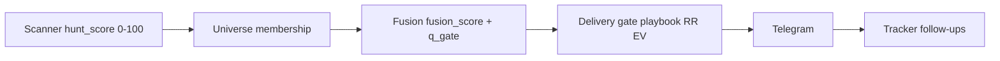

# Hunt architecture (canonical)

Standalone **crypto-hunter** package (`hunt/`, import `hunt_core`). No `engine.*`, no `bot.*`, no `hunt/scripts/` on hot path.

## Product — two independent planes (+ catalog)

| Plane | Trigger | Pipeline | Artifacts | Telegram |
|-------|---------|----------|-----------|----------|
| **Module 2 — Scanner** | `watch` tick (dynamic universe only) | fusion detect → delivery → gates | `data/hunt_scan.jsonl`, `plane=hunt` | ARMED / CONFIRM for **alts only** (pinned blocked) |
| **Module 1 — Deep** | `deep_pinned_loop` + `/signal` / `/analyze` | `deep/` + maps + `verdict_v2` | `data/deep_ticks.jsonl`, `pinned_cache/` | Change-only for pinned; on-demand for user symbols |
| **Catalog** | `/signals [SYMS]` | 7 setup detectors + probability | setup candidates | Setup list + tracker block |

Pinned anchors stay on WS for market context but are **excluded** from Module 2 fusion ticks. Module 1 never calls `build_live_detection` or scanner delivery gates for TG.

**North star (short):** gate_edge hold-to-target SL ≤30%, TP1+ ≥50% (n≥30). Uncalibrated **long** signals route to **lab lane** (`long_ramp_reason`) until `gate_edge` long n≥30 passes; `HUNT_LONG_TG=1` overrides for production.

## Metrics (fusion cutover, 2026-06-20)

| Metric | Value |
|--------|-------|
| `hunt_core/` `.py` files | **~105** (legacy scan/regime removed) |
| hot path LOC | **~36k** (budget gate 44k; stretch 32k) |
| offline verify | `_dev/check_*` + `replay_fusion` + CI live-smoke |

## Package layout

```
hunt/
├── hunt_core/              # production hot path
│   ├── __main__.py         # python -m hunt_core watch
│   ├── contract.py         # trade plan + feature payload + delivery contract
│   ├── market/             # factory, client, streams, cross, symbols, … (CCXT.md)
│   ├── data/               # collect, universe, lake, completeness
│   ├── features/           # prepare, snapshot, lake append
│   ├── shared/             # mathlib, facts, primitives, shadow ledger
│   ├── scanner/            # Module 2: detect, gate, setups, delivery, telegram
│   ├── deep/               # Module 1: verdict_v2, plan, engine façade, telegram
│   ├── deliver/            # dispatch, telegram, digest
│   ├── track/              # tracker, events, outcomes, …
│   ├── analysis/           # playbook, fusion helpers (scanner-owned via playbook shim)
│   ├── runtime/            # cycle/_impl, tick_assembly, telegram_commands
│   ├── domain/             # config, schemas, policy
│   └── _dev/               # budget, check_*, replay_fusion, watch_once_smoke
├── docs/
└── data/baseline/          # smoke regression snapshots
```

Fusion migration **done** (2026-06-20): legacy `scan/{predump,prepump,…}` and `regime/leg_fsm` deleted; detection is `detect/*` only.

## Hot path (watch tick — Module 2 Scanner only)

```
run_loop → resolve_hunt_scan_universe (no pinned fusion)
  → data.collect.snapshot_symbol (hunt_fusion=True, plane=hunt)
  → detect.live.build_live_detection → delivery bridge → gates
  → hunt_scan.jsonl + HuntScanStore
  → [confirmed alt] deliver.telegram (pinned blocked via hunt_auto_confirm_blocked)

deep_pinned_loop (background, Module 1 Deep):
  assemble_deep_tick (hunt_fusion=False, plane=deep) → deep/verdict_v2 → change-only TG
```

### Delivery invariant

```
validate_signal_contract(setup) → must_pass → family_vote → evaluate_delivery (gate) → telegram.send
```

## Entrypoints

```bash
python -m hunt_core watch --interval 60
python -m hunt_core watch --once --no-telegram
python -m hunt_core._dev.budget
python -m hunt_core._dev.replay_fusion --all --q-gate 0.92
python -m hunt_core._dev.smoke_signals --baseline data/baseline/hunt_baseline.json BTCUSDT
scripts/supervised_session.py --hours 8 --watch-interval 30
```

## Merge policy (post-fusion 2026-06-20)

| File | LOC | Policy |
|------|-----|--------|
| `runtime/cycle/_impl.py` | ~2500 | watch loop |
| `runtime/tick_assembly.py` | ~1200 | tick orchestration + fusion wiring |
| `detect/fusion.py` + `factors.py` | ~800 | statistical fusion core |
| `gate/delivery.py` | ~2100 | delivery gates |
| `gate/_delivery_helpers.py` | ~400 | evidence/maps helpers (extracted from legacy scan) |
| `deliver/telegram.py` | ~1800 | transport + formatters |
| `track/tracker.py` | ~1800 | FSM |
| `levels/levels.py` | ~1200 | SL/TP geometry |

Merge small modules into fewer files; never split these.

## Library-first

`polars` + `polars_ta` + `polars-ols` + `polars-ds` + `polars-trading` + `bottleneck` + `ccxt` (100% market plane — [CCXT.md](CCXT.md)). See [LIBRARY_STACK.md](LIBRARY_STACK.md).

## Market plane (CCXT)

```
hunt_core/market/
├── factory.py      # create_hunt_market_plane(), build_network_config(pro=True)
├── client.py       # HuntCcxtClient — REST + lazy Pro
├── streams.py      # HuntCcxtStreams — watch* multiplex
├── ccxt_rest.py    # HuntCcxtRestGate — invoke / invoke_fapi / invoke_secondary
├── ccxt_guard.py   # ccxt_method_available(), ccxt_ws_method_available()
├── network.py      # CCXT proxy probe + ProxyPool
├── spot.py         # HuntCcxtSpotCompanion
├── cross.py        # multi-venue REST + secondary Pro funding WS
├── symbols.py      # exchange.market() resolution
├── live_price.py   # price from streams snapshot
├── rate_limit.py   # sliding weight windows
└── capacity.py     # HuntLoadPlanner per-tick budget
```

**Funding WS:** Binance primary = `watchMarkPrices` only; `watchFundingRates` on secondaries when `HUNT_CROSS_WS=1` (default on via `load_cross_exchange_config`).

## Score hierarchy (post-fusion)

Each stage owns a **different score namespace**. They do not override each other — conflicts resolve by stage order.



| Stage | Module | Score / gate | Effect |
|-------|--------|--------------|--------|
| **Discovery** | `data/scanner.py` | `hunt_score` (0–100) | Candidacy ≥25; watchlist ≥45; priority minute watch ≥60 |
| **Universe** | `data/universe.py` | scanner row + pinned table | Merge pinned → DEFAULT_SYMBOLS → watchlist; scanner `watch_bias` does **not** overwrite pinned modes |
| **Detection** | `detect/fusion.py`, `detect/phase.py` | `fusion_score`, `q_gate`, `gate_open` | `gate_open = magnitude_quantile_pass AND phase.watch_ok` (MID closes gate) |
| **Routing** | `detect/routing.py` | `setup.confirmed` | `confirmed := gate_open` from delivery_bridge — one direction per symbol |
| **Delivery** | `gate/delivery.py` | playbook N-of-M, RR, EV, lifecycle | Blocks even when fusion confirmed; codes in `watch_alert_blocked` |
| **Tracker** | `track/tracker.py` | — | Opens only after `telegram_sent=True`; structural invalidate / TP follow-ups |

**Conflict example:** scanner bias = short, fusion = long confirmed → delivery evaluates **long** setup only (`route_tick` picks confirmed side). Short bias affects universe mode, not fusion direction.

Fusion parameter detail: [FUSION_PARAMS.md](FUSION_PARAMS.md). Scanner/delivery thresholds: [config.defaults.toml](../config.defaults.toml).

## Threshold matrix (owner per stage)

| Threshold | Default | Owner module | Config key |
|-----------|---------|--------------|------------|
| Candidacy floor | 25 | `data/scanner.py` | hardcoded (`score < 25.0` filter) |
| Watchlist | 45 | `data/scanner.py` | `[scanner] score_watch` (+ `HUNT_SCORE_WATCH_THRESHOLD`) |
| Priority minute watch | 60 | `data/scanner.py` | `[scanner] score_priority` |
| Fusion gate quantile | 0.92 | `detect/fusion.py` | `[fusion] q_gate` |
| Fusion score scale | 25 | `detect/fusion.py` | `[fusion] fusion_score_scale` |
| Confirm min (legacy path) | 60 | `params/store.py` | `[confirm.short] min_score` |
| Forming telemetry floor | 45 | `params/store.py` | `[confirm.short] forming_min_score` |
| Entry TG cooldown | 45 min | `deliver/dispatch.py` | `[watch] telegram_cooldown_min` |
| Max dynamic symbols | 12 | `data/universe.py` | `[watch] max_dynamic_symbols` |

**Drift risk:** scanner constants in `data/scanner.py` duplicate `config.defaults.toml`. When tuning, change both or migrate scanner to read `[scanner]` from settings (open debt).

## Missing-data policy

Policy is **layered** — not a single global switch.

| Layer | Module | Missing OI/funding/book | Behavior |
|-------|--------|-------------------------|----------|
| Tick assembly | `data_readiness.py` | derivatives / orderbook columns | **Block tick** when `strict_data_quality=True` (default); fast tier skips derivatives REST |
| Factors | `detect/factors.py` | per-factor inputs | **Abstain** (`active=False`); fusion needs ≥2 active directional factors |
| Delivery completeness | `data/completeness.py` → `gate/_registry.py` | delivery market keys | **Block delivery** via `delivery_derivatives_complete` |
| Quality gates | `gate/_quality.py` | ADX, pos_in_range, volume_ratio | **Block** with `data_missing_*` codes (ranked in `_types.py`) |
| Wash / kinematic | `gate/_wash.py` | wash inputs | **Block** with `wash_data_missing` / `kinematic_data_missing` |

Telemetry: `data_quality.fields_missing` on each tick row in `dump_minute_watch.jsonl`; health log `data_missing` in watch_tick.

**Rule:** strict path = fail-closed at tick; fusion abstains per factor; delivery never ships on incomplete derivatives (full tier).

## Pre-TG observability

| Artifact | Path | When |
|----------|------|------|
| Full tick rows | `data/dump_minute_watch.jsonl` | Every symbol tick |
| Gate-block funnel | `data/setup_candidates.jsonl` | forming / blocked / `gate_blocked` without TG |
| Early tiers | `data/prep_shadow_events.jsonl` | prep/imminent/start shadow (no TG required) |
| Deliver/block audit | `track/outcome_ledger.py` → JSONL | Delivery decision |
| Active tracker | `data/hunt_signal_state.json` | **Only** after successful Telegram |

Gap: structural follow-ups (invalidate/TP) require `telegram_sent=True`. Confirm-pass + TG-fail is visible in tick JSONL + setup_candidates, not in tracker FSM.

## REST/WS capacity (`market/capacity.py`)

Per-tick scheduling stays **under** venue limits (proactive, not 429-reactive).

| Limit | Value | Env override |
|-------|-------|--------------|
| Binance weight / min | 2400 | pace target `HUNT_BINANCE_WEIGHT_PACE` (default 1500) |
| `/futures/data/*` / 5 min | 1000 | pace `HUNT_BINANCE_FAPI_PACE` (default 900) |
| Target weight per tick | ~700 | `HUNT_TARGET_WEIGHT_PER_TICK` |
| Parallel snapshot cap | 6 | `HUNT_SNAPSHOT_PARALLEL` |

`HuntLoadPlanner.plan_tick()` assigns **full** vs **fast** tier per symbol: pinned always full; rotatable symbols round-robin when budget tight. Estimates: full ≈100 weight + 12 fapi calls; fast ≈35 weight + 6 fapi.

**Worst-case sanity:** N symbols × interval → run `python -m hunt_core._dev.ccxt_plane_smoke` on 1 vs full universe; compare `TickLoadPlan.estimated_binance_weight` in cycle logs. Universe >40 or weight >85% pace → `skip_secondary_tickers`.

Note: `_dev/budget.py` is **LOC budget** (hot-path line count), not API budget.

## Offline verification limits

No full event-driven backtest on the live signal path. Available:

| Tool | Scope |
|------|-------|
| `_dev/replay_fusion` | Detection parity on lake bars (`gate_open`, phase, `fusion_score`) |
| `_dev/live_integrity_check` | One-shot data → indicators → routing → gates |
| `scripts/reconcile_signals.py` | Post-hoc SL/TP on 5m bars after tracker open |
| `scripts/supervised_session.py` | Live watch + pause/resume diff |

Lookahead check: same closed bar, compare live tick vs `replay_fusion` with matching `ts_max`.

## Delivery authority (canonical — resolves doc conflicts)

```text
FUSION gate_open  →  setup.confirmed  →  route_tick candidate
  →  contract + must_pass + family_vote
  →  mission (pre_* phase) + playbook N-of-M + RR + EV + freshness
  →  telegram  →  tracker
```

| Question | Answer |
|----------|--------|
| Who picks side? | Fusion (`detect/fusion.py`) |
| Who sets `confirmed`? | Fusion `gate_open` via `delivery_bridge` |
| Who blocks mid-leg TG? | Mission gate (`gate/_mission.py`) + cross-module arbiter |
| Who is default delivery authority? | Playbook N-of-M when `HUNT_PWIN_GATE=0` ([AUTHORITY_MAP_v2.md](AUTHORITY_MAP_v2.md)) |
| Is `fusion_score` the gate? | No — magnitude quantile opens gate; score is strength index |
| PRE phase source | CUSUM only (`detect/phase.py`); legacy FSM removed from tick writer |
| Cross-module conflict | `shared/delivery/cross_module.py` blocks opposing Deep/Expansion vs Scanner |

**Audit:** every deliver/block writes `hunt_outcome_ledger.jsonl` with `fusion_gate_open`, `playbook_pass_ok`, `mission_pass`, `authority_violation`. Run `python -m hunt_core._dev.authority_audit` after sessions.

**Pre-TG funnel:** `setup_candidates.jsonl` + `dump_minute_watch.jsonl` — not tracker FSM.

## Layer 0 prescan (P0-B + Phase 9 D1)

Universe scan ranks on **expansion readiness energy**, not `abs(change_pct)` (`data/scanner.py` → `prescan_from_tickers`).

**Lite prescan debounce** (`runtime/cycle/_cycle_loop.py` + `[watch.prescan]` in `config.defaults.toml`):

| Key | Default | Role |
|-----|---------|------|
| `debounce_s` | 90 | Min dwell before a symbol joins the watch universe |
| `cadence_s` | 90 | How often prescan hits are offered to the debounce queue |
| `merge_cap` | 12 | Max symbols promoted into Full-tier slots per cycle |

This closes the 15‑min blind spot between full universe REST scans and Layer‑1/2 WS fan-out.

## Liquidation map approximation (Phase 9)

`maps/liquidation.py` builds forward squeeze zones from **default leverage tiers** `(5, 10, 20, 50)×` when real multi-venue liquidation events are sparse:

- **Primary:** realized liq events from public CCXT streams (no auth).
- **Overlay:** estimated clusters at tier notionals around swing highs/lows — labeled `source=forward` / `realized` in zone metadata.
- **Limitation:** tier notionals are not per-symbol max-leverage from exchange metadata; treat overlay as directional magnet hints, not exact liquidation prices.

Improve only via additional public OI/liq feeds — no authenticated endpoints.

## Forbidden

- `from engine.*` / `from bot.*`
- Raw `fapi.binance.com` HTTP in `hunt_core/` (use CCXT only — `python -m hunt_core._dev.check_ccxt`)
- `hunt/scripts/` on hot path
- Auto-trading, private Binance auth
- Indicator fallback chains on hot path

## Hunt setup catalog (7 detectors)

Metadata in `hunt_core/setups/catalog.py` — `HUNT_SETUP_IDS` + `HUNT_SETUP_META`. Detectors in `setups/detectors.py`.
